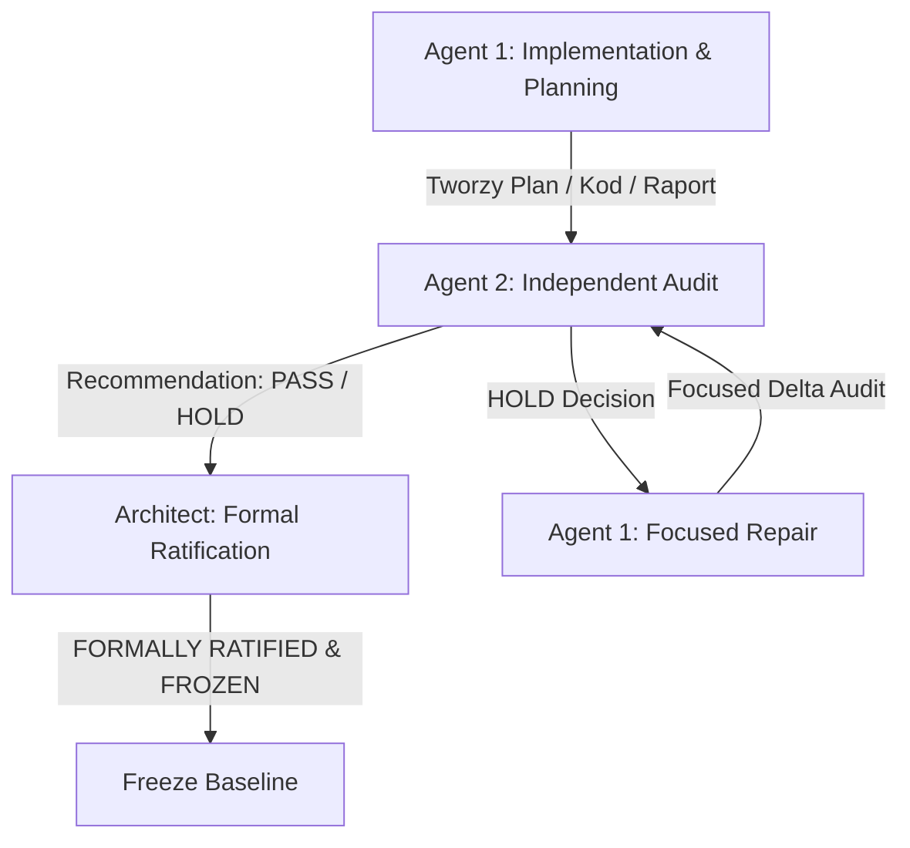

# GLOBAL_REPAIR_MASTER_PLAN.md v1.0 — Web Factor Master Governance & Repair Protocol

> **Wersja:** `1.0.0`  
> **Status:** 🏛️ **KANONICZNY DOKUMENT NADRZĘDNY (SINGLE SOURCE OF TRUTH FOR GOVERNANCE & EXECUTION)**  
> **Odpowiedzialność:** Agent 1 (Implementation), Agent 2 (Independent Audit), Architect (Formal Ratification)  
> **Data ustanowienia:** 13 sierpnia 2026 r.  

---

## 1. Cel i Stan Wyjściowy Repozytorium (Repository Baseline & Objectives)

### 1.1. Cel Główny
Doprowadzenie monorepo **WEB FACTOR** do stanu 100% stabilności, zerowej liczby błędów kompilacji i testów, pełnej zgodności z architekturą domenową (ADR DECISION-042..045) oraz przygotowanie czystego gruntu pod formalną ratyfikację wersji `v1.0.0` i późniejszą implementację Sprintu **S39 (Multi-Timeline Orchestration)**.

### 1.2. Stan Wyjściowy Repozytorium (Confirmed vs Unconfirmed Baseline)
1. **Fakty Potwierdzone (Confirmed Evidence)**:
   - Monorepo składa się z dwóch niezależnych torów: **Toru Produktowego** (`src/app/`, Next.js 15+ App Router, Storefront, API, E-commerce) oraz **Toru Authoring Studio** (`packages/builder-core/`, `packages/authoring-studio/`, `packages/commerce-engine/`).
   - Pakiety PM29–PM48, S1–S38 oraz Commerce Step 6 posiadają zaimplementowane warstwy domenowe i edytorskie.
   - Wykryto potwierdzone błędy wyjściowe:
     - Błąd kontraktu Route Handlera Next.js 15+ w `src/app/api/store/order/[id]/route.ts` (parametr `params` jako `Promise<{ id: string }>`).
     - Zdublowana deklaracja `AnimationInterpolation` w `packages/builder-core/src/index.ts`.
     - Błędy nieistniejących/zmienionych eksportów w testach unitowych interpolatorów animacji w `packages/builder-core/src/animation/__tests__/`.
     - Błędy w komponentach React w `src/app/page.tsx` oraz `src/app/opinie/page.tsx` (`set-state-in-effect`, `Date.now()` w `key`, hoisting wywołania `randomize`).
2. **Hipotezy i Dane Niepotwierdzone (Unconfirmed Hypotheses)**:
   - Wszelkie liczby błędów ze starych lub niepotwierdzonych logów (np. hipoteza 407 błędów z dawnych uruchomień) są traktowane jako **niepotwierdzone hipotezy**.
   - **Twardy Baseline zostanie ustalony wyłącznie przez świeży audyt Agenta 2 w Etapie 1.**

---

## 2. Zasady Governance (Governance Framework)

Wszystkie działania w repozytorium podlegają bezwzględnym regułom architektonicznym (ADR Log):

- **DECISION-042 (Bridge Delegation Rule)**:  
  `AnimationTriggerBridge` nie może implementować własnej logiki playbacku, time-steppingu ani schedulera. Musi wyłącznie delegować do metody interfejsu `AnimationPlaybackController` (`play()`, `pause()`, `reset()`, `stop()`, `seek()`).
- **DECISION-043 (Editor Data Only)**:  
  Inspector edytuje wyłącznie dane animacji DTO. Odtwarzanie i egzekucja animacji odbywa się wyłącznie wewnątrz `builder-core`.
- **DECISION-044 (SSOT Preservation)**:  
  Dokument `BuilderDocument` jest jedynym źródłem prawdy (SSOT) dla osi czasu i konfiguracji węzłów. Niedozwolone jest tworzenie wtórnych modeli dokumentów.
- **DECISION-045 (Inspector Playback Isolation)**:  
  Inspector nigdy nie wywołuje bezpośrednio `PlaybackController`. Edytuje wyłącznie konfigurację DTO w dokumencie.

---

## 3. Rozdział Odpowiedzialności (Role Responsibilities)



### 3.1. Agent 1 — Senior Architect & Implementation Agent
- Odpowiedzialny za badania, edycję kodu, naprawianie błędów, wdrażanie etapów i generowanie raportów z wykonania (`IMPLEMENTATION_REPORT.md`).
- **Ograniczenie**: Agent 1 **NIE MOŻE** przyznawać sobie ani kodowi formalnego werdyktu `PASS` ani ratyfikacji `FORMALLY RATIFIED 🔒`.

### 3.2. Agent 2 — Independent Code Evidence Audit Agent
- Odpowiedzialny za niezależny audyt dowodowy (Code Evidence Audit Protocol v2.8), weryfikację czystości logów, sprawdzenie braku wycieków API środowiskowych (DOM, rAF) do warstw domenowych, weryfikację testów i wystawienie wyłącznej rekomendacji: **`Recommendation: PASS`** lub **`Recommendation: HOLD`**.

### 3.3. Architect — Lead Architect & Approval Authority
- Wyłączny organ posiadający uprawnienia do wydania formalnej ratyfikacji **`FORMALLY RATIFIED & FROZEN 🔒`** i przejścia do kolejnych głównych kamieni milowych.

---

## 4. Pełna Kolejność Etapów (Master Stage Roadmap)

```
[Etap 0: Cache Hygiene] ➔ [Etap 1: Fresh Baseline Audit] ➔ [Etap 2: Product Track Repair]
                                                                    │
[Etap 5: Global Audit & Freeze] ◄─ [Etap 4: S1-S38 Subsystem Audit] ◄─ [Etap 3: Studio Track Repair]
       │
       ▼
[Etap 6: S39 Implementation] ➔ [Etap 7: Final Ratification]
```

---

## 5. Kryteria Wejścia / Wyjścia i Zakres Etapów

### Etap 0: Sanitacja Środowiska i Cache Hygiene
* **Przypisany Agent**: Agent 1 & Agent 2
* **Opis**: Czyszczenie podkatalogów `.next/`, `node_modules/.cache`, plików tymczasowych oraz przygotowanie czystego środowiska uruchomieniowego.
* **Kryteria Wejścia**: Zgłoszenie potrzeby wyczyszczenia środowiska.
* **Kryteria Wyjścia**: Czyste katalogi robocze bez zaktualizowanych/starych pamięci podręcznych bundlerów.

### Etap 1: Audyt Świeżego Baseline Błędów (Baseline Verification)
* **Przypisany Agent**: Agent 2
* **Opis**: Niezależne uruchomienie sprawdzenia `tsc --noEmit` i wygenerowanie świeżego, rzeczywistego raportu z liczbą błędów kompilacji, bez opierania się na hipotezach z przeszłości.
* **Kryteria Wejścia**: Ukończenie Etapu 0.
* **Kryteria Wyjścia**: Oficjalny raport Agenta 2 z dokładną liczbą błędów typu baseline (np. potwierdzenie lub sprostowanie liczby 407 błędów).

### Etap 2: Naprawa Długu Technicznego Toru Produktowego (Product Track Repair)
* **Przypisany Agent**: Agent 1 (Naprawa) / Agent 2 (Audyt Delta)
* **Opis**:
  - Naprawa kontraktu Next.js 15 Route Handlera w `src/app/api/store/order/[id]/route.ts`.
  - Rozwiązanie problemu aliasu `@/lib/utils` w komponentach UI.
  - Usunięcie nieczystych funkcji (`Date.now()` w `key`), kaskadowych re-renderów `setState` w `useEffect` i niepoprawnego hoistingu w `src/app/page.tsx` i `src/app/opinie/page.tsx`.
* **Kryteria Wejścia**: Zatwierdzenie baseline z Etapu 1.
* **Kryteria Wyjścia**: 0 błędów TypeScript i lint w torze produktowym (`src/`).

### Etap 3: Naprawa Długu Technicznego Toru Authoring Studio (Studio Track Repair)
* **Przypisany Agent**: Agent 1 (Naprawa) / Agent 2 (Audyt Delta)
* **Opis**:
  - Usunięcie zdublowanej deklaracji `AnimationInterpolation` w `packages/builder-core/src/index.ts`.
  - Naprawa nieistniejących/zmienionych eksportów w testach interpolatorów w `packages/builder-core/src/animation/__tests__/`.
  - Naprawa niepoprawnych ścieżek importów pomocniczych testów w `packages/authoring-studio/src/inspector/__tests__/`.
* **Kryteria Wejścia**: Ukończenie Etapu 2.
* **Kryteria Wyjścia**: 0 błędów kompilacji TypeScript w `packages/builder-core` oraz `packages/authoring-studio`.

### Etap 4: Audyt Świeżych Quality Gates dla Wszystkich Sprintów (S1–S38 & PM29–PM48)
* **Przypisany Agent**: Agent 2
* **Opis**: Przeprowadzenie pełnego audytu testów Vitest (`npx vitest run`) we wszystkich zrealizowanych podsystemach domenowych S1–S38 oraz PM29–PM48.
* **Kryteria Wejścia**: Ukończenie Etapu 3.
* **Kryteria Wyjścia**: 100% pass rate we wszystkich istniejących plikach testowych domenowych.

### Etap 5: Finalny Global Audit i Zamrożenie Baseline v1.0.0 (Global Audit & Freeze)
* **Przypisany Agent**: Agent 2 (Rekomendacja) / Architect (Ratyfikacja)
* **Opis**: Weryfikacja czystego `npm run build`, `npx tsc --noEmit` (0 błędów) i wystawienie ratyfikacji `FORMALLY RATIFIED & FROZEN 🔒` dla wersji 1.0.0.
* **Kryteria Wejścia**: Ukończenie Etapu 4.
* **Kryteria Wyjścia**: Formalna ratyfikacja Architekta dla v1.0.0.

### Etap 6: Implementacja i Weryfikacja Sprintu S39 (Multi-Timeline Orchestration)
* **Przypisany Agent**: Agent 1 (Implementacja) / Agent 2 (Audyt S39)
* **Opis**: Implementacja komponentów domenowych `StudioTimelineRegistry.ts`, `StudioTriggerOrchestrator.ts` oraz `StudioMultiTimelineCoordinator.ts` w `packages/authoring-studio/src/preview/` na podstawie zaakceptowanego planu [S39_IMPLEMENTATION_PLAN.md](file:///c:/Users/HP/Documents/GOOGLE%20ANTIGRAVITY%20APK/WEB%20FACTOR/docs/studio/S39_IMPLEMENTATION_PLAN.md).
* **Kryteria Wejścia**: Formalna ratyfikacja Baseline v1.0.0 z Etapu 5.
* **Kryteria Wyjścia**: Ukończenie S39, 100% pass rate testów S39, brak regresji.

### Etap 7: Ratyfikacja Końcowa i Release Manifest Update
* **Przypisany Agent**: Architect
* **Opis**: Aktualizacja `RELEASE_MANIFEST_v1.0.md` i zamknięcie cyklu.

---

## 6. Reguła HOLD → Repair → Focused Delta Audit

W przypadku wydania przez Agenta 2 decyzji **`Recommendation: HOLD`**:
1. Agent 2 określa precyzyjną listę zastrzeżeń i nadaje im unikalne identyfikatory (`Finding ID`).
2. Agent 1 przeprowadza wyłącznie celowaną fazę naprawy (`Repair Phase`), dotyczącą punktów z listy `Finding ID`.
3. Agent 2 **NIE wykonuje pełnego ponownego audytu od zera**, lecz przeprowadza wyłącznie **Focused Delta Audit**, weryfikujący naprawę konkretnych `Finding ID` oraz brak zmian w zamrożonych plikach.

---

## 7. Pełna Lista Aktualnego Długu Technicznego (Technical Debt Inventory)

| ID Długu | Tor / Pakiet | Opis Problemu | Priorytet | Przypisany Etap |
|---|---|---|---|---|
| **DEBT-PROD-01** | Produktowy (`src/app/api/`) | Mismatch sygnatury `params` w Next.js 15 w `src/app/api/store/order/[id]/route.ts`. | P0 (Critical) | Etap 2 |
| **DEBT-PROD-02** | Produktowy (`src/components/ui/`) | Błąd resolvera ścieżki aliasu `@/lib/utils` w Turbopack. | P1 (High) | Etap 2 |
| **DEBT-PROD-03** | Produktowy (`src/app/page.tsx`) | `react-hooks/set-state-in-effect`, `Date.now()` w `key`, hoisting `randomize`. | P1 (High) | Etap 2 |
| **DEBT-CORE-01** | Studio (`builder-core`) | Zdublowany eksport `AnimationInterpolation` w `packages/builder-core/src/index.ts`. | P0 (Critical) | Etap 3 |
| **DEBT-CORE-02** | Studio (`builder-core`) | Nieaktualne nazwy importów funkcji interpolatorów w testach unitowych. | P1 (High) | Etap 3 |
| **DEBT-STUDIO-01**| Studio (`authoring-studio`) | Niepoprawne ścieżki importów pomocniczych w testach panelu inspectora. | P1 (High) | Etap 3 |
| **DEBT-DOCS-01**  | Dokumentacja (`docs/studio/`) | Nieaktualne statusy w `37_STUDIO_SUBSYSTEM_ROADMAP.md` w stosunku do S28-S32. | P2 (Medium) | Etap 5 |

---

## 8. Zakres Sprintów do Audytu (Sprint Audit Scope)

Audytowi i weryfikacji podlegają następujące bloki funkcjonalne:
- **Pakiety Domenowe Silnika Animacji (PM29–PM48)**: `builder-core/src/animation/` (PlaybackController, Interpolatory, State Machine, Runtime Bridge, Trigger Engine, Preview Adapter).
- **Pakiety Authoring Studio (S1–S38)**: `authoring-studio/src/` (Timeline, Layout, Responsive, Components S32, Live Preview S38, Inspector 2.0).
- **Commerce Engine (Step 6)**: `commerce-engine/`, CartStore, OrderProcessingEngine, CheckoutFlow, PaymentFactory.
- **Sprint S39**: Multi-Timeline Orchestration (do zrealizowania w Etapie 6).

---

## 9. Oddzielenie Toru Produktowego od Authoring Studio

Obowiązuje ścisła separacja odpowiedzialności architektonicznej:

1. **Tor Produktowy (`src/app/`, `src/lib/`)**:
   - Dedykowany dla serwowania aplikacji webowej, panelu sklepu, marketingu, API Routes oraz integracji Next.js 15+ App Router.
   - Może używać komponentów React, hooków klienta/serwera i API Next.js.
2. **Tor Authoring Studio (`packages/`)**:
   - Wyłącznie czyste, bezstanowe lub domenowe pakiety TypeScript.
   - **Zakaz wycieku klasycznego DOM (`document`, `window`), `requestAnimationFrame`, `setTimeout` czy `AudioContext` do pakietów domenowych `builder-core` oraz domenowych warstw edytora.**

---

## 10. Procedura Świeżych Gate'ów i Cache Hygiene

Przed każdym audytem Agenta 2 obowiązuje procedura czyszczenia pamięci podręcznej:
1. Usunięcie katalogu `.next/` w korzeniu projektu.
2. Usunięcie pamięci podręcznych kompilatorów.
3. Uruchomienie kompilatora w trybie pełnej weryfikacji typów: `npx tsc --noEmit`.
4. Uruchomienie zestawu testów w trybie bez pamięci podręcznej: `npx vitest run --no-cache`.

---

## 11. Freeze Policy (Polityka Zamrożenia Modułów)

Moduły zrealizowane i zatwierdzone w sprintach S1–S38 oraz PM29–PM48 pozostają **ZAMROŻONE (`FROZEN 🔒`)**.
Wszelkie modyfikacje zamrożonych plików są niedozwolone, chyba że stanowią element autoryzowanego etapu naprawczego (`Repair Phase`) zaakceptowanego przez Architekta.

---

## 12. Document Deprecation Policy

Pliki dokumentacji, które dezaktualizują się w wyniku ustaleń niniejszego Master Planu (np. dawne roadmapy w `37_STUDIO_SUBSYSTEM_ROADMAP.md` zawierające status "Planned" dla gotowych modułów S28-S32), muszą zostać opatrzone nagłówkiem:
`> ⚠️ DEPRECATED / SUPERSEDED BY GLOBAL_REPAIR_MASTER_PLAN.md v1.0`

---

## 13. Końcowy Global Audit Protocol

Przed przejściem do Etapu 6 (Implementacja S39), Agent 2 i Architekt muszą potwierdzić następujące kryteria:
- `npx tsc --noEmit` -> **0 błędów**.
- `npx vitest run` -> **0 failed**.
- `npm run build` -> **GREEN (exit code 0)**.
- 0 wycieków API przeglądarkowych w pakietach domenowych.
- Pełna zgodność z DECISION-042..045.

---

## 14. Status Matrix (Macierz Stanu Wykonania)

| Etap | Opis Etapu | Przypisany Agent | Status Etapu | Wyjściowy Dokument / Raport |
|---|---|---|---|---|
| **Etap 0** | Sanitacja Środowiska i Cache Hygiene | Agent 1 & Agent 2 | 🟢 **COMPLETED** | Świeże środowisko robocze |
| **Etap 1** | Fresh Baseline Error Audit | Agent 2 | ⏳ **PENDING** | `S39_FRESH_BASELINE_AUDIT_REPORT.md` |
| **Etap 2** | Product Track Repair (Next.js 15 & React) | Agent 1 / Agent 2 | ⏳ **PENDING** | `PRODUCT_TRACK_REPAIR_REPORT.md` |
| **Etap 3** | Studio Track Repair (`builder-core` & `authoring-studio`) | Agent 1 / Agent 2 | ⏳ **PENDING** | `STUDIO_TRACK_REPAIR_REPORT.md` |
| **Etap 4** | Fresh Quality Gates Audit (S1–S38 & PM29–PM48) | Agent 2 | ⏳ **PENDING** | `QUALITY_GATES_AUDIT_REPORT.md` |
| **Etap 5** | Global Audit & Freeze Baseline v1.0.0 | Agent 2 / Architect | ⏳ **PENDING** | `GLOBAL_AUDIT_FREEZE_REPORT.md` |
| **Etap 6** | Sprint S39 Implementation (Multi-Timeline Orchestration) | Agent 1 / Agent 2 | ⏳ **PENDING** | `S39_IMPLEMENTATION_REPORT.md` |
| **Etap 7** | Final Ratification & Release Manifest Update | Architect | ciphertext | `RELEASE_MANIFEST_v1.0.md` (Updated) |

---

## 15. Podsumowanie i Gotowość do Egzekucji

Dokument `GLOBAL_REPAIR_MASTER_PLAN.md v1.0` stanowi **jedyny nadrzędny kanoniczny punkt odniesienia** dla wszystkich kolejnych operacji naprawczych, audytowych i wdrożeniowych.

Zgodnie z poleceniem:  
**Wszystkie zadania są dokładnie ponumerowane i przypisane. Oczekuję na dalsze polecenia użytkownika.**
