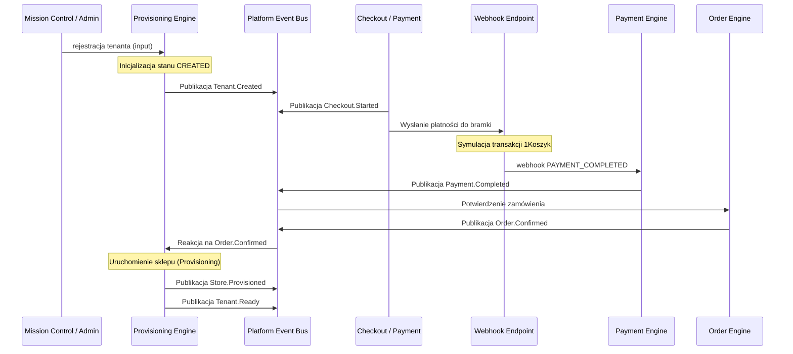

# SPRINT 7: PRODUCTION HARDENING & FIRST TENANT
## Specyfikacja Kontraktu — GOLDEN_FLOW.md
*Definicja pełnego cyklu życia wdrożenia biznesowego dzierżawcy (B2B2C Golden Flow) od rejestracji, przez checkout i płatność, aż do uruchomienia sklepu.*

---

### 1. Model Wejściowy (Input Contract)

Każde nowe wdrożenie rozpoczyna się od zdefiniowania żądania rejestracji tenant-partnera:

```typescript
export interface TenantRegistrationInput {
  readonly id: string;         // Sugerowany unikalny identyfikator (np. slug / uuid)
  readonly ownerEmail: string;  // Adres e-mail partnera zarządzającego sklepem
  readonly selectedPackage: {
    readonly id: string;       // ID pakietu (np. 'premium_store', 'standard_store')
    readonly priceCents: number;
    readonly currency: string;
  };
}
```

---

### 2. Sekwencja Zdarzeń (Event Flow Sequence)

Szyna zdarzeń `PlatformEventBus` rejestruje i orkiestruje następującą chronologiczną listę zdarzeń:



| # | Nazwa Zdarzenia | Nadawca | Dane Payloadu | Opis |
|---|---|---|---|---|
| 1 | `Tenant.Created` | `TenantProvisioningEngine` | `tenantId`, `ownerEmail`, `status: 'CREATED'` | Inicjalizacja konta dzierżawcy |
| 2 | `Checkout.Started` | `CheckoutFlow` | `checkoutId`, `tenantId`, `totalAmountCents` | Rozpoczęcie procesu zakupowego |
| 3 | `Payment.Completed` | `PaymentEngine` | `paymentIntentId`, `tenantId`, `amountCents` | Przetworzenie płatności przez webhook |
| 4 | `Order.Confirmed` | `OrderProcessingEngine` | `orderId`, `tenantId`, `paymentIntentId` | Zmiana statusu zamówienia na opłacone |
| 5 | `Store.Provisioned` | `TenantProvisioningEngine` | `tenantId`, `storeId`, `status: 'PROVISIONED'` | Przypisanie pakietów i zasobów sklepu |
| 6 | `Tenant.Ready` | `TenantProvisioningEngine` | `tenantId`, `status: 'ACTIVE'` | Uaktywnienie sklepu i routingu domen |

---

### 3. Oczekiwany Stan Końcowy (Output Contract)

Po pomyślnym przejściu całego przepływu, dane w bazie danych Supabase muszą spełniać następujące asercje:

#### Status Dzierżawcy (`Tenant`):
- Stan: `ACTIVE`
- Weryfikacja: `tenant.status === 'ACTIVE'`

#### Zamówienie (`Order`):
- Stan: `PAID` (lub odpowiednik potwierdzonego zakupu w silniku zamówień)
- Weryfikacja: `order.status === 'PAID'`

#### Sklep Dzierżawcy (`Store` / `Storefront`):
- Stan: `READY`
- Weryfikacja: `store.status === 'READY'`

---

### 4. Kryteria Testu Integracyjnego (golden-flow.test.ts)

Test integracyjny przepływu musi zweryfikować:
1. Reakcję `TenantProvisioningEngine` na zdarzenie `Order.Confirmed`.
2. Trwałość danych w bazach Supabase (symulowanych/rzeczywistych) po przejściu potoku.
3. Izolację danych — potwierdzenie, że zdarzenia uruchomione dla `tenant_id = A` nie powodują wdrożeń ani modyfikacji zasobów dla `tenant_id = B`.
