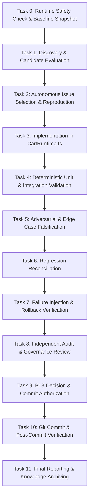

# B17-REAL-CANARY-1 — TASK GRAPH

## Task Node Specifications

### Node T0: Runtime Safety Check & Baseline Snapshot
- **Role**: Governance / System Auditor
- **Capability**: Environment & Git Status Inspection
- **Dependencies**: None
- **Inputs**: Workspace path, Git HEAD, Node/NPM runtime
- **Expected Output**: Verified execution boundaries, recorded git revision `8d9f45a1b2a30546afc44ab7d3fb214ec6296897`, baseline test inventory (546 files, 522 passed, 24 pre-existing failures).
- **Validation**: Strict integrity check of paths and permissions.
- **Failure Condition**: Missing isolation or ambiguous repository state.

### Node T1: Discovery & Candidate Evaluation
- **Role**: Researcher / Domain Explorer
- **Capability**: Physical Code Inspection
- **Dependencies**: T0
- **Inputs**: Codebase modules in `packages/` and `src/`
- **Expected Output**: Minimum 3 evaluated candidates with full risk/value profiles.
- **Validation**: Verified existence in physical code.
- **Failure Condition**: Less than 3 real issues identified.

### Node T2: Autonomous Selection & Reproduction
- **Role**: Architect
- **Capability**: Domain Modeling & Defect Analysis
- **Dependencies**: T1
- **Inputs**: Evaluated candidate list
- **Expected Output**: Selection of `CartRuntime.ts` multi-item crash; reproduction evidence.
- **Validation**: Reproduction script/test demonstrating exact failure.
- **Failure Condition**: Selected issue cannot be reproduced or exceeds canary scope.

### Node T3: Implementation in CartRuntime.ts
- **Role**: Worker / Core Engineer
- **Capability**: TypeScript Domain Engine Development
- **Dependencies**: T2
- **Inputs**: `packages/commerce-engine/src/CartRuntime.ts`
- **Expected Output**: Robust recalculate and multi-product cart handling with fallback and domain helpers.
- **Validation**: Clean TypeScript compilation with zero suppressions.
- **Failure Condition**: Syntax errors, lint errors, or type mismatches.

### Node T4: Deterministic Unit & Integration Validation
- **Role**: Deterministic Validator
- **Capability**: Vitest Test Runner Execution
- **Dependencies**: T3
- **Inputs**: `packages/commerce-engine/src/*.test.ts`
- **Expected Output**: 100% PASS on all commerce-engine test files.
- **Validation**: Vitest exit code 0.
- **Failure Condition**: Any failing test case in commerce-engine suite.

### Node T5: Adversarial & Edge Case Falsification
- **Role**: Adversarial Tester
- **Capability**: Chaos & Edge-Case Test Authoring
- **Dependencies**: T4
- **Inputs**: Falsification scenarios (negative quantities, missing maps, coupon boundary, empty items)
- **Expected Output**: All adversarial edge cases pass gracefully without throwing unhandled errors or producing invalid totals.
- **Validation**: Explicit assertion coverage for all edge cases.
- **Failure Condition**: Unhandled crash, NaN total, negative total, or schema parse failure.

### Node T6: Regression Reconciliation
- **Role**: Regression Analyst
- **Capability**: Test Inventory & Identity Diffing
- **Dependencies**: T5
- **Inputs**: Pre-canary vs post-canary test logs
- **Expected Output**: Mathematical proof that zero baseline tests regressed.
- **Validation**: Exact test identity reconciliation.
- **Failure Condition**: Any previously passing test now failing.

### Node T7: Failure Injection & Rollback Verification
- **Role**: DevOps / Reliability Engineer
- **Capability**: Rollback & State Isolation Testing
- **Dependencies**: T6
- **Inputs**: Temporary intentional mutation
- **Expected Output**: Verified clean rollback without lingering artifacts or partial state.
- **Validation**: Git diff comparison after rollback.
- **Failure Condition**: Partial state left in repository or failed rollback.

### Node T8: Independent Audit & Governance Review
- **Role**: Independent Auditor
- **Capability**: Code & Evidence Audit Protocol
- **Dependencies**: T7
- **Inputs**: Diff, test execution records, claim-evidence matrix
- **Expected Output**: Formal audit finding and recommendation (`PASS` / `HOLD` / `REJECT`).
- **Validation**: Verification of zero suppressions, zero unauthorized file modifications.
- **Failure Condition**: Finding of rule violation or missing proof.

### Node T9: B13 Decision & Commit Authorization
- **Role**: B13 Governor
- **Capability**: Final Authority & Gatekeeper
- **Dependencies**: T8
- **Inputs**: Auditor Report & Evidence Matrix
- **Expected Output**: Explicit decision: `COMMIT`, `HOLD`, or `REJECT`.
- **Validation**: Full consensus of deterministic proofs.
- **Failure Condition**: Ambiguous evidence or unverified claims.

### Node T10: Git Commit & Post-Commit Verification
- **Role**: Release Engineer
- **Capability**: Git Version Control
- **Dependencies**: T9 (Only if B13 == COMMIT)
- **Inputs**: Staged changes, verified commit message
- **Expected Output**: New Git commit SHA, clean git status, re-run test pass.
- **Validation**: `git status -uno` and `vitest` post-commit check.
- **Failure Condition**: Git conflict, untracked pollution, or post-commit test failure.

### Node T11: Final Reporting & Knowledge Archiving
- **Role**: System Chronicler
- **Capability**: Documentation & Knowledge Synthesis
- **Dependencies**: T10
- **Inputs**: All execution artifacts
- **Expected Output**: Complete `docs/B17-REAL-CANARY-1_FINAL_REPORT.md` (27 sections) and updated progress logs.
- **Validation**: Verification of all mandatory sections.
- **Failure Condition**: Missing sections or unverified claims.
