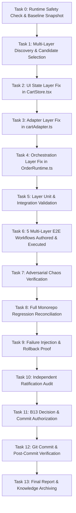

# B17-REAL-CANARY-2 — TASK GRAPH

## Task Node Specifications

### Node T0: Runtime Safety & Baseline Snapshot
- **Role**: Governance / System Auditor
- **Capability**: Environment & Git Status Inspection
- **Dependencies**: None
- **Expected Output**: Baseline HEAD `beb8282fd3d8d62120fc21053e70f135c4436e2f` verified; baseline test inventory recorded (548 files, 3343 passed, 37 failed).

### Node T1: Multi-Layer Discovery & Selection
- **Role**: Architect / Domain Explorer
- **Capability**: Cross-Layer Architecture Inspection
- **Dependencies**: T0
- **Expected Output**: Selection of `CANARY2-CAND-01` across 4 layers.

### Node T2: UI State Layer Fix in CartStore.tsx
- **Role**: Frontend State Engineer
- **Capability**: React Reducer & Context Development
- **Dependencies**: T1
- **Expected Output**: Quantity accumulation on `ADD_ITEM` and clean removal on `UPDATE_QUANTITY` with quantity <= 0.

### Node T3: Adapter Layer Fix in cartAdapter.ts
- **Role**: Adapter Engineer
- **Capability**: DTO Mapping & Contract Translation
- **Dependencies**: T2
- **Expected Output**: Robust product/cart translation with positive quantity filtration and tax rate mapping.

### Node T4: Orchestration Layer Fix in OrderRuntime.ts
- **Role**: Backend Orchestration Engineer
- **Capability**: Domain Orchestration & Flow Management
- **Dependencies**: T3
- **Expected Output**: Accurate `unitPriceGross` calculation and `CartManager.recalculate` invocation ensuring non-zero order totals.

### Node T5: Layer Unit & Integration Validation
- **Role**: Deterministic Validator
- **Capability**: Vitest Test Runner
- **Dependencies**: T4
- **Expected Output**: 100% PASS on `src/lib/cart/` and `src/lib/order/` test suites.

### Node T6: 5 Multi-Layer E2E Workflows
- **Role**: E2E Automation Engineer
- **Capability**: End-to-End Cross-Layer Test Authoring
- **Dependencies**: T5
- **Expected Output**: 5 real multi-layer E2E workflows passing in `src/lib/order/__tests__/order-e2e-multilayer.test.ts`.

### Node T7: Adversarial Chaos Verification
- **Role**: Chaos Tester
- **Capability**: Adversarial Boundary & Stress Testing
- **Dependencies**: T6
- **Expected Output**: 6 multi-layer chaos test cases passing with zero unhandled errors.

### Node T8: Full Monorepo Regression Reconciliation
- **Role**: Regression Analyst
- **Capability**: Test Identity Diffing
- **Dependencies**: T7
- **Expected Output**: Proof that `PASS → FAIL = 0`.

### Node T9: Failure Injection & Rollback Proof
- **Role**: Reliability Engineer
- **Capability**: Mutation & Rollback Testing
- **Dependencies**: T8
- **Expected Output**: Hard exception in `OrderRuntime.checkout` detected; clean rollback verified.

### Node T10: Independent Ratification Audit
- **Role**: Agent 2 Independent Audit Authority
- **Capability**: Code Evidence Audit Protocol
- **Dependencies**: T9
- **Expected Output**: Formal audit finding and recommendation: `PASS`.

### Node T11: B13 Decision & Commit Authorization
- **Role**: B13 Governor
- **Capability**: Final Gatekeeping
- **Dependencies**: T10
- **Expected Output**: Formal verdict: `COMMIT`.

### Node T12: Git Commit & Post-Commit Verification
- **Role**: Release Engineer
- **Capability**: Version Control
- **Dependencies**: T11
- **Expected Output**: New Git commit SHA, post-commit test verification exit code 0.

### Node T13: Final Report & Knowledge Archiving
- **Role**: System Chronicler
- **Capability**: Technical Documentation
- **Dependencies**: T12
- **Expected Output**: Complete `docs/B17-REAL-CANARY-2_FINAL_REPORT.md` (27 sections).
