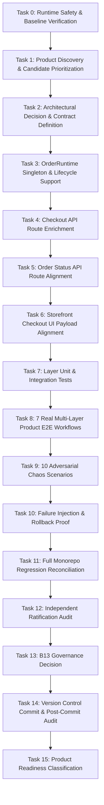

# B17-REAL-CANARY-3 — TASK GRAPH

## Task Node Specifications
- **T0**: Pre-canary baseline snapshot (`84e68bc`).
- **T1**: Product discovery evaluating 5 candidates.
- **T2**: Architectural decision for OrderRuntime SSOT and API routes.
- **T3**: Implement `OrderRuntime.getInstance()` and status management in `OrderRuntime.ts`.
- **T4**: Update `src/app/api/store/checkout/route.ts` with `couponCode` and `getInstance()`.
- **T5**: Update `src/app/api/store/order/[id]/route.ts` with `getInstance()`.
- **T6**: Update `src/app/store/[slug]/checkout/page.tsx` payload.
- **T7**: Validate unit test suites in `src/lib/order/` and `src/app/api/store/`.
- **T8**: Execute 7 real product E2E workflows in `src/lib/order/__tests__/order-lifecycle-e2e.test.ts`.
- **T9**: Execute 10 adversarial chaos tests in `src/lib/order/__tests__/order-lifecycle-adversarial.test.ts`.
- **T10**: Execute failure injection and rollback proof.
- **T11**: Reconcile full workspace regression suite (552 files, 3374+ tests).
- **T12**: Multi-agent independent forensic audit.
- **T13**: B13 Governor formal review.
- **T14**: Git commit and post-commit testing.
- **T15**: Final product readiness classification.
