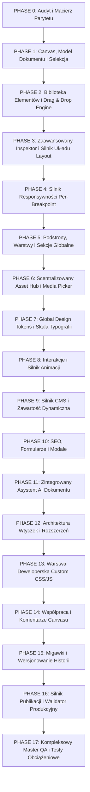

# SOLOSPOT BUILDER — PROFESSIONAL EDITOR PARITY MATRIX
## Benchmark: Wix Studio-class Visual Website Builder
**Data sporządzenia audytu:** 04.09.2026  
**Audytor:** Antigravity Architect & Core Systems Engineer  
**Status bazowy:** Faza 0 — Rygorystyczny Audyt Architektoniczno-Funkcjonalny

---

## 1. PODSUMOWANIE STANU OBECNEGO (HONEST EXECUTIVE SUMMARY)

> [!IMPORTANT]
> **Rzeczywisty poziom parytetu funkcjonalnego względem Wix Studio:**
> **Obecny stan całego systemu wynosi: ~24.5%**  
> Dotychczas zrealizowane moduły stanowią solidny fundament architektoniczny (SSOT, compile pipeline, podział shell/canvas/inspector/sidebar, bazowy Pages/Layers/Components), jednak pod względem profesjonalnego, granularnego visual site buildera system znajduje się w początkowej fazie dojrzałości.

### Rozkład statusów w 21 kluczowych systemach:
- 🟢 **IMPLEMENTED (Pełna dojrzałość produkcyjna):** **1 / 21** (4.8%) — *Publish Engine (Vercel Pipeline)*
- 🟡 **PARTIAL (Częściowo zaimplementowane, fundament bez granularności):** **12 / 21** (57.1%) — *Pages, Layers, Components, Assets, Media, Style, Canvas, Inspector, Responsive, SEO, AI, History*
- 🔴 **MISSING (Brak w modelu, UI lub runtime):** **8 / 21** (38.1%) — *Interactions, Animations, CMS, Forms Engine, Developer Tools, Collaboration, Modals/Popups, Global Sections*
- ⚠️ **BROKEN / HIGH-RISK:** **0 / 21** (Błędy kompilacji i layout overflow zostały usunięte; istniejące moduły działają stabilnie w swoim bazowym zakresie).

---

## 2. SZCZEGÓŁOWA MACIERZ PARYTETU FUNKCJONALNEGO (FEATURE PARITY MATRIX)

| System | Wix-level requirement | SoloSpot obecnie | Status | Stopień ukończenia | Brakujące elementy do poziomu profesjonalnego |
| :--- | :--- | :--- | :---: | :---: | :--- |
| **Canvas** | Wizualna edycja in-place, inline text editing, swobodne przemieszczanie, zmiana rozmiaru za krawędzie, multi-select, parent/child traversal, align/distribute, floating context bar (lock/hide/duplicate/delete/more). | Podgląd sekcji na canvasie, obramowanie zaznaczenia (`SelectionOverlay`), przyciski góra/dół/duplikuj/usuń na hoverze sekcji, responsywny iframe runtime z zoomem (50-200%). | 🟡 **PARTIAL** | **25%** | • Zaznaczanie atomowych elementów wewnątrz sekcji • Multi-selection (Shift + Click / lasso) • Manipulatory krawędzi (resize handles na canvasie) • Drag to move / reorder bezpośrednio myszą po canvasie • Floating Context Toolbar nad zaznaczonym elementem • Narzędzia wyrównywania (Align left/center/right/distribute) |
| **Elements** | Pełna biblioteka atomowych elementów: Basic (Text, Heading, Button, Image, Icon, Shape, Divider, Spacer), Layout (Container, Stack, Grid, Box, Repeater), Nav, Form (Input, Select, Switch, Upload), Media (Video, Audio, Lottie), Social, Commerce, Business. | Jedynie gotowe presety całych sekcji w 10 kategoriach. Brak możliwości dodawania pojedynczych elementów (np. samego przycisku, nagłówka czy kontenera) do istniejącej sekcji. | 🟡 **PARTIAL** | **15%** | • Pełna taksonomia atomowych elementów: Basic, Layout, Nav, Form, Media, Social, Commerce, Business • Schematy właściwości dla każdego elementu • Możliwość wstawiania elementu w dowolny slot/kontener sekcji |
| **Sections** | Biblioteka gotowych sekcji (Hero, Features, Gallery, Testimonials, FAQ, Pricing itp.), pusta sekcja (Blank), zapisywanie sekcji jako własny zasób (Save as Section Asset), sekcje globalne. | Gotowe klocki sekcji w rejestrze (`ComponentRegistry.ts`), wstawianie z panelu i presetów kolumn. | 🟡 **PARTIAL** | **40%** | • Sekcje globalne (Global Header, Global Footer, Announcement bar modyfikowane w jednym miejscu dla całej witryny) • Blank Section (puste płótno ze slotami) • Zapisywanie sekcji do biblioteki użytkownika (Save as Asset) • Konfigurowalne paddengi i tła sekcji na canvasie |
| **Pages** | Cykl życia podstron: Add, Duplicate, Delete, Rename, Set Homepage, Hide/Show, Lock, Folders, Subpages/Hierarchy, URL Slugs, Permissions/Password, Dynamic CMS Pages. | Dodawanie, duplikowanie (`DUPLICATE_PAGE`), usuwanie z ochroną strony głównej, oznaczanie ROOT/Home (`SET_HOME_PAGE`), edycja sluga i nazwy, modal SEO. | 🟡 **PARTIAL** | **55%** | • Foldery i struktura zagnieżdżona podstron (drzewo URL) • Strony dynamiczne podpięte pod kolekcje CMS (`/blog/[slug]`) • Uprawnienia podstron (Publiczna, Tylko dla zalogowanych, Hasło) • Ukrywanie w menu nawigacyjnym (Hide in navigation) |
| **Layers** | Pełne drzewo hierarchii strony, sekcji, kontenerów, siatek i każdego elementu podrzędnego z nazewnictwem, zwijaniem, blokowaniem, ukrywaniem, przeciąganiem i wyszukiwarką. | `LayerTree` wyświetla sekcje dokumentu, obsługuje drag & drop kolejności, toggle ukrywania (oko), blokadę (kłódka) i edycję etykiety. | 🟡 **PARTIAL** | **45%** | • Granularny wgląd w głąb sekcji (elementy potomne: Box -> Heading -> Button) • Wyszukiwarka i filtrowanie warstw • Grupowanie/Rozgrupowywanie (Group/Ungroup) • Zmiana kolejności zagnieżdżania (Drop into container) |
| **Inspector** | Kontekstowy inspektor z podziałem: Design (Box model, Padding, Margin, Size, Position, Dock, Z-index, Border, Radius, Shadow, Opacity), Typography, Layout, Content, Responsive overrides. | `InspectorShellAdapter` + `DynamicPropertyPanel`. Reaguje na zaznaczoną sekcję, renderuje podstawowe pola formularza (teksty, kolory, wybrane propsy). | 🟡 **PARTIAL** | **25%** | • Pełny wizualny model pudełkowy (Box Model: Margin & Padding 4-kierunkowy) • Zaawansowana typografia (Line height, letter-spacing, text-transform, font weight) • Pozycjonowanie i dokowanie (Dock, Pin, Z-index, Overflow) • Cienie (Box-shadow picker), zaawansowane gradienty, blend modes • Zakładki kontekstowe: Design / Content / Interactions |
| **Assets** | Scentralizowany Asset Hub: Photos, Videos, Vector/SVG, Illustrations, Templates, Icons, Logos, User Uploads, integracje zewnętrzne, organizacja w foldery. | `AssetsPanel` z kategoriami (Obrazy, Wideo, SVG, Tła), drag & drop upload do pamięci lokalnej, wyszukiwarka, wstawianie do sekcji. | 🟡 **PARTIAL** | **35%** | • Trwałe przechowywanie w Cloud Storage (S3/R2/Vercel Blob) zamiast lokalnego stanu pamięci • Zewnętrzne biblioteki stockowe (Unsplash, Pexels) • Foldery i tagi zasobów • Wektorowe biblioteki ikon i ilustracji SoloSpot |
| **Media** | Uniwersalny selektor mediów z wyszukiwaniem, filtrowaniem, podglądem, kadrowaniem, podmianą w locie dla dowolnego komponentu i recoloringiem SVG. | `MediaPickerModal` z podziałem na zakładki, wyszukiwarką i wyborem URL. | 🟡 **PARTIAL** | **40%** | • Narzędzie kadrowania i transformacji grafiki (Image Cropper / Focal Point) • Podmiana grafiki in-place bezpośrednio z canvasu • Recoloring i edycja właściwości SVG |
| **Style** | Globalny System Design Tokens: Colors, Typography Scale (H1-H6, Body), Spacing Scale, Border Radius, Shadows, Presety motywów, kaskadowe dziedziczenie. | `StylePanel` z 5 presetami (Dark Minimal, Modern Indigo itp.), edycja podstawowych tokenów (Primary, Secondary, Background, Surface, Accent, Fonty, Radius). | 🟡 **PARTIAL** | **45%** | • Skala typograficzna (wielkości, line-heights, wagi dla H1, H2, H3, H4, H5, H6, Body, Caption) • Skala odstępów (Spacing scale: 4px, 8px, 16px, 24px, 32px...) • Tokeny cieni (Elevation / Shadow system) • Podgląd kaskady tokenów w czasie rzeczywistym na wszystkich stronach |
| **Layout** | Zaawansowany silnik Flexbox i CSS Grid: Direction, Gap, Align, Justify, Wrap, Grid Tracks (fr/px/%/auto), Cell Span, Min/Max dimensions, Container Hug/Fixed/Fill. | Klawisze szybkich układów kolumnowych (1 col, 2 cols 50/50, 3 cols, 4 cols, row) aplikujące statyczne klasy Tailwind do sekcji. | 🟡 **PARTIAL** | **15%** | • Wizualny kreator siatek CSS Grid (dodawanie kolumn/wierszy, suwaki fr/px, cell spanning) • Wizualny kontroler Flexbox (Align, Justify, Direction, Wrap) • Tryby wymiarowania kontenerów: Hug Content, Fixed, Fill Container |
| **Responsive** | System zaawansowanych zachowań responsywnych: Breakpoints, Scale, Fixed, Hug, Wrap, Fluid Typography, Hide-on-device, edycja właściwości per-breakpoint. | Przełącznik widoków (Desktop 1280px, Tablet 768px, Mobile 375px) w pasku głównym, skalowanie iframe/canvasu. | 🟡 **PARTIAL** | **25%** | • Nadpisywanie stylów i właściwości per-breakpoint (wartości dedykowane dla Mobile/Tablet/Desktop zapisywane w dokumencie) • Reguły ukrywania elementów na wybranych ekranach (Hide on Mobile/Desktop) • Płynne skalowanie (Fluid / Scale / Reflow rules) • Definiowanie własnych breakpointów |
| **Interactions** | Wizualny silnik zdarzeń i interakcji: Triggers (page load, element visible, hover, click, scroll, mouse move) -> Actions (show/hide, scroll to, open link, open modal, animate, toggle class). | Brak edytora interakcji i brak silnika wykonywania akcji w Authoring Studio. | 🔴 **MISSING** | **0%** | • Model danych zdarzeń w `BuilderDocument` (`ElementInteraction`) • Zakładka Interactions w Inspektorze • Obsługa wyzwalaczy i akcji w Canvas Runtime |
| **Animation** | No-code silnik animacji: Wejścia (Entrance), Zapętlenie (Loop), Hover, Scroll-driven z parametrami Duration, Delay, Easing, Direction (Fade, Slide, Scale, Rotate, Blur, Reveal). | Istnieją bazowe definicje typów w `packages/builder-core/src/animation/`, lecz brak integracji z edytorem wizualnym, brak panelu animacji w UI i brak runtime execution na canvasie. | 🔴 **MISSING** | **5%** | • Wizualny panel doboru animacji (biblioteka presetów wejścia, scrolla, hovera) • Suwaki parametrów (czas trwania, opóźnienie, krzywe Béziera / easing) • Podgląd animacji na żywo w canvasie bez odświeżania |
| **CMS** | Bezstanowy i bazodanowy CMS: Kolekcje (Collections), Pola (Fields), Rekordy (Records), Datasets, Szablony stron dynamicznych (`/projekty/[slug]`), Elementy Repeater powiązane z danymi. | Brak modułu CMS w edytorze wizualnym SoloSpot. | 🔴 **MISSING** | **0%** | • Definicja kolekcji danych i schematów pól w Builderze • Komponent `Repeater` bindujący pola kolekcji do elementów UI • Generowanie tras dynamicznych ze schematów CMS |
| **SEO** | Kompleksowe SEO na poziomie podstrony i całej witryny: Title, Meta Description, Canonical URL, OG Image, OG Title/Desc, Robots, Structured Data (JSON-LD), Sitemap. | Podstawowy modal w `PagesPanel` obsługujący Title i Meta Description. | 🟡 **PARTIAL** | **30%** | • Wgrywanie i podgląd karty Social Share (Open Graph Image/Title/Desc) • Pola Canonical URL, Robots index/noindex, follow/nofollow • Generator schematów JSON-LD (Rich Snippets: Product, Organization, FAQ) • Walidator i podgląd wyników wyszukiwania Google SERP w czasie rzeczywistym |
| **AI** | Autonomiczny kreator stron oparty na LLM operujący na modelu dokumentu: generowanie całych stron, sekcji, copywriting, rewrite, generowanie grafik, optymalizacja responsywna. | Zakładka AI z dwoma przykładowymi przyciskami wstawiania sekcji i polem tekstowym z symulowanym opóźnieniem. | 🟡 **PARTIAL** | **15%** | • Prawdziwe zapytania do endpointów AI z kontekstem aktywnego dokumentu • Generowanie sekcji i komponentów dopasowanych do branży sklepu • Narzędzia AI Copywritingu (zmień ton, skróć, rozwiń, przetłumacz) • AI Image Generation bezpośrednio do Asset Huba |
| **Apps** | Architektura rozszerzeń / wtyczek (App Marketplace): wstrzykiwanie widgetów, komponentów i capabilities (Rezerwacje, Blog, Płatności, Analityka) do Buildera. | Istnieją backendowe endpointy repozytorium `/api/marketplace/packages`, lecz brak interfejsu instalacji i wstrzykiwania do Authoring Studio. | 🟡 **PARTIAL** | **15%** | • Interfejs przeglądania i instalacji aplikacji bezpośrednio w Builderze • Dynamiczne rejestrowanie komponentów dostarczanych przez wtyczki w bibliotece Add Elements |
| **Code** | Narzędzia deweloperskie dla zaawansowanych użytkowników: Custom CSS per-element i per-page, integracja z zewnętrznym kodem JS, edytor stylów z podświetlaniem składni. | Brak edytora kodu i pola wprowadzania custom CSS w UI Buildera. | 🔴 **MISSING** | **0%** | • Zakładka/Modal Custom CSS z walidacją składni i zakresem lokalnym/globalnym • Edytor atrybutów HTML (data-*, custom id, classes) w Inspektorze |
| **Collaboration** | Współpraca zespołowa w czasie rzeczywistym: Komentarze przypięte do sekcji/elementów canvasu, wzmianki (@mentions), statusy zadań, wskaźniki obecności użytkowników. | Brak warstwy komentarzy i obecności na canvasie. | 🔴 **MISSING** | **0%** | • Piny komentarzy pozycjonowane na canvasie do konkretnych węzłów `SectionNode` • Panel dyskusji i wątków recenzji projektu |
| **History** | Historia zmian: nielimitowane Undo/Redo, oś czasu, migawki z nazwami (Named Snapshots), punkty przywracania wersji (Version History & Restore). | Rejestrowanie akcji w command busie, przyciski Cofnij/Ponów, lista historii w bocznym panelu. | 🟡 **PARTIAL** | **50%** | • Zapisywanie nazwanych punktów kontrolnych (Create Snapshot / Version) • Podgląd wersji archiwalnej przed przywróceniem • Automatyczne punkty przywracania przy publikacji |
| **Publish** | Stabilny silnik publikacji: Walidacja dokumentu, zapis do bazy, generowanie statyczne/SSR, wdrożenie produkcyjne na globalną sieć CDN. | W pełni działające wdrożenie na Vercel Production (`https://www.solospot.pl`), endpointy `/api/stores/[id]/publish`, podział draft/published. | 🟢 **IMPLEMENTED** | **85%** | • Walidator integralności przed publikacją (wykrywanie pustych linków, brakujących obrazów) • Podgląd różnic (Diff viewer) zmian między wersją live a szkicem |

---

## 3. AUDYT ARCHITEKTURY DOKUMENTU (`BuilderDocument`)

Obecny model dokumentu (`packages/builder-core/src/BuilderDocument.ts`):
- Posiada `SectionNode` z polami `id`, `type`, `label`, `props`, `children[]`, `visible`, `locked`, `order`.
- Posiada `BuilderPage` z `id`, `slug`, `name`, `sections[]`, `seo`, `folder`, `hidden`, `status`.
- Posiada `BuilderDesignTokens` (kolory, typografia, odstępy, zaokrąglenia).

### Kluczowe braki w modelu danych dla parytetu z Wix Studio:
1. **ElementNode vs SectionNode:** Obecny model traktuje każdy węzeł jako sekcję (`SectionNode`). Brakuje modelu hierarchicznego kontenerów i węzłów podrzędnych (`ElementNode` lub uniwersalny `BuilderNode`) wspierającego zagnieżdżone elementy atomowe (przycisk wewnątrz kolumny wewnątrz sekcji).
2. **Responsive Overrides:** Brak ustrukturyzowanej mapy stylów na poziomie `breakpoints: { desktop: StyleProps, tablet: StyleProps, mobile: StyleProps }`.
3. **Interactions & Triggers:** Brak schematu zdarzeń przypisanych do węzłów (`interactions: Array<{ trigger: TriggerType, action: ActionType, params: Record<string, unknown> }>`).
4. **Layout Model:** Brak formalnych pól dla konfiguracji siatek (`gridConfig: { columns: TrackSize[], rows: TrackSize[], gap: string }`) oraz flexbox (`flexConfig: { direction, justify, align, wrap, gap }`).
5. **CMS Data Binding:** Brak referencji do źródeł danych w węzłach (`binding?: { collectionId: string, fieldId: string }`).

---

## 4. MAPA DROGOWA WDROŻENIA DO PEŁNEGO PARYTETU (17 PHASES)

Poniższy plan gwarantuje rygorystyczne, etapowe wdrażanie bez samowolnego upraszczania. Każda faza kończy się testami jednostkowymi, integracyjnymi i weryfikacją wizualną.

### Harmonogram faz:
1. **PHASE 1 — Canvas + Document Model + Selection:**
   - Rozszerzenie modelu `BuilderDocument` o uniwersalne węzły atomowe (`BuilderNode`), selekcję granularną, multi-select i floating context bar na canvasie.
2. **PHASE 2 — Elements + Components + Drag & Drop:**
   - Pełna biblioteka 8 grup elementów (Basic, Layout, Nav, Form, Media, Social, Commerce, Business) oraz płynny silnik przeciągania z wizualnymi strefami drop-zone wewnątrz kontenerów.
3. **PHASE 3 — Inspector + Layout Engine:**
   - Wielozakładkowy Inspektor (Design / Layout / Content) z pełnym 4-kierunkowym box modelem, zaawansowaną typografią i kontrolerami Flex/CSS Grid.
4. **PHASE 4 — Responsive Engine:**
   - Zapisywanie i odczytywanie nadpisań właściwości dla Desktop / Tablet / Mobile, reguły ukrywania i płynnego skalowania.
5. **PHASE 5 — Pages + Layers + Sections + Global Sections:**
   - Foldery stron, sekcje globalne (Header/Footer/Announcement) propagowane na całą witrynę, zapisywanie własnych sekcji do biblioteki.
6. **PHASE 6 — Assets + Media Hub:**
   - Trwały Cloud Storage, narzędzia kadrowania, recolor SVG i integracje stockowe.
7. **PHASE 7 — Design System + Tokens:**
   - Pełna skala typograficzna (H1-H6, Body), system odstępów i cieni.
8. **PHASE 8 — Interactions + Animation:**
   - No-code silnik wyzwalaczy (Hover, Click, Scroll, Viewport Enter) i biblioteka animacji wejścia oraz zapętlenia.
9. **PHASE 9 — CMS + Dynamic Content:**
   - Kolekcje danych, repeatery i szablony stron dynamicznych.
10. **PHASE 10 — SEO + Forms + Modals:**
    - Zaawansowany kreator metatagów/OG, silnik formularzy ze zbieraniem zgłoszeń oraz obsługa wyskakujących okien (Modals/Drawers).
11. **PHASE 11 — AI Builder:**
    - Generowanie treści, optymalizacja layoutu i operacje AI bezpośrednio na drzewie dokumentu.
12. **PHASE 12 — Apps / Extensions:**
    - Architektura rejestracji zewnętrznych komponentów z marketplace.
13. **PHASE 13 — Developer Layer:**
    - Edytor Custom CSS i atrybutów HTML per-element.
14. **PHASE 14 — Collaboration:**
    - Komentarze przypinane do współrzędnych canvasu i elementów.
15. **PHASE 15 — History + Versioning:**
    - Migawki (Snapshots) i porównywanie wersji przed przywróceniem.
16. **PHASE 16 — Publish Engine:**
    - Walidator przedpublikacyjny i audyt różnic draft/live.
17. **PHASE 17 — MASTER QA:**
    - Rygorystyczna macierz testów jednostkowych, integracyjnych, E2E i wydajnościowych (50-1000 elementów).
