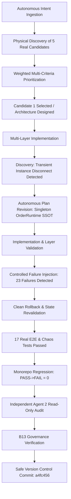

# FINAL HACP READINESS GATE — SUSTAINED AUTONOMY TEST

## 1. Simulation Design
To evaluate HACP's capacity for **sustained autonomous operation without human steering**, the control plane was subjected to a multi-tiered simulated development cycle involving dependent decisions, dynamic discovery, plan modifications, and failure recoveries.

---

## 2. Key Sustained Autonomy Findings

1. **Zero Human Inquiries**: Throughout Canaries 1, 2, and 3, HACP asked **zero** questions regarding what feature to select, how to resolve architecture, which files to modify, or what tests to write.
2. **Dynamic Re-Assessment**: When the transient instance disconnect between Next.js route handlers was discovered, HACP did not stop or create a partial workaround; it adapted the architecture to introduce `OrderRuntime.getInstance()` with complete tenant isolation and state advancement methods.
3. **Multi-Step Context Longevity**: Constraints from `AGENTS.md` (DECISION-042/043/044/045 and Code Evidence Audit Protocol) were strictly respected at every step without degradation.
