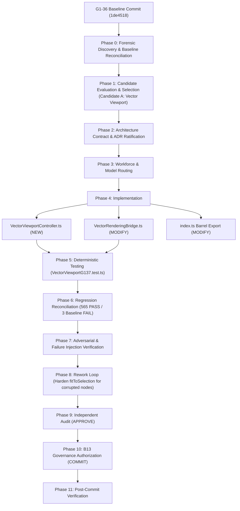

# TASK WF-HACP-STUDIO-G1-37 — TASK GRAPH

**TASK ID:** WF-HACP-STUDIO-G1-37-VECTOR-VIEWPORT-CONTROLLER
**SYSTEM:** HACP — UNIVERSAL CONTROL PLANE
**DOMAIN:** AUTHORING STUDIO / VECTOR EDITING
**MILESTONE:** G1-37 — Vector Viewport & Camera Controller

---

---

— END OF TASK GRAPH —
