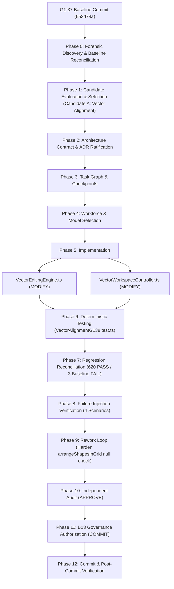

# TASK WF-HACP-STUDIO-G1-38 — TASK GRAPH

**TASK ID:** WF-HACP-STUDIO-G1-38-VECTOR-ALIGNMENT-ENGINE
**SYSTEM:** HACP — UNIVERSAL CONTROL PLANE
**DOMAIN:** AUTHORING STUDIO / VECTOR EDITING
**MILESTONE:** G1-38 — Vector Alignment Engine Expansion

---

---

— END OF TASK GRAPH —
