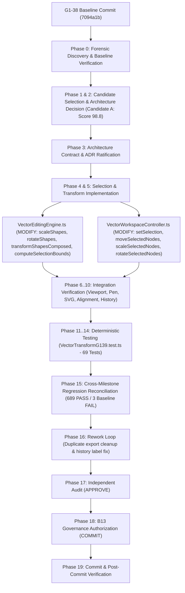

# TASK WF-HACP-STUDIO-G1-39 — TASK GRAPH

**TASK ID:** WF-HACP-STUDIO-G1-39-SELECTION-TRANSFORM-SYSTEM
**SYSTEM:** HACP — UNIVERSAL CONTROL PLANE
**DOMAIN:** AUTHORING STUDIO / VECTOR EDITING
**MILESTONE:** G1-39 — Professional Selection & Transform System

---

---

— END OF TASK GRAPH —
