```mermaid
graph TD
    A["G1-39 Baseline Commit (92d44c9)"] --> B["Phase 0 & 1: Forensic Discovery & Candidate Selection (Candidate A: Score 95.2)"]
    B --> C["Phase 2: Immutable Mission Contract"]
    C --> D["Stage 1: Architecture & Foundations (VectorSnappingEngine.ts)"]
    D --> E["Stage 2: Core Domain & Guide Generation (generateAlignmentGuides)"]
    E --> F1["Phase 7: Controlled Interruption #1 (Recovery & Verification CP-02)"]
    F1 --> F2["Stage 3: Subsystem Integration (VectorWorkspaceController.ts snapping actions)"]
    F2 --> G["Stage 4: Runtime, History & SSOT Isolation (activeGuideLines transient state)"]
    G --> H1["Phase 8: Controlled Interruption #2 (Recovery & Verification CP-04)"]
    H1 --> H2["Phase 9: Real Rework Event (Grid fallback, threshold range, canvas snap isolation)"]
    H2 --> I["Stage 5: Validation, Hardening & Testing (VectorSnappingG140.test.ts - 67 Tests)"]
    I --> J["Phase 12: Regression Reconciliation (756 PASS / 3 Baseline FAIL)"]
    J --> K["Phase 13: Context Retention Audit (PASS)"]
    K --> L["Phase 14: Independent Audit (Agent 2 Read-Only APPROVE)"]
    L --> M["Phase 15: B13 Governance Authorization (COMMIT)"]
    M --> N["Phase 16: Commit & Post-Commit Verification"]
```

# TASK WF-HACP-STUDIO-G1-40 — TASK GRAPH

**TASK ID:** WF-HACP-STUDIO-G1-40-SNAPPING-ENGINE-DYNAMIC-GUIDES
**SYSTEM:** HACP — UNIVERSAL CONTROL PLANE
**MODE:** HACP NIGHT SHIFT TRAINING — LEVEL 2
**MILESTONE:** G1-40 — Vector Snapping Engine & Dynamic Alignment Guides

---

---

— END OF TASK GRAPH —
