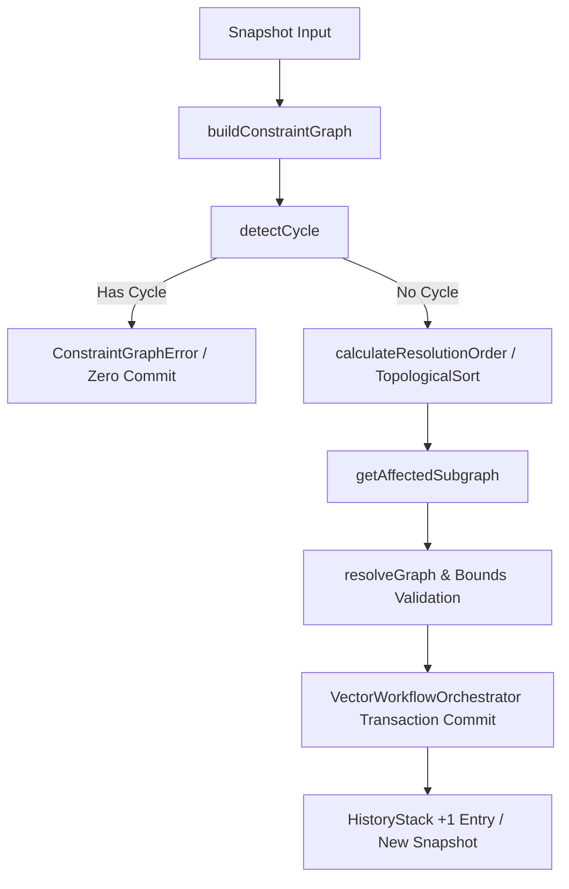

# WF-HACP-STUDIO-G1-51 Task Graph

```mermaid
graph TD
    A[Snapshot Input] --> B[buildConstraintGraph]
    B --> C[detectCycle]
    C -->|Has Cycle| D[ConstraintGraphError / Zero Commit]
    C -->|No Cycle| E[calculateResolutionOrder / TopologicalSort]
    E --> F[getAffectedSubgraph]
    F --> G[resolveGraph & Bounds Validation]
    G --> H[VectorWorkflowOrchestrator Transaction Commit]
    H --> I[HistoryStack +1 Entry / New Snapshot]
```
