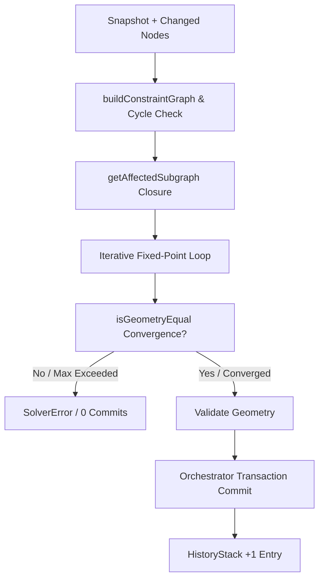

# WF-HACP-STUDIO-G1-52 Task Graph

```mermaid
graph TD
    A[Snapshot + Changed Nodes] --> B[buildConstraintGraph & Cycle Check]
    B --> C[getAffectedSubgraph Closure]
    C --> D[Iterative Fixed-Point Loop]
    D --> E[isGeometryEqual Convergence?]
    E -->|No / Max Exceeded| F[SolverError / 0 Commits]
    E -->|Yes / Converged| G[Validate Geometry]
    G --> H[Orchestrator Transaction Commit]
    H --> I[HistoryStack +1 Entry]
```
