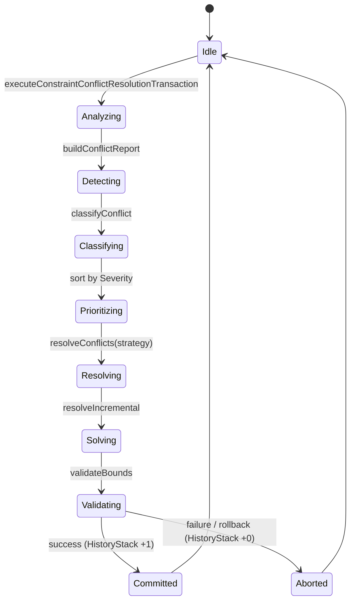

# WF-HACP-STUDIO-G1-53: State Machine Specification

```mermaid
stateDiagram-v2
    [*] --> Idle
    Idle --> Analyzing: executeConstraintConflictResolutionTransaction
    Analyzing --> Detecting: buildConflictReport
    Detecting --> Classifying: classifyConflict
    Classifying --> Prioritizing: sort by Severity
    Prioritizing --> Resolving: resolveConflicts(strategy)
    Resolving --> Solving: resolveIncremental
    Solving --> Validating: validateBounds
    Validating --> Committed: success (HistoryStack +1)
    Validating --> Aborted: failure / rollback (HistoryStack +0)
    Committed --> Idle
    Aborted --> Idle
```
