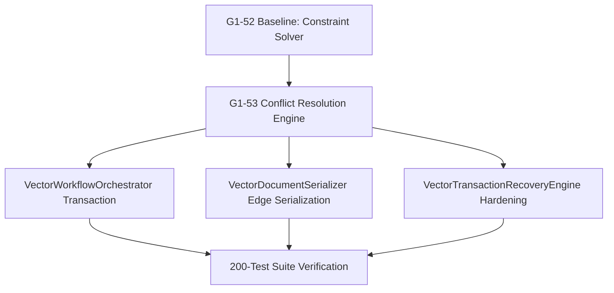

# WF-HACP-STUDIO-G1-53: Task Graph

```mermaid
graph TD
    A[G1-52 Baseline: Constraint Solver] --> B[G1-53 Conflict Resolution Engine]
    B --> C[VectorWorkflowOrchestrator Transaction]
    B --> D[VectorDocumentSerializer Edge Serialization]
    B --> E[VectorTransactionRecoveryEngine Hardening]
    C --> F[200-Test Suite Verification]
    D --> F
    E --> F
```
