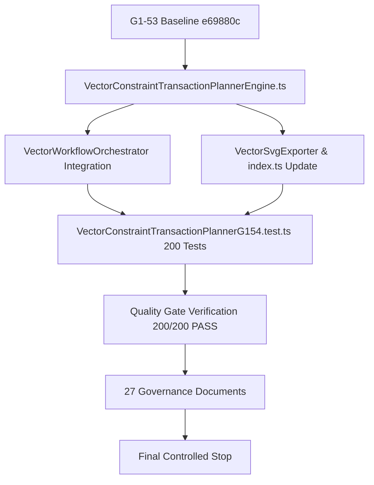

# G1-54 Task Graph

```mermaid
graph TD
    A[G1-53 Baseline e69880c] --> B[VectorConstraintTransactionPlannerEngine.ts]
    B --> C[VectorWorkflowOrchestrator Integration]
    B --> D[VectorSvgExporter & index.ts Update]
    C --> E[VectorConstraintTransactionPlannerG154.test.ts 200 Tests]
    D --> E
    E --> F[Quality Gate Verification 200/200 PASS]
    F --> G[27 Governance Documents]
    G --> H[Final Controlled Stop]
```
