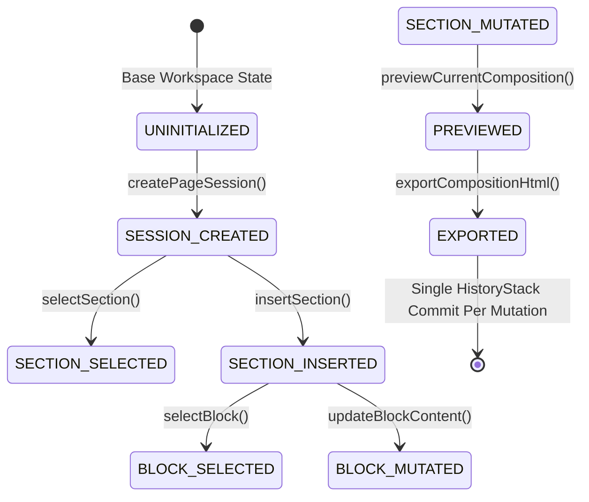

# G1-55 State Machine

```mermaid
stateDiagram-v2
    [*] --> UNINITIALIZED: Base Workspace State
    UNINITIALIZED --> SESSION_CREATED: createPageSession()
    SESSION_CREATED --> SECTION_SELECTED: selectSection()
    SESSION_CREATED --> SECTION_INSERTED: insertSection()
    SECTION_INSERTED --> BLOCK_SELECTED: selectBlock()
    SECTION_INSERTED --> BLOCK_MUTATED: updateBlockContent()
    SECTION_MUTATED --> PREVIEWED: previewCurrentComposition()
    PREVIEWED --> EXPORTED: exportCompositionHtml()
    EXPORTED --> [*]: Single HistoryStack Commit Per Mutation
```
