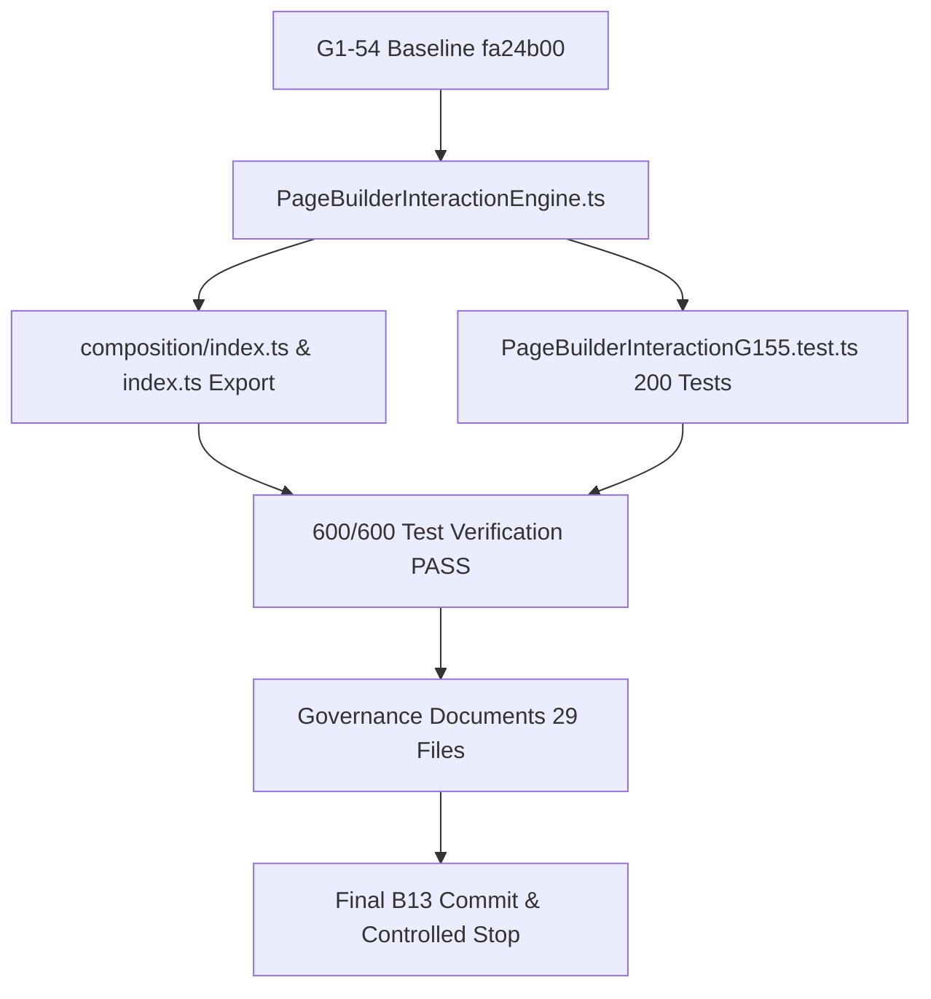

# G1-55 Task Graph

```mermaid
graph TD
    A[G1-54 Baseline fa24b00] --> B[PageBuilderInteractionEngine.ts]
    B --> C[composition/index.ts & index.ts Export]
    B --> D[PageBuilderInteractionG155.test.ts 200 Tests]
    C --> E[600/600 Test Verification PASS]
    D --> E
    E --> F[Governance Documents 29 Files]
    F --> G[Final B13 Commit & Controlled Stop]
```
