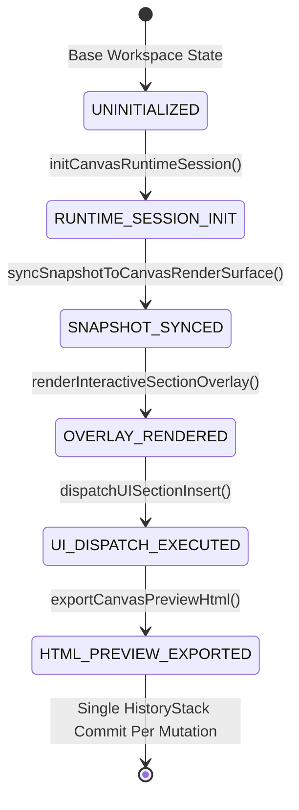

# G1-56 State Machine

```mermaid
stateDiagram-v2
    [*] --> UNINITIALIZED: Base Workspace State
    UNINITIALIZED --> RUNTIME_SESSION_INIT: initCanvasRuntimeSession()
    RUNTIME_SESSION_INIT --> SNAPSHOT_SYNCED: syncSnapshotToCanvasRenderSurface()
    SNAPSHOT_SYNCED --> OVERLAY_RENDERED: renderInteractiveSectionOverlay()
    OVERLAY_RENDERED --> UI_DISPATCH_EXECUTED: dispatchUISectionInsert()
    UI_DISPATCH_EXECUTED --> HTML_PREVIEW_EXPORTED: exportCanvasPreviewHtml()
    HTML_PREVIEW_EXPORTED --> [*]: Single HistoryStack Commit Per Mutation
```
