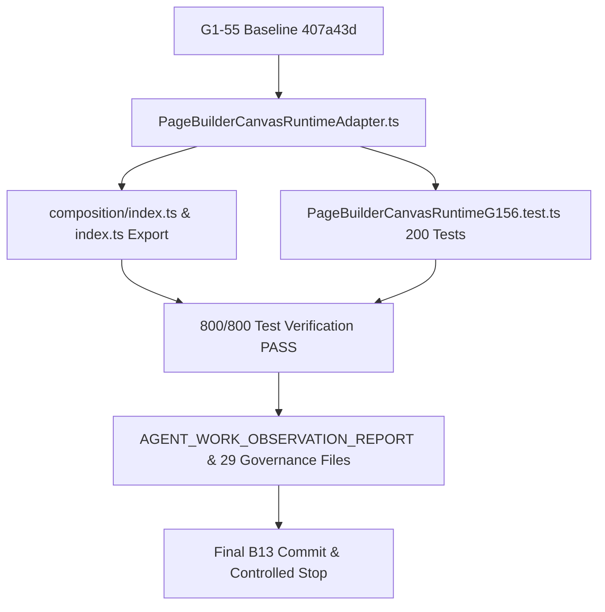

# G1-56 Task Graph

```mermaid
graph TD
    A[G1-55 Baseline 407a43d] --> B[PageBuilderCanvasRuntimeAdapter.ts]
    B --> C[composition/index.ts & index.ts Export]
    B --> D[PageBuilderCanvasRuntimeG156.test.ts 200 Tests]
    C --> E[800/800 Test Verification PASS]
    D --> E
    E --> F[AGENT_WORK_OBSERVATION_REPORT & 29 Governance Files]
    F --> G[Final B13 Commit & Controlled Stop]
```
