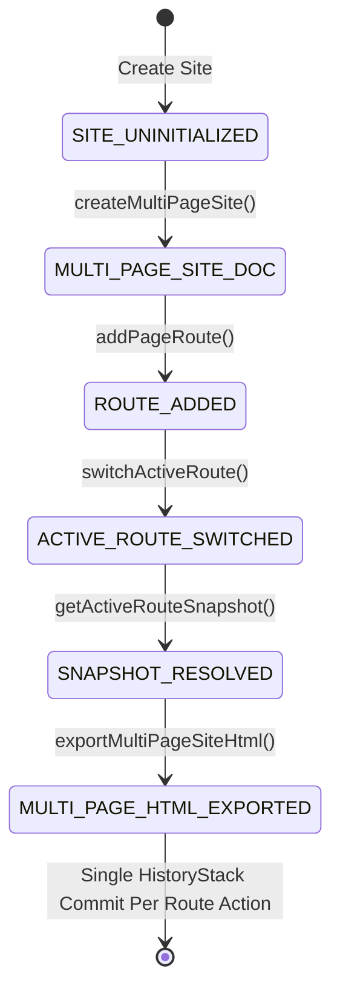

# G1-57 State Machine

```mermaid
stateDiagram-v2
    [*] --> SITE_UNINITIALIZED: Create Site
    SITE_UNINITIALIZED --> MULTI_PAGE_SITE_DOC: createMultiPageSite()
    MULTI_PAGE_SITE_DOC --> ROUTE_ADDED: addPageRoute()
    ROUTE_ADDED --> ACTIVE_ROUTE_SWITCHED: switchActiveRoute()
    ACTIVE_ROUTE_SWITCHED --> SNAPSHOT_RESOLVED: getActiveRouteSnapshot()
    SNAPSHOT_RESOLVED --> MULTI_PAGE_HTML_EXPORTED: exportMultiPageSiteHtml()
    MULTI_PAGE_HTML_EXPORTED --> [*]: Single HistoryStack Commit Per Route Action
```
