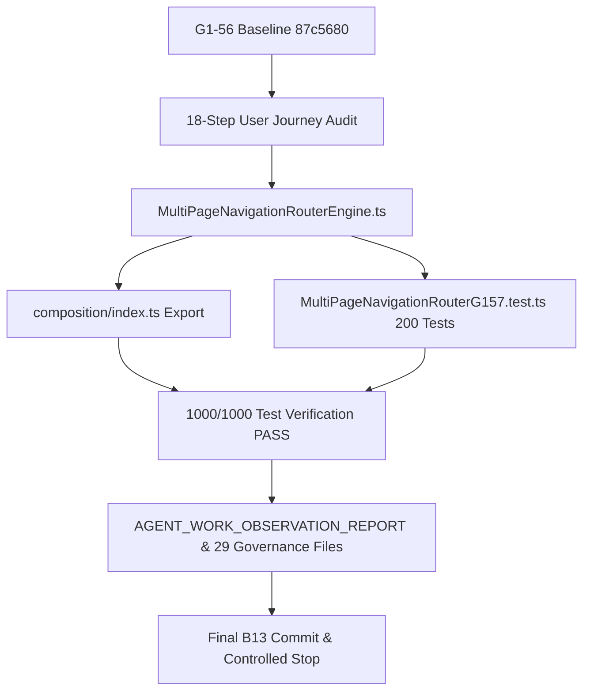

# G1-57 Task Graph

```mermaid
graph TD
    A[G1-56 Baseline 87c5680] --> B[18-Step User Journey Audit]
    B --> C[MultiPageNavigationRouterEngine.ts]
    C --> D[composition/index.ts Export]
    C --> E[MultiPageNavigationRouterG157.test.ts 200 Tests]
    D --> F[1000/1000 Test Verification PASS]
    E --> F
    F --> G[AGENT_WORK_OBSERVATION_REPORT & 29 Governance Files]
    G --> H[Final B13 Commit & Controlled Stop]
```
