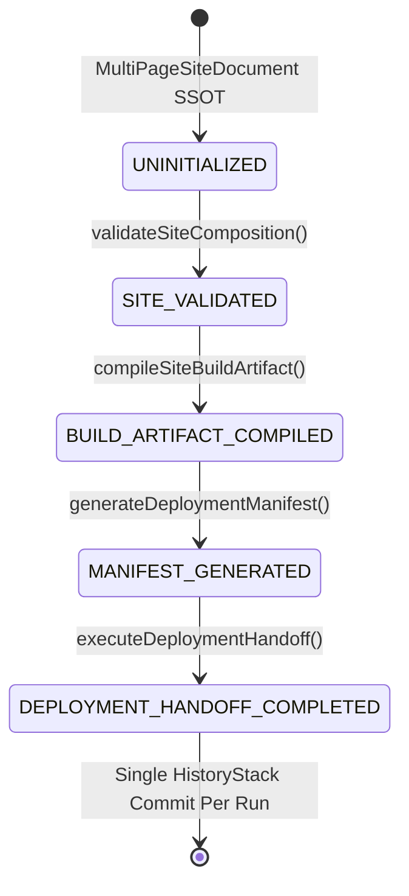

# G1-59 State Machine

```mermaid
stateDiagram-v2
    [*] --> UNINITIALIZED: MultiPageSiteDocument SSOT
    UNINITIALIZED --> SITE_VALIDATED: validateSiteComposition()
    SITE_VALIDATED --> BUILD_ARTIFACT_COMPILED: compileSiteBuildArtifact()
    BUILD_ARTIFACT_COMPILED --> MANIFEST_GENERATED: generateDeploymentManifest()
    MANIFEST_GENERATED --> DEPLOYMENT_HANDOFF_COMPLETED: executeDeploymentHandoff()
    DEPLOYMENT_HANDOFF_COMPLETED --> [*]: Single HistoryStack Commit Per Run
```
