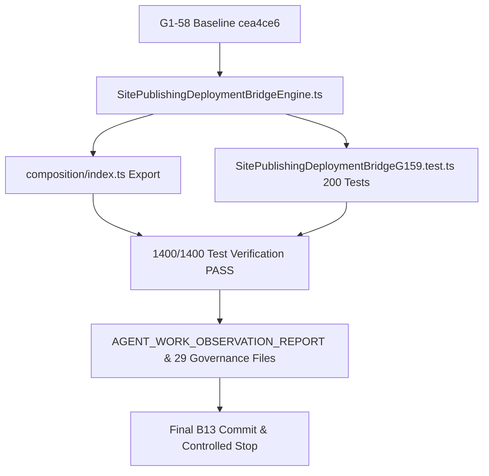

# G1-59 Task Graph

```mermaid
graph TD
    A[G1-58 Baseline cea4ce6] --> B[SitePublishingDeploymentBridgeEngine.ts]
    B --> C[composition/index.ts Export]
    B --> D[SitePublishingDeploymentBridgeG159.test.ts 200 Tests]
    C --> E[1400/1400 Test Verification PASS]
    D --> E
    E --> F[AGENT_WORK_OBSERVATION_REPORT & 29 Governance Files]
    F --> G[Final B13 Commit & Controlled Stop]
```
