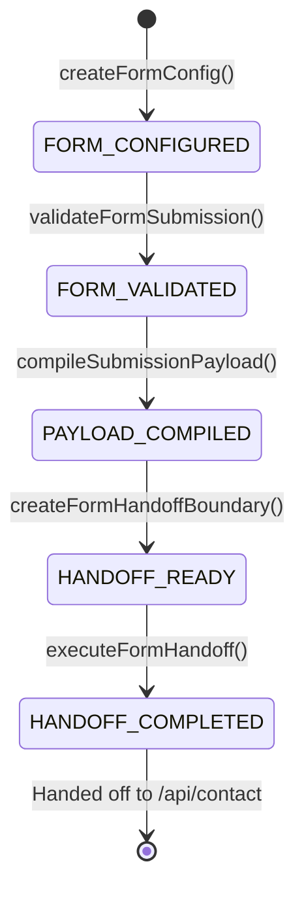

# G1-60 State Machine

```mermaid
stateDiagram-v2
    [*] --> FORM_CONFIGURED: createFormConfig()
    FORM_CONFIGURED --> FORM_VALIDATED: validateFormSubmission()
    FORM_VALIDATED --> PAYLOAD_COMPILED: compileSubmissionPayload()
    PAYLOAD_COMPILED --> HANDOFF_READY: createFormHandoffBoundary()
    HANDOFF_READY --> HANDOFF_COMPLETED: executeFormHandoff()
    HANDOFF_COMPLETED --> [*]: Handed off to /api/contact
```
