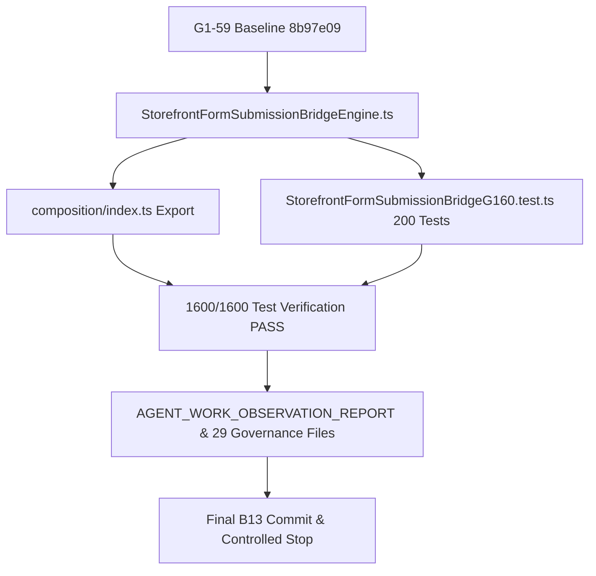

# G1-60 Task Graph

```mermaid
graph TD
    A[G1-59 Baseline 8b97e09] --> B[StorefrontFormSubmissionBridgeEngine.ts]
    B --> C[composition/index.ts Export]
    B --> D[StorefrontFormSubmissionBridgeG160.test.ts 200 Tests]
    C --> E[1600/1600 Test Verification PASS]
    D --> E
    E --> F[AGENT_WORK_OBSERVATION_REPORT & 29 Governance Files]
    F --> G[Final B13 Commit & Controlled Stop]
```
