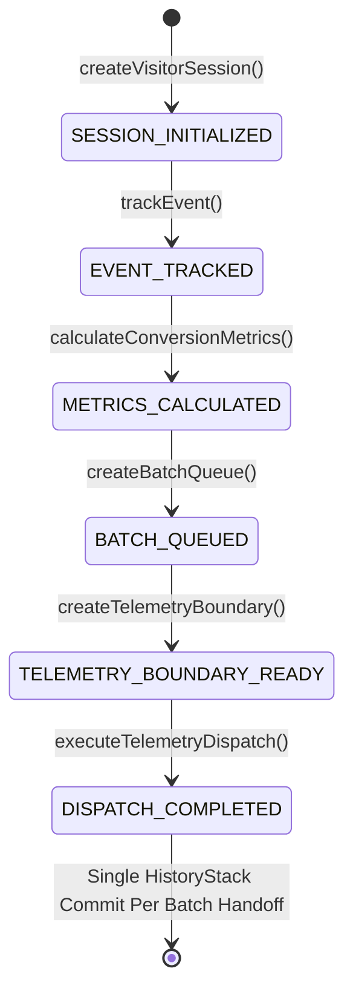

# G1-61 State Machine

```mermaid
stateDiagram-v2
    [*] --> SESSION_INITIALIZED: createVisitorSession()
    SESSION_INITIALIZED --> EVENT_TRACKED: trackEvent()
    EVENT_TRACKED --> METRICS_CALCULATED: calculateConversionMetrics()
    METRICS_CALCULATED --> BATCH_QUEUED: createBatchQueue()
    BATCH_QUEUED --> TELEMETRY_BOUNDARY_READY: createTelemetryBoundary()
    TELEMETRY_BOUNDARY_READY --> DISPATCH_COMPLETED: executeTelemetryDispatch()
    DISPATCH_COMPLETED --> [*]: Single HistoryStack Commit Per Batch Handoff
```
