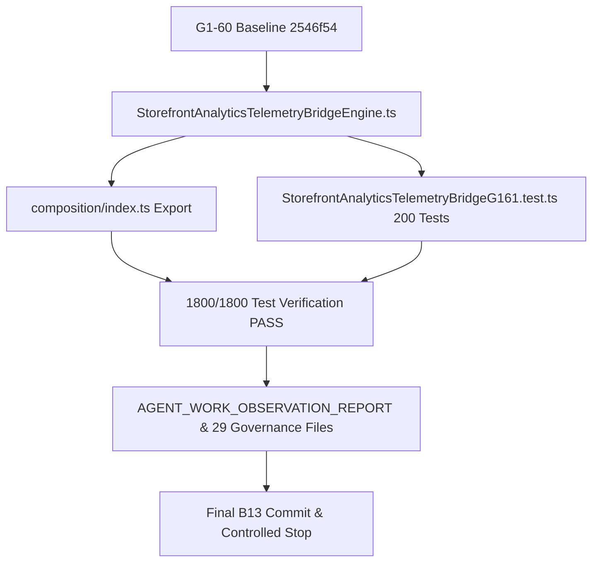

# G1-61 Task Graph

```mermaid
graph TD
    A[G1-60 Baseline 2546f54] --> B[StorefrontAnalyticsTelemetryBridgeEngine.ts]
    B --> C[composition/index.ts Export]
    B --> D[StorefrontAnalyticsTelemetryBridgeG161.test.ts 200 Tests]
    C --> E[1800/1800 Test Verification PASS]
    D --> E
    E --> F[AGENT_WORK_OBSERVATION_REPORT & 29 Governance Files]
    F --> G[Final B13 Commit & Controlled Stop]
```
