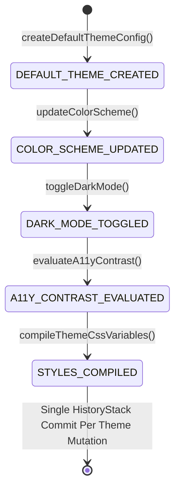

# G1-62 State Machine

```mermaid
stateDiagram-v2
    [*] --> DEFAULT_THEME_CREATED: createDefaultThemeConfig()
    DEFAULT_THEME_CREATED --> COLOR_SCHEME_UPDATED: updateColorScheme()
    COLOR_SCHEME_UPDATED --> DARK_MODE_TOGGLED: toggleDarkMode()
    DARK_MODE_TOGGLED --> A11Y_CONTRAST_EVALUATED: evaluateA11yContrast()
    A11Y_CONTRAST_EVALUATED --> STYLES_COMPILED: compileThemeCssVariables()
    STYLES_COMPILED --> [*]: Single HistoryStack Commit Per Theme Mutation
```
