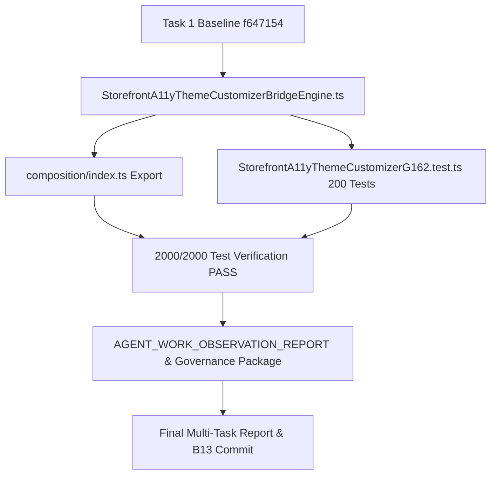

# G1-62 Task Graph

```mermaid
graph TD
    A[Task 1 Baseline f647154] --> B[StorefrontA11yThemeCustomizerBridgeEngine.ts]
    B --> C[composition/index.ts Export]
    B --> D[StorefrontA11yThemeCustomizerG162.test.ts 200 Tests]
    C --> E[2000/2000 Test Verification PASS]
    D --> E
    E --> F[AGENT_WORK_OBSERVATION_REPORT & Governance Package]
    F --> G[Final Multi-Task Report & B13 Commit]
```
