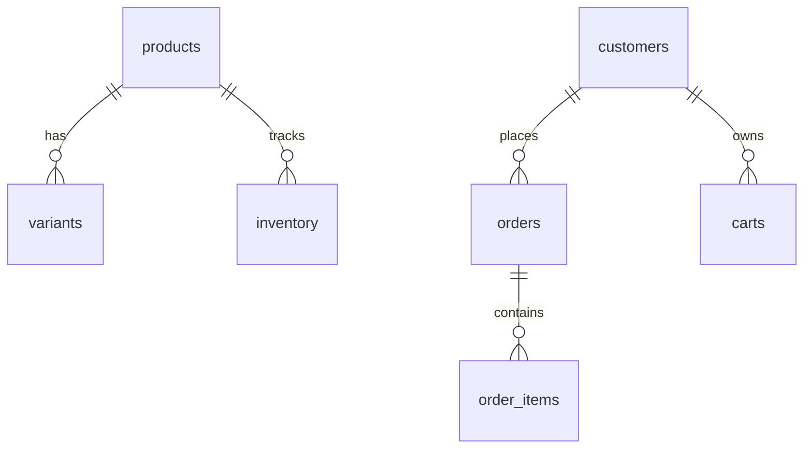

# Database Baseline v1.0

**Epik:** C9 Commerce Persistence  
**Baseline:** v1.0  
**Status:** APPROVED  
**Date:** 2026-07-19  

---

## 1. Schema Overview



---

## 2. Tables

### 2.1 products
| Column | Type | Constraints | Description |
|--------|------|-------------|-------------|
| id | UUID | PK, gen_random_uuid() | Unikalny identyfikator |
| tenant_id | UUID | NOT NULL, RLS | Izolacja tenant |
| slug | TEXT | NOT NULL | URL-friendly nazwa |
| name | TEXT | NOT NULL | Nazwa wyświetlana |
| description | TEXT | NULLABLE | Opis |
| categories | TEXT[] | DEFAULT '{}' | ID kategorii |
| pricing | JSONB | NOT NULL | {priceGross, priceNet, taxRate, currency} |
| inventory | JSONB | NOT NULL | {sku, quantityAvailable, allowBackorder} |
| is_active | BOOLEAN | DEFAULT true | Status publikacji |
| metadata | JSONB | DEFAULT '{}' | Extensibility |
| created_at | TIMESTAMPTZ | DEFAULT now() | |
| updated_at | TIMESTAMPTZ | DEFAULT now() | |

**Indexes:**
- `idx_products_tenant_id` (tenant_id)
- `idx_products_slug` (tenant_id, slug) — unique per tenant
- `idx_products_active` (tenant_id, is_active)

---

### 2.2 variants
| Column | Type | Constraints | Description |
|--------|------|-------------|-------------|
| id | UUID | PK, gen_random_uuid() | |
| product_id | UUID | FK→products.id CASCADE | Parent produkt |
| sku | TEXT | NOT NULL | Stock Keeping Unit |
| price | DECIMAL(10,2) | NOT NULL | Cena w groszach/centach |
| inventory | INTEGER | DEFAULT 0 | Stan magazynowy |
| metadata | JSONB | DEFAULT '{}' | |
| created_at | TIMESTAMPTZ | DEFAULT now() | |
| updated_at | TIMESTAMPTZ | DEFAULT now() | |

**Indexes:**
- `idx_variants_product_id` (product_id)

---

### 2.3 customers
| Column | Type | Constraints | Description |
|--------|------|-------------|-------------|
| id | UUID | PK, gen_random_uuid() | |
| tenant_id | UUID | NOT NULL, RLS | |
| email | TEXT | NOT NULL | |
| name | TEXT | NOT NULL | |
| metadata | JSONB | DEFAULT '{}' | |
| created_at | TIMESTAMPTZ | DEFAULT now() | |
| updated_at | TIMESTAMPTZ | DEFAULT now() | |

**Indexes:**
- `idx_customers_tenant_id` (tenant_id)
- `idx_customers_email` (tenant_id, email) — unique per tenant

---

### 2.4 carts
| Column | Type | Constraints | Description |
|--------|------|-------------|-------------|
| id | UUID | PK, gen_random_uuid() | |
| tenant_id | UUID | NOT NULL, RLS | |
| customer_id | UUID | FK→customers.id CASCADE, NULLABLE | |
| session_id | TEXT | NULLABLE | Anonymous cart |
| items | JSONB | DEFAULT '[]' | [{productId, variantId?, quantity}] |
| created_at | TIMESTAMPTZ | DEFAULT now() | |
| updated_at | TIMESTAMPTZ | DEFAULT now() | |

**Indexes:**
- `idx_carts_tenant_id` (tenant_id)
- `idx_carts_customer_id` (customer_id)
- `idx_carts_session_id` (session_id)

---

### 2.5 orders
| Column | Type | Constraints | Description |
|--------|------|-------------|-------------|
| id | UUID | PK, gen_random_uuid() | |
| tenant_id | UUID | NOT NULL, RLS | |
| customer_id | UUID | FK→customers.id SET NULL | |
| status | TEXT | NOT NULL DEFAULT 'pending' | pending\|paid\|shipped\|completed\|cancelled |
| total | DECIMAL(10,2) | NOT NULL DEFAULT 0 | Kwota brutto |
| metadata | JSONB | DEFAULT '{}' | |
| created_at | TIMESTAMPTZ | DEFAULT now() | |
| updated_at | TIMESTAMPTZ | DEFAULT now() | |

**Indexes:**
- `idx_orders_tenant_id` (tenant_id)
- `idx_orders_customer_id` (customer_id)
- `idx_orders_status` (tenant_id, status)

---

### 2.6 order_items
| Column | Type | Constraints | Description |
|--------|------|-------------|-------------|
| id | UUID | PK, gen_random_uuid() | |
| order_id | UUID | FK→orders.id CASCADE | |
| product_id | UUID | NOT NULL | Ref do products |
| variant_id | UUID | NULLABLE | Ref do variants |
| quantity | INTEGER | NOT NULL | |
| price | DECIMAL(10,2) | NOT NULL | Cena w momencie zamówienia |
| metadata | JSONB | DEFAULT '{}' | |
| created_at | TIMESTAMPTZ | DEFAULT now() | |

**Indexes:**
- `idx_order_items_order_id` (order_id)
- `idx_order_items_product_id` (product_id)

---

### 2.7 inventory
| Column | Type | Constraints | Description |
|--------|------|-------------|-------------|
| product_id | UUID | PK, FK→products.id CASCADE | |
| quantity | INTEGER | NOT NULL DEFAULT 0 | Dostępne |
| reserved | INTEGER | NOT NULL DEFAULT 0 | Zarezerwowane (w koszykach/zamówieniach) |
| created_at | TIMESTAMPTZ | DEFAULT now() | |
| updated_at | TIMESTAMPTZ | DEFAULT now() | |

**Indexes:**
- `idx_inventory_product_id` (product_id)

---

## 3. Row Level Security (RLS)

Wszystkie tabele mają włączone RLS z polityką `tenant_isolation_*` opartą na funkcji `app_current_tenant()`.

```sql
CREATE OR REPLACE FUNCTION app_current_tenant() RETURNS UUID AS $$
  SELECT COALESCE(
    current_setting('app.tenant_id', true)::UUID,
    (auth.jwt() -> 'app_metadata' ->> 'tenant_id')::UUID
  )
$$ LANGUAGE SQL STABLE;
```

**Polityki:**
- `products`: USING (tenant_id = app_current_tenant()) WITH CHECK (tenant_id = app_current_tenant())
- `variants`: USING (EXISTS (SELECT 1 FROM products p WHERE p.id = variants.product_id AND p.tenant_id = app_current_tenant()))
- `customers`: USING (tenant_id = app_current_tenant())
- `carts`: USING (tenant_id = app_current_tenant())
- `orders`: USING (tenant_id = app_current_tenant())
- `order_items`: USING (EXISTS (SELECT 1 FROM orders o WHERE o.id = order_items.order_id AND o.tenant_id = app_current_tenant()))
- `inventory`: USING (EXISTS (SELECT 1 FROM products p WHERE p.id = inventory.product_id AND p.tenant_id = app_current_tenant()))

---

## 4. Migrations

| Plik | Opis |
|------|------|
| `001_commerce_schema.sql` | Całe powyższe schema + RLS |

Lokalizacja: `packages/commerce-persistence/src/migrations/001_commerce_schema.sql`

---

## 5. Rollback Strategy

Każda migracja musi mieć sekcję `-- DOWN` (opcjonalnie w osobnym pliku `.down.sql`).

```sql
-- 001_commerce_schema.down.sql
DROP POLICY IF EXISTS tenant_isolation_inventory ON inventory;
DROP POLICY IF EXISTS tenant_isolation_order_items ON order_items;
DROP POLICY IF EXISTS tenant_isolation_orders ON orders;
DROP POLICY IF EXISTS tenant_isolation_carts ON carts;
DROP POLICY IF EXISTS tenant_isolation_customers ON customers;
DROP POLICY IF EXISTS tenant_isolation_variants ON variants;
DROP POLICY IF EXISTS tenant_isolation_products ON products;

DROP TABLE IF EXISTS inventory;
DROP TABLE IF EXISTS order_items;
DROP TABLE IF EXISTS orders;
DROP TABLE IF EXISTS carts;
DROP TABLE IF EXISTS customers;
DROP TABLE IF EXISTS variants;
DROP TABLE IF EXISTS products;

DROP FUNCTION IF EXISTS app_current_tenant();
```

---

## 6. Naming Conventions

| Element | Konwencja |
|---------|-----------|
| Tables | snake_case, plural (products, order_items) |
| Columns | snake_case (tenant_id, created_at) |
| PK | id (UUID) |
| FK | {table}_id (product_id, order_id) |
| Indexes | idx_{table}_{column(s)} |
| Policies | tenant_isolation_{table} |
| Functions | app_{name} (prefix `app_` dla custom) |

---

## 6. Extensibility

- `metadata JSONB` na każdej tabeli dla custom fields bez migracji
- `pricing` / `inventory` jako JSONB w `products` — szybkie query bez JOIN
- RLS policies opierają się na `app_current_tenant()` — kompatybilne z Supabase Auth i custom JWT

---

## 7. Wersja dokumentu

| Wersja | Data | Zmiany |
|--------|------|--------|
| 1.0 | 2026-07-19 | C9 Commerce Persistence — Database Baseline |