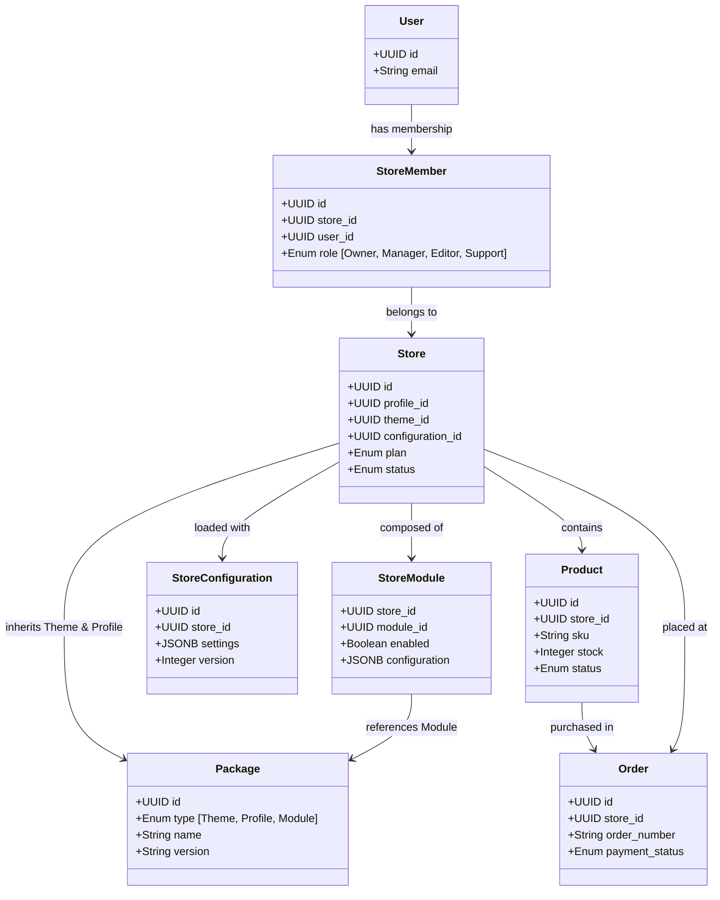

# SPRINT 0: DISCOVERY
## Zadanie 4 — Database v2 (Domain Model & ERD)
*Fundamentalny model danych platformy WEB FACTOR, odzwierciedlający architekturę Single Engine Architecture (SEA). Zaimplementowano Database Principle #1: The database models the platform, not the current UI.*

---

### 1. Domain Model Hierarchy



---

### 2. Entity Specifications (ERD v1.1)

#### 2.1 Core Identity & Access Control (MVP)
* **`users`** (Zarządzane przez Supabase Auth)
* **`store_members`** (Przypisanie personelu do instancji sklepu)
  * `id` (UUID, PK)
  * `store_id` (UUID, FK -> stores)
  * `user_id` (UUID, FK -> users)
  * `role` (Enum: `owner`, `manager`, `editor`, `support`)
  * `created_at` (Timestamp)

#### 2.2 Provisioning & Core Tenants (MVP)
* **`stores`** (Tenant Instancy)
  * `id` (UUID, PK)
  * `profile_id` (UUID, FK -> packages.id)
  * `theme_id` (UUID, FK -> packages.id)
  * `configuration_id` (UUID, FK -> store_configurations.id)
  * `status` (Enum: `active`, `suspended`, `pending_provision`)
  * `plan` (Enum: `start`, `grow`, `scale`)
  * `runtime_version` (String, np. '1.0.0') -- Do celów aktualizacji silnika
  * `created_at` (Timestamp)
  * `updated_at` (Timestamp)
  * `deleted_at` (Timestamp, NULL by default for soft delete)

* **`store_configurations`** (Wersjonowane ustawienia sklepu - branding, SEO, dane firmy)
  * `id` (UUID, PK)
  * `store_id` (UUID) -- Note: Circular FK resolved in runtime
  * `settings` (JSONB - paleta kolorów HSL, fonty, SEO tags, domeny)
  * `version` (Integer, default 1)
  * `configuration_schema_version` (String, np. '1.0') -- Ułatwienie przyszłych migracji danych
  * `created_at` (Timestamp)
  * `updated_at` (Timestamp)

#### 2.3 Package & Extensibility System (MVP)
* **`packages`** (Metarepozytorium silnika)
  * `id` (UUID, PK)
  * `type` (Enum: `theme`, `profile`, `module`, `integration`, `workflow`, `capability`, `language`, `ai_agent`) -- Model gotowy na rozszerzenia
  * `name` (String, np. 'Fashion Premium')
  * `version` (String, np. '1.0.0')
  * `status` (Enum: `active`, `deprecated`)
  * `engine_version` (String) -- Określa wersję silnika wymaganą przez pakiet
  * `manifest` (JSONB - definiuje zależności i wymagane capabilities)
  * `created_at` (Timestamp)

* **`store_modules`** (Integracje i capabilities włączane na żądanie)
  * `store_id` (UUID, PK, FK -> stores)
  * `module_id` (UUID, PK, FK -> packages.id)
  * `enabled` (Boolean, default false)
  * `installed_version` (String) -- Aktualna wersja zainstalowanego modułu w sklepie
  * `configuration` (JSONB - np. klucze API dla modułu InPost)
  * `created_at` (Timestamp)
  * `updated_at` (Timestamp)

#### 2.4 Commerce Entities (MVP)
* **`products`**
  * `id` (UUID, PK)
  * `store_id` (UUID, FK -> stores)
  * `sku` (String, UNIQUE per store)
  * `slug` (String, UNIQUE per store) -- Wymóg SEO
  * `name` (String)
  * `price` (Decimal)
  * `currency` (String, np. 'PLN')
  * `description` (Text)
  * `image_url` (String)
  * `stock` (Integer, default 0)
  * `status` (Enum: `draft`, `published`, `archived`)
  * `visibility` (Boolean, default true)
  * `created_at` (Timestamp)
  * `updated_at` (Timestamp)

* **`orders`**
  * `id` (UUID, PK)
  * `store_id` (UUID, FK -> stores)
  * `order_number` (String, UNIQUE, np. 'ORDER-2026-0001')
  * `customer_email` (String)
  * `total_amount` (Decimal)
  * `currency` (String)
  * `payment_provider` (String, np. '1koszyk', 'stripe') -- Bramka obsługująca transakcję
  * `payment_status` (Enum: `unpaid`, `paid`, `refunded`)
  * `fulfillment_status` (Enum: `pending`, `processing`, `shipped`, `delivered`, `cancelled`)
  * `created_at` (Timestamp)
  * `updated_at` (Timestamp)

#### 2.5 Administration & Operations (Future)
* **`subscriptions`** (Subskrypcje B2B partnerów)
* **`support_tickets`** (Obsługa zgłoszeń)
* **`audit_logs`** (Logowanie krytycznych zmian konfiguracyjnych - Event Sourcing Friendly)

---

### 3. Role-Based Row Level Security (RLS)
Wyeliminowano bezpośrednie wiązanie RLS wyłącznie do jednego pola `owner_id`. Dostęp do danych w panelu administracyjnym zależy teraz od ról zdefiniowanych w `store_members`.

1. **Polityka `stores` (Odczyt i Zapis):**
   ```sql
   CREATE POLICY "Zezwól członkom sklepu na dostęp" ON stores
   FOR ALL USING (
     EXISTS (
       SELECT 1 FROM store_members 
       WHERE store_members.store_id = id 
       AND store_members.user_id = auth.uid()
     )
   );
   ```
2. **Polityka `products` & `orders` (Dostęp operacyjny):**
   - Członkowie z rolami (`owner`, `manager`, `editor`, `support`) mogą odczytywać zamówienia.
   - Modyfikacja produktów dozwolona wyłącznie dla ról (`owner`, `manager`, `editor`).
   - RLS weryfikuje przynależność za pomocą zapytania złączeniowego do `store_members`.
3. **Polityka `products` (Dostęp publiczny dla klientów końcowych):**
   - Zezwala na odczyt (`SELECT`) publiczny dla niezalogowanych użytkowników tylko wtedy, gdy stan sklepu w tabeli `stores` ma wartość `status = active` a sam produkt posiada `status = published` i `visibility = true`.

---

### 4. Architecture Notes & Future Recommendations (Approved 2026-07-09)
* **Zasada No-Direct-Themes:** Usunięto tabele `themes` i `store_profiles`. Jedynym źródłem prawdy dla wszystkich rozszerzeń silnika jest tabela `packages` (type system).
* **Zasada No-AdHoc-DB-Edits:** Zabrania się dodawania nowych tabel lub pól bazodanowych po Documentation Freeze v1.0 bez formalnego przejścia przez proces ADR (Architecture Decision Record).
* **Event Sourcing Ready:** Tabela `audit_logs` w fazie [Future] musi zostać zaprojektowana jako append-only log, przechowujący pełne stany obiektów w celach audytowych i ułatwienia odtwarzania błędów.
