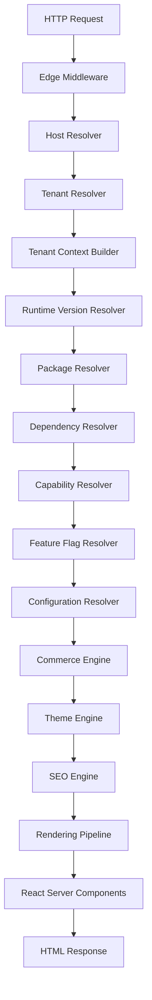

# SPRINT 1: FOUNDATION IMPLEMENTATION
## Zadanie 1 — Platform Core Architecture
*Serce platformy WEB FACTOR: Pełny Runtime Pipeline obsługi żądania HTTP od przeglądarki klienta do wygenerowania kodu HTML.*

---

### 1. Pełny Runtime Pipeline (End-to-End Execution Sequence)

Każde żądanie przychodzące do platformy WEB FACTOR przechodzi przez następujący, ściśle zdefiniowany potok wykonawczy:



---

### 2. Opis Kroków w Potoku (Pipeline Steps Details)

1. **HTTP Request:** Żądanie przesyłane z przeglądarki użytkownika.
2. **Edge Middleware:** Logika wykonywana najbliżej klienta (Vercel Edge) filtrująca i normalizująca nagłówki.
3. **Host Resolver:** Identyfikacja domeny lub subdomeny z nagłówka `Host`.
4. **Tenant Resolver:** Wyszukiwanie identyfikatora sklepu (`store_id`) przypisanego do danej domeny w bazie Supabase (z cache na poziomie brzegu sieci).
5. **Tenant Context Builder:** Budowanie bezpiecznego obiektu `TenantContext` i przekazanie go w nagłówkach żądania (`x-store-id`, itp.).
6. **Runtime Version Resolver:** Odczyt wersji runtime sklepu w celu dopasowania właściwej wersji silnika.
7. **Package Resolver:** Ładowanie zadeklarowanych motywów, profilu branżowego oraz modułów dodatkowych.
8. **Dependency Resolver:** Walidacja zależności między wybranymi pakietami i modułami.
9. **Capability Resolver:** Tłumaczenie aktywnych pakietów na zestaw możliwości technicznych (np. `features.hasSizes = true`).
10. **Feature Flag Resolver:** Nakładanie specyficznych flag włączanych przez administratora lub w ramach testów A/B.
11. **Configuration Resolver:** Odczyt parametrów konfiguracyjnych sklepu (metody płatności, dane kontaktowe, waluta).
12. **Commerce Engine:** Główna, bezstanowa logika koszyka, produktów, cenników i zamówień.
13. **Theme Engine:** Dynamiczne generowanie zmiennych CSS na podstawie parametrów brandingu.
14. **SEO Engine:** Generowanie nagłówków meta, Open Graph oraz tagów indeksowania wyszukiwarek.
15. **Rendering Pipeline:** Proces dynamicznego łączenia struktury podstrony z wybranymi komponentami.
16. **React Server Components (RSC):** Renderowanie komponentów po stronie serwera przy zerowym narzucie JS po stronie klienta.
17. **HTML Response:** Wysłanie gotowego, zoptymalizowanego dokumentu HTML do przeglądarki użytkownika.

---

### 3. Ścieżki Obsługi Błędów (Failure Paths)

Błędy na dowolnym etapie potoku są obsługiwane w sposób przewidywalny i bezpieczny:

| Etap Awarii | Objaw / Przyczyna | Ścieżka Awaryjna (Failure Path / Fallback) |
| :--- | :--- | :--- |
| **Tenant Resolve** | Brak domeny w bazie danych | Przekierowanie do systemowej strony **404 Store Not Found** |
| **Package Resolve** | Brak zadeklarowanego pakietu w bazie | Załadowanie bazowego pakietu systemowego (**Fallback Core**) |
| **Capability Resolve** | Brak wymaganej capabilities | Wyłączenie danej funkcji w interfejsie (**Disable Feature**) |
| **Theme Resolve** | Błąd ładowania stylów motywu | Wstrzyknięcie domyślnego motywu systemowego (**Default Theme**) |
| **Version Resolve** | Niezgodność wersji runtime | Uruchomienie warstwy wstecznej kompatybilności (**Compatibility Layer**) |

---

### 4. Budżet Wydajnościowy (Performance Budget)

Aby sprostać wymaganiom czasu ładowania i SEO, definiujemy rygorystyczny budżet wydajnościowy dla każdego kroku w środowisku ciepłym (Warm Start):

| Etap Potoku | Maksymalne Opóźnienie (P95) | Uwagi |
| :--- | :---: | :--- |
| **Edge Middleware & Host Resolve** | `< 5 ms` | Czysta operacja na nagłówkach i routing |
| **Tenant & Configuration Resolve** | `< 15 ms` | Wykorzystanie cache na brzegu sieci (Redis / Cloudflare KV) |
| **Package & Capability Resolve** | `< 10 ms` | Bezstanowe parsowanie manifestów z cache |
| **Theme & SEO Resolve** | `< 5 ms` | Generowanie stylów HSL i metatagów w pamięci |
| **React Server Components (Render)** | `< 80 ms` | Końcowa generacja kodu HTML |
| **Razem (Server-Side Latency)** | **`< 115 ms`** | Cel dla czasu do pierwszego bajtu (TTFB) |

---

### 5. Obserwowalność (Observability & Event Timeline)

Każde przetworzone żądanie musi emitować ustandaryzowane zdarzenia telemetryczne w celu ułatwienia monitorowania wydajności i debugowania:

```text
[Request Start] 
   │
   ├── event: TenantResolved (store_id, resolved_host)
   ├── event: RuntimeLoaded (runtime_version)
   ├── event: PackagesLoaded (active_packages_count, unresolved_dependencies)
   ├── event: CapabilitiesResolved (active_capabilities_list)
   ├── event: StoreRendered (render_duration_ms)
   │
[Request Completed] ──► event: RequestCompleted (http_status, total_duration_ms)
```
Zdarzenia te są przesyłane asynchronicznie do systemu analitycznego (PostHog / Axiom) bez blokowania wątku renderującego.
