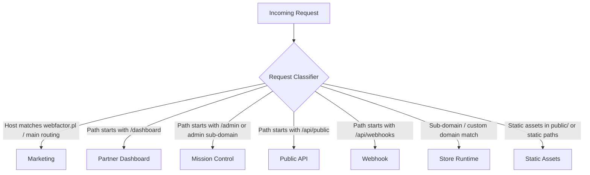
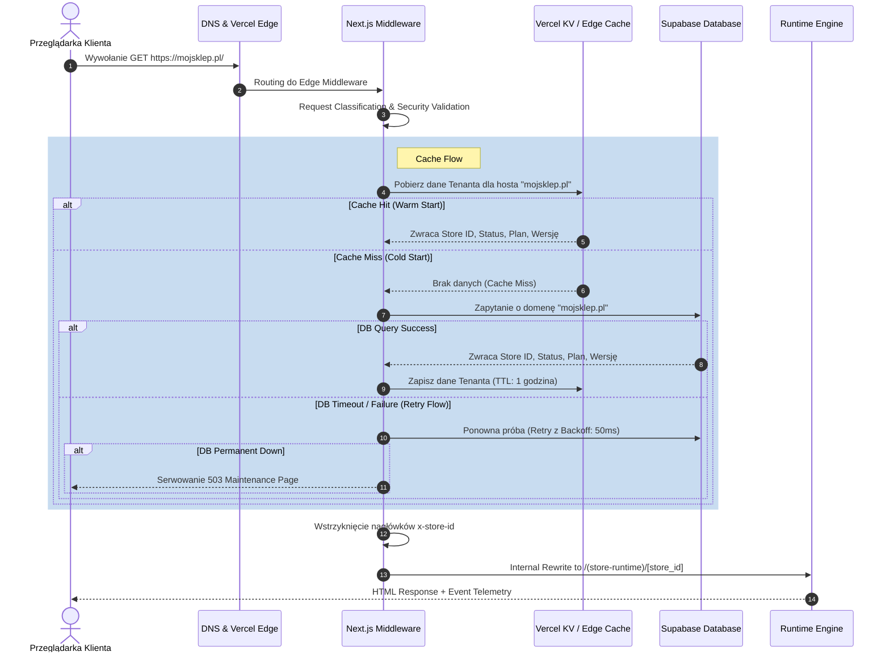

# SPRINT 1: FOUNDATION IMPLEMENTATION
## Zadanie 2 — Runtime Request Flow
*Szczegółowy proces obsługi żądania sieciowego na poziomie środowiska uruchomieniowego platformy WEB FACTOR.*

---

### 1. Request Classification (Klasyfikacja Żądań)

Każde przychodzące do serwera żądanie HTTP jest klasyfikowane na samym wejściu w Edge Middleware. Zapobiega to zgadywaniu i niejednoznaczności na dalszych etapach potoku wykonawczego.



---

### 2. Runtime Flow Chart & Sequence



---

### 3. Context Propagation (Propagacja Kontekstu)

Aby zapobiec wielokrotnemu odpytywaniu bazy danych lub parsowaniu tych samych parametrów w obrębie jednego żądania, obiekt `TenantContext` jest propagowany jednokierunkowo przez cały cykl życia żądania:

```text
  Middleware (Ekstrakcja i detekcja hosta)
     │
     ▼
  TenantContext (Utworzenie i walidacja)
     │
     ▼
  Request Context (Wstrzyknięcie do nagłówków HTTP / Edge Context)
     │
     ▼
  Server Components (RSC - odczyt przez Server Helper / React cache)
     │
     ▼
  Server Actions (Przekazanie kontekstu do akcji mutujących)
     │
     ▼
  API (Wykorzystanie kontekstu w routingu API)
     │
     ▼
  Logs & Observability (Propagacja ID żądania i ID tenanta do logów telemetrycznych)
```

---

### 4. Zasady Unieważniania Pamięci Podręcznej (Cache Invalidation Rules)

Dynamiczne cache'owanie wymaga jasnych reguł czyszczenia (inwalidacji) po zmianie stanu w bazie danych, aby zapobiec serwowaniu nieaktualnych danych:

| Zmiana w Systemie | Wyzwalacz (Trigger) | Cache do Wyczyszczenia (Invalidation Scope) |
| :--- | :--- | :--- |
| Zmiana stylistyki / loga | Aktualizacja w `store_configurations` (Branding) | **Theme Cache** |
| Edycja karty produktu | Aktualizacja rekordu w tabeli `products` | **Product Cache** |
| Zmiana domeny / waluty | Aktualizacja w `store_configurations` (Settings) | **Tenant Cache** (Host-to-Store-ID mapping) |
| Włączenie nowej capabilities | Dodanie rekordu w `store_modules` | **Runtime Cache** (Capabilities list) |
| Aktualizacja pakietu | Zmiana wersji pakietu w `packages` | **Package Cache** (Dependency tree) |

---

### 5. Runtime Events Sequence (Potok Zdarzeń Telemetrii)

Każde żądanie emituje zdarzenia w ściśle określonej kolejności, stanowiąc podstawę dla systemu telemetrycznego:

```text
RequestStarted
   │
   ├──► TenantResolved (Powiązanie domeny z ID tenanta)
   │
   ├──► RuntimeLoaded (Załadowanie właściwej wersji silnika)
   │
   ├──► CapabilitiesResolved (Wyliczenie możliwości technicznych)
   │
   ├──► RenderingStarted (Rozpoczęcie renderowania komponentów)
   │
   ├──► RenderingCompleted (Zakończenie renderowania drzewa RSC)
   │
[ResponseSent] (Wysłanie gotowego HTML i zakończenie telemetrii żądania)
```
Zdarzenia te mają zdefiniowany interfejs i są asynchronicznie przesyłane do analityki platformy.
