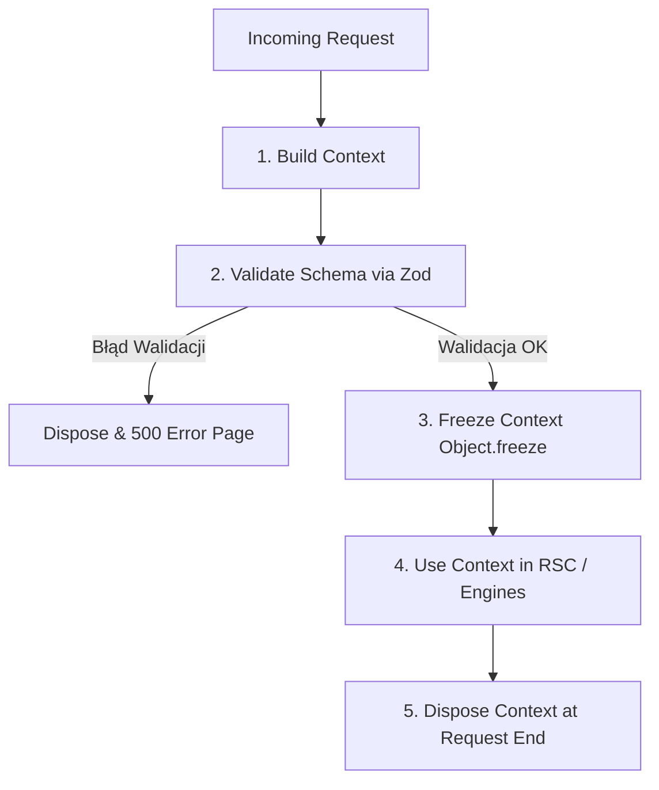

# SPRINT 1: FOUNDATION IMPLEMENTATION
## Zadanie 3 — Tenant Context Specification
*Oficjalny kontrakt techniczny obiektu TenantContext stanowiący jądro informacyjne dla każdego żądania w platformie WEB FACTOR.*

---

### 1. Definicja Kontraktu TypeScript (API Interface)

Obiekt `TenantContext` jest zamrożonym, kompletnym migawkowym stanem sklepu w czasie przetwarzania pojedynczego żądania.

```typescript
export interface TenantContext {
  // ==========================================
  // Core Identifiers & Plan
  // ==========================================
  /** Unikalny identyfikator instancji sklepu (UUID) */
  readonly store_id: string;
  /** Unikalny identyfikator tekstowy (subdomena/slug) */
  readonly slug: string;
  /** Poziom abonamentu (start, grow, scale). Używany wyłącznie do walidacji limitów */
  readonly plan: 'start' | 'grow' | 'scale';
  /** Status operacyjny sklepu */
  readonly status: 'active' | 'suspended' | 'pending_provision';

  // ==========================================
  // Runtime Metadata
  // ==========================================
  readonly metadata: {
    /** Wersja silnika runtime aktualnie obsługującego to żądanie */
    readonly runtimeVersion: string;
    /** Wersja schematu konfiguracji zapisanej w bazie danych */
    readonly schemaVersion: string;
    /** Bazowa wersja silnika core platformy */
    readonly engineVersion: string;
    /** Identyfikator buildu produkcyjnego dla celów debugowania i cache */
    readonly buildVersion: string;
  };

  // ==========================================
  // Cache Metadata
  // ==========================================
  readonly cache: {
    /** Klucz pod jakim kontekst leży w pamięci cache KV */
    readonly cacheKey: string;
    /** Czas życia cache (TTL) w sekundach */
    readonly cacheTTL: number;
    /** Znacznik czasu ostatniego pobrania z bazy danych */
    readonly lastRefresh: string;
    /** Unikalny etag wyliczony dla zawartości konfiguracji sklepu */
    readonly etag: string;
  };

  // ==========================================
  // Capability Snapshot
  // ==========================================
  readonly capabilities: {
    /** Zbiór aktywnych możliwości technicznych (np. "B2B_Pricing", "HasSizes") */
    readonly capabilities: string[];
    /** Lista uprawnień operacyjnych aktualnie zalogowanego użytkownika */
    readonly permissions: Array<'owner' | 'manager' | 'editor' | 'support' | 'guest'>;
    /** Aktywne flagi funkcjonalności (Feature Flags) włączone dla tego tenanta */
    readonly featureFlags: string[];
    /** Identyfikatory włączonych pakietów z tabeli packages (np. ["fashion_theme", "inpost_mod"]) */
    readonly enabledPackages: string[];
    /** Aktywne moduły w runtime sklepu (typ, wersja i stan włączenia) */
    readonly runtimeModules: Array<{ id: string; version: string; enabled: boolean }>;
  };

  // ==========================================
  // Mutable Configuration Data
  // ==========================================
  /** Motyw graficzny przypisany do sklepu */
  readonly theme: {
    readonly id: string;
    readonly version: string;
  };

  /** Profil branżowy sklepu */
  readonly profile: {
    readonly id: string;
    readonly version: string;
  };

  /** Ustrukturyzowana konfiguracja sklepu (branding, lokalizacja, SEO) */
  readonly configuration: {
    readonly branding: {
      readonly logo_url?: string;
      readonly primary_color_hsl: string;
      readonly secondary_color_hsl: string;
      readonly font_family: string;
      readonly border_radius: string;
    };
    readonly seo: {
      readonly meta_title_suffix: string;
      readonly meta_description_default: string;
      readonly og_image_default?: string;
    };
    readonly localization: {
      readonly currency: string;
      readonly locale: string;
      readonly timezone: string;
    };
  };
}
```

---

### 2. Mutowalność Pól w Czasie Rzeczywistym (Immutable vs Mutable)

Wszystkie pola w obiekcie `TenantContext` w runtime są oznaczone słowem kluczowym `readonly`. Poniższa tabela określa, które wartości mogą być modyfikowane przez użytkownika za pośrednictwem paneli i baz danych, a które pozostają niezmienne (stałe) przez cały cykl życia sklepu:

| Pole | Mutowalność (Mutable) | Opis |
| :--- | :---: | :--- |
| **`store_id`** | ❌ | Stały identyfikator bazy danych przydzielany przy utworzeniu sklepu. |
| **`slug`** | ❌ | Stała subdomena systemowa; zmiana wymaga asysty administratora. |
| **`runtimeVersion`**| ❌ | Zarządzane automatycznie przez system aktualizacji floty platformy. |
| **`theme`** | ✅ | Zmiana motywu w panelu Partnera modyfikuje ten wpis. |
| **`branding`** | ✅ | Kolory, logotyp i fonty są w pełni mutowalne przez Partnera. |
| **`capabilities`** | ✅ | Zmiana modułów dodatkowych lub planu zmienia aktywne możliwości. |
| **`configuration`**| ✅ | Ustawienia regionalne, SEO i dane firmy są edytowalne. |

---

### 3. Cykl Życia Kontekstu (Context Lifecycle)

Obiekt kontekstu podlega ścisłemu, jednokierunkowemu przepływowi bez możliwości manipulowania nim po utworzeniu:



1. **Build Context:** Edge Middleware wyciąga dane z cache/DB i konstruuje bazowy obiekt JSON.
2. **Validate Schema:** Obiekt jest weryfikowany przez schemat `TenantContextSchema` (Zod).
3. **Freeze Context:** Obiekt przechodzi przez głębokie zamrożenie (`Object.freeze()`), gwarantując immutability.
4. **Use Context:** Kontekst jest przekazywany w dół do Server Components, Commerce Engine i Theme Engine. Żaden komponent nie może go zmienić ani dopisać pól.
5. **Dispose Context:** Po wysłaniu odpowiedzi do przeglądarki obiekt jest usuwany przez garbage collector.

---

### 4. Specyfikacja Walidacji Zod (Zod Schema Validation)

```typescript
import { z } from 'zod';

export const TenantContextSchema = z.object({
  store_id: z.string().uuid(),
  slug: z.string().regex(/^[a-z0-9-]+$/),
  plan: z.enum(['start', 'grow', 'scale']),
  status: z.enum(['active', 'suspended', 'pending_provision']),
  
  metadata: z.object({
    runtimeVersion: z.string(),
    schemaVersion: z.string(),
    engineVersion: z.string(),
    buildVersion: z.string()
  }),

  cache: z.object({
    cacheKey: z.string(),
    cacheTTL: z.number().nonnegative(),
    lastRefresh: z.string().datetime(),
    etag: z.string()
  }),

  capabilities: z.object({
    capabilities: z.array(z.string()),
    permissions: z.array(z.enum(['owner', 'manager', 'editor', 'support', 'guest'])),
    featureFlags: z.array(z.string()),
    enabledPackages: z.array(z.string()),
    runtimeModules: z.array(z.object({
      id: z.string(),
      version: z.string(),
      enabled: z.boolean()
    }))
  }),

  theme: z.object({
    id: z.string(),
    version: z.string()
  }),

  profile: z.object({
    id: z.string(),
    version: z.string()
  }),

  configuration: z.object({
    branding: z.object({
      logo_url: z.string().url().optional(),
      primary_color_hsl: z.string().regex(/^hsl\(\d+,\s*\d+%\,\s*\d+%\)$/),
      secondary_color_hsl: z.string().regex(/^hsl\(\d+,\s*\d+%\,\s*\d+%\)$/),
      font_family: z.string(),
      border_radius: z.string()
    }),
    seo: z.object({
      meta_title_suffix: z.string(),
      meta_description_default: z.string(),
      og_image_default: z.string().url().optional()
    }),
    localization: z.object({
      currency: z.string().length(3),
      locale: z.string(),
      timezone: z.string()
    })
  })
});
```
