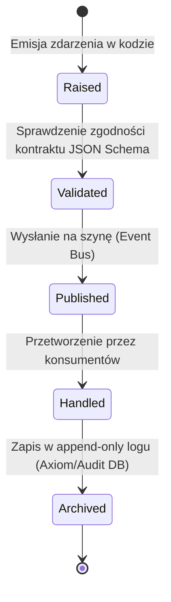

# SPRINT 1: FOUNDATION IMPLEMENTATION
## Zadanie 3A — Runtime Event Model
*Specyfikacja i kontrakty zdarzeń środowiska uruchomieniowego platformy WEB FACTOR (Standard MEF).*

---

### 1. Event Taxonomy (Kategorie Zdarzeń)

Wszystkie zdarzenia w platformie WEB FACTOR są kategoryzowane według domen funkcjonalnych. Umożliwia to Mission Control filtrowanie i monitorowanie strumienia zdarzeń bez narzutu logicznego.

```text
  Runtime Events (np. RequestStarted, TenantResolved, RequestFinished)
  ├── Provisioning Events (np. ProvisioningStarted, StoreProvisioned)
  ├── Commerce Events (np. OrderCreated, OrderPaid, OrderCancelled)
  ├── Package Events (np. PackageLoaded, PackageValidationFailed)
  ├── Security Events (np. PermissionDenied, RLSViolation)
  ├── Audit Events (np. ConfigMutated, SessionImpersonated)
  ├── Telemetry Events (np. PerformanceBudgetExceeded)
  ├── Mission Control Events (np. FleetUpdateInitiated)
  └── Partner Events (np. StorePublished, FeatureToggled)
```

---

### 2. Konwencja Nazewnictwa i Wersjonowanie (Naming & Versioning)

1. **Konwencja czasu przeszłego (Past Tense):** Nazwy zdarzeń muszą odzwierciedlać fakt, który już zaistniał. Używamy nazw takich jak `StoreCreated` (zamiast `CreateStore`), `PackageLoaded` (zamiast `LoadPackage`) oraz `RequestFinished` (zamiast `FinishRequest`).
2. **Wersjonowanie zdarzeń (Event Versioning):** Każde zdarzenie posiada deklarację wersji (`eventVersion`, np. `"v1"`, `"v2"`). Zmiany w strukturze payloadu zdarzenia wymagają wydania nowej wersji, co gwarantuje wsteczną kompatybilność konsumentów zdarzeń.

---

### 3. Własność i SLA Zdarzeń (Ownership & Service Level Agreement)

Każde zdarzenie posiada przypisanego właściciela domenowego (moduł odpowiedzialny za jego emisję) oraz zdefiniowany czas reakcji/obsługi (SLA):

| Kategoria | Zdarzenie | Właściciel (Owner) | SLA Reakcji |
| :--- | :--- | :--- | :--- |
| **Runtime** | `RequestStarted` | Runtime Engine | Natychmiast (Inline) |
| **Runtime** | `TenantResolved` | Runtime Engine | `< 5 ms` |
| **Packages** | `PackageLoaded` | Package Runtime | `< 100 ms` |
| **Commerce** | `OrderCreated` | Commerce Engine | Asynchronicznie (`< 1 s`) |
| **Provisioning** | `StoreProvisioned` | Provisioning Engine | `< 30 s` |

---

### 4. Idempotentność i Identyfikowalność (Correlation & Idempotency)

Każde zdarzenie w systemie musi przenosić identyfikatory pozwalające na pełną identyfikację przyczynowo-skutkową (Traceability) oraz klucze idempotencji zapobiegające powtórnemu przetworzeniu:

* **`eventId`:** Unikalny identyfikator konkretnego wystąpienia zdarzenia (UUID v4).
* **`correlationId`:** Identyfikator wiążący całą operację (np. ID transakcji inicjującej, ID żądania HTTP). Przechodzi bez zmian przez wszystkie powiązane zdarzenia w łańcuchu.
* **`causationId`:** Identyfikator bezpośredniego zdarzenia-rodzica, które wywołało obecne zdarzenie.
* **`idempotencyKey`:** Klucz wyliczany na podstawie danych wejściowych (np. `idempotencyKey = sha256(webhook_id + payment_amount)`). Moduły krytyczne (Provisioning, Billing, Webhooks) są zobowiązane do weryfikacji tego klucza przed wykonaniem operacji.

---

### 5. Cykl Życia Zdarzenia (Event Lifecycle)

Zdarzenia przechodzą przez rygorystyczny proces stanów:



---

### 6. Obsługa Błędów i Retry Policy (Resiliency)

Polityka ponawiania prób i izolacji błędów zależy bezpośrednio od krytyczności (Severity) zdarzenia:

| Poziom (Severity) | Polityka Ponawiania (Retry Policy) | Opis / Zachowanie |
| :--- | :---: | :--- |
| **Info** | **Brak (No)** | Zdarzenie informacyjne, brak krytycznych skutków awarii. |
| **Warning** | **Opcjonalnie (Optional)** | Ponowienie próby (1x) po krótkim opóźnieniu (100 ms). |
| **Error** | **Tak (Yes)** | Ponowienie (3x) z wykładniczym opóźnieniem (Exponential Backoff). |
| **Fatal** | **Circuit Breaker** | Natychmiastowe odcięcie przetwarzania i przejście w tryb awaryjny. |

#### 6.1 Dead Letter Queue (DLQ Flow)
Gdy zdarzenie typu `Error` nie może zostać przetworzone po 3 próbach:
```text
[Event Fail] ──► [Handler Crash] ──► [Dead Letter Queue (DLQ)] ──► [Alert Mission Control] ──► [Interwencja Operatora]
```
DLQ przechowuje pełny stan payloadu, correlation ID oraz stack trace błędu.

---

### 7. Kontrakt TypeScript i Przykład Zdarzenia (Event Contract Specification)

```typescript
export interface RuntimeEventHeader {
  readonly eventId: string;
  readonly correlationId: string;
  readonly causationId: string;
  readonly eventVersion: string;
  readonly eventType: string;
  readonly timestamp: string;
  readonly storeId?: string;
  readonly idempotencyKey?: string;
}

export interface StoreProvisionedEvent {
  readonly header: RuntimeEventHeader;
  readonly payload: {
    readonly storeId: string;
    readonly ownerUserId: string;
    readonly plan: 'start' | 'grow' | 'scale';
    readonly slug: string;
    readonly configurationSchemaVersion: string;
    readonly provisionedModules: string[];
  };
}
```

* **Przykład JSON Payload (`StoreProvisioned`):**
  ```json
  {
    "header": {
      "eventId": "e9b27ac8-3f1d-407e-976c-ec45f21bc9e4",
      "correlationId": "req_102839281a8b9f",
      "causationId": "req_102839281a8b9f",
      "eventVersion": "v1",
      "eventType": "StoreProvisioned",
      "timestamp": "2026-07-10T10:44:00.000Z",
      "storeId": "8f31b8a9-4b62-4217-a02d-0210e7b8c3d1",
      "idempotencyKey": "idem_prov_order_849204"
    },
    "payload": {
      "storeId": "8f31b8a9-4b62-4217-a02d-0210e7b8c3d1",
      "ownerUserId": "usr_902f238d-8a21-4f11-9ab2-81c8b321ab9d",
      "plan": "grow",
      "slug": "fashion-fit",
      "configurationSchemaVersion": "1.0",
      "provisionedModules": ["fashion_theme", "sizes_module", "onekoszyk_gateway"]
    }
  }
  ```

---

### 8. Powtórzenia Strumienia Zdarzeń (Event Replay & Replay Stream)

Zapewniamy możliwość odtworzenia stanu systemu na podstawie historii zdarzeń (Event Sourcing compatibility):
* **Replay Event:** Możliwość ponownego wysłania pojedynczego zdarzenia z DLQ do określonego handlera w celach naprawczych.
* **Replay Stream:** Odtworzenie stanu konfiguracji sklepu od momentu inicjalizacji poprzez sekwencyjne zaaplikowanie wszystkich historycznych zdarzeń typu `ConfigMutated` dla wybranego `store_id`.

---

### 9. Mission Control Event Viewer (Kategorie w Panelu)

Panel administracyjny Mission Control posiada dedykowaną zakładkę **System Telemetry** podzieloną na karty odpowiadające domenom taksonomii:
* **Runtime:** Logi Middleware, czasy rozwiązywania hostów, cache hits/misses.
* **Provisioning:** Statusy procesów wdrożeniowych nowych sklepów.
* **Commerce:** Logi transakcji, procesów checkoutu i zamówień.
* **Security:** Wykazy zablokowanych prób nieautoryzowanego dostępu RLS.
* **Packages:** Logi ładowania modułów i niezgodności zależności.
* **Performance:** Raporty przekroczenia budżetów wydajnościowych.
