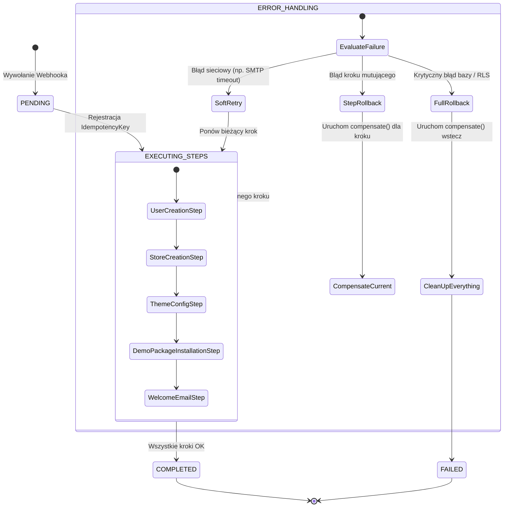

# SPRINT 1: FOUNDATION IMPLEMENTATION
## Zadanie 5 — Provisioning Engine Specification
*Specyfikacja techniczna i maszyna stanów silnika automatycznego uruchamiania instancji sklepów (SaaS Provisioning).*

---

### 1. Model Orkiestracji (Orchestrator Pattern)

Silnik Provisioning Engine działa wyłącznie jako bezstanowy orkiestrator przepływu (Workflow Orchestrator), koordynujący zadania i delegujący ich wykonanie do wyspecjalizowanych usług. **Złota reguła: Provisioning Engine zawiera wyłącznie logikę przepływu (workflow), nigdy logikę biznesową.**

```text
               [Provisioning Engine (Orchestrator)]
                                │
       ┌───────────┬────────────┼───────────┬───────────┐
       ▼           ▼            ▼           ▼           ▼
  [Identity]    [Store]     [Package]    [Theme]    [Config]
   Service      Service      Runtime     Service    Service
```

---

### 2. Rejestr Kroków (Step Registry Engine)

Zamiast sztywnego ciągu instrukcji, proces wdrożenia jest tablicą instancji kroków implementujących wspólny kontrakt:

```typescript
export interface ProvisioningStep {
  readonly name: string;
  readonly description: string;
  execute(context: ProvisioningContext): Promise<StepResult>;
  compensate(context: ProvisioningContext): Promise<void>;
  validate(context: ProvisioningContext): Promise<boolean>;
}
```
Dodanie nowego zachowania wdrożeniowego sprowadza się do rejestracji nowej klasy implementującej powyższy interfejs w tablicy `ProvisioningStep[]`.

---

### 3. Maszyna Stanów i Rollback Levels

Maszyna stanów monitoruje postęp i decyduje o poziomie kompensacji (Rollback Level) w przypadku wykrycia błędów:



---

### 4. Identyfikowalność i Migawki (Provisioning Snapshots)

Po wykonaniu każdego kroku (Step), stan przepływu jest zapisywany w bazie danych (tabela `provisioning_snapshots`) w celu analizy i możliwości wznowienia (Rerun):

```typescript
export interface ProvisioningSnapshot {
  readonly provisionId: string;           // UUID transakcji wdrożenia
  readonly idempotencyKey: string;        // Klucz idempotencji (z transakcji płatniczej)
  readonly currentState: string;          // Nazwa bieżącego kroku
  readonly completedSteps: string[];      // Lista nazw pomyślnie wykonanych kroków
  readonly durationMs: number;            // Całkowity czas od rozpoczęcia
  readonly retryCount: number;            // Liczba podjętych prób dla kroku
  readonly compensationStatus: 'none' | 'in_progress' | 'completed' | 'failed';
  readonly lastError?: {
    readonly stepName: string;
    readonly message: string;
    readonly stackTrace?: string;
  };
}
```

---

### 5. Tryby Wdrożenia (Provisioning Modes)

Silnik wspiera różne scenariusze uruchomieniowe poprzez zmianę zestawu kroków w rejestrze:
* **New Store:** Standardowe wdrożenie nowego sklepu z domyślnym pakietem demo.
* **Clone Existing Store:** Wdrożenie na bazie snapshotu innego istniejącego sklepu (przydatne przy tworzeniu sklepów testowych).
* **Import Store:** Migracja sklepu z innej platformy na podstawie pliku importu.
* **Restore Backup:** Przywrócenie sklepu do stanu z kopii zapasowej.
* **Template Deployment:** Uruchomienie sklepu opartego o gotowy, branżowy szablon premium.
* **Development Sandbox:** Szybkie wdrożenie lokalnej instancji deweloperskiej z pominięciem webhooków i systemów płatniczych.

---

### 6. Blokowanie Wersji (Version Lock)

Każde pomyślne wdrożenie zapisuje w konfiguracji sklepu stałą migawkę wersji systemowych (Version Lock) w celu ułatwienia późniejszych migracji i zachowania stabilności wstecznej:
```json
{
  "versionLock": {
    "engineVersion": "1.2.0",
    "runtimeVersion": "2026.07",
    "packageManifestVersion": "1.0",
    "configurationSchemaVersion": "1.4"
  }
}
```

---

### 7. Demowe Dane jako Pakiet Zewnętrzny (Demo Content Package)

Zgodnie z zasadą **One Engine**, dane demonstracyjne nie są wpisywane na sztywno w silniku wdrożenia. Produkty, kategorie i branding są zapakowane jako zewnętrzny pakiet instalacyjny (`Demo Package`), posiadający własny manifest i pliki JSON:

```text
packages/themes/demo-basic/
├── manifest.json
├── data/
│   ├── products.json      (3 produkty testowe: prosty, wariantowy, cyfrowy)
│   ├── categories.json    (kategorie demo)
│   └── branding.json      (palety kolorów HSL, fonty)
```
Krok `DemoPackageInstallationStep` po prostu instaluje ten pakiet za pośrednictwem `Package Runtime`.

---

### 8. Metryki Wydajności Operacyjnej (Provisioning Metrics)

Wskaźniki monitorowane w Mission Control w celach operacyjnych i analitycznych:

| Nazwa Metryki | Cel (SLA) | Opis |
| :--- | :---: | :--- |
| **Provision Success Rate** | `> 99.8%` | Stosunek wdrożeń zakończonych sukcesem do wszystkich prób. |
| **Average Provision Time** | `< 8 s` | Średni czas wykonania wszystkich kroków orkiestratora. |
| **Retry Rate** | `< 2%` | Częstotliwość występowania błędów sieciowych wymagających retries. |
| **Rollback Rate** | `< 0.1%` | Procent wdrożeń wymagających pełnego cofnięcia transakcji (Saga). |
| **Provision Queue Length** | `0-2` | Liczba wdrożeń oczekujących w kolejce w Edge. |
| **Average Step Duration** | Zmienne | Czas wykonania poszczególnych kroków (do wykrywania wąskich gardeł). |
| **Most Failed Step** | N/A | Identyfikacja kroku generującego najwięcej błędów. |

---

### 9. Deklaratywny Przepływ (Provisioning DSL - Future)

Na potrzeby przyszłej rozbudowy platformy, proces wdrożenia będzie opisywany deklaratywnie za pomocą konfiguracji YAML, co pozwoli na zmianę ścieżki wdrożenia bez modyfikowania kodu źródłowego silnika:

```yaml
# future_provisioning_flow.yaml
scenarios:
  new-store-standard:
    steps:
      - name: create-user
        service: IdentityService
      - name: create-store-instance
        service: StoreService
      - name: link-demo-theme
        service: PackageRuntime
        params:
          themeId: "demo-basic-theme"
      - name: populate-demo-content
        service: PackageRuntime
        params:
          packageId: "demo-basic-content"
      - name: send-welcome-email
        service: NotificationService
```
