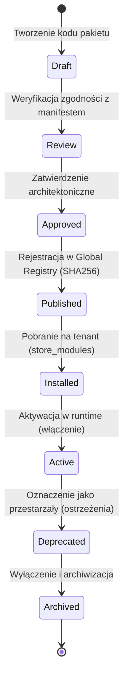

# SPRINT 1: FOUNDATION IMPLEMENTATION
## Zadanie 6 — Package Runtime & Capability Engine Specification
*Specyfikacja architektury rejestru pakietów, walidacji zależności oraz silnika zarządzania możliwościami (Capabilities) na poziomie środowiska uruchomieniowego.*

---

### 1. Model Rejestru Pakietów (Package Registry)

Pakiety (Packages) to zunifikowane, instalowalne rozszerzenia platformy WEB FACTOR.

```text
  [System Rejestru Pakietów]
   ├── theme (Motywy graficzne, siatki CSS)
   ├── profile (Profile branżowe, np. Fashion, Electronics)
   └── module (Rozszerzenia funkcjonalne, np. InPost, Stripe)
```

Wszystkie pakiety są rejestrowane w bazie danych w tabeli `packages` i posiadają spójny interfejs manifestu `manifest.json`.

---

### 2. Cykl Życia Pakietu (Package Lifecycle)

Pakiety przechodzą przez następujące fazy cyklu życia kontrolowane przez status w rejestrze platformy:



---

### 3. Zabezpieczenia i Podpisy Cyfrowe (Security & Sandboxing)

Każdy pakiet w rejestrze posiada wbudowaną sygnaturę bezpieczeństwa weryfikowaną przed instalacją i załadowaniem:
* **`publisher`:** Identyfikator certyfikowanego wydawcy pakietu.
* **`hash` (SHA256):** Suma kontrolna wyliczana ze wszystkich plików w pakiecie.
* **`signature`:** Cyfrowy podpis kryptograficzny wydawcy, weryfikowany kluczem publicznym platformy.

#### Uprawnienia Pakietu (Package Permissions)
Pakiety nie mają bezpośredniego dostępu do całego API i zasobów systemu. Muszą jawnie zadeklarować uprawnienia w manifest.json:
```json
{
  "permissions": [
    "read_products",
    "write_orders",
    "send_notifications"
  ]
}
```
Runtime przyznaje pakietom dostęp wyłącznie w granicach zadeklarowanych uprawnień. Próba wykonania operacji poza zakresem generuje błąd bezpieczeństwa.

---

### 4. Specyfikacja i Walidacja `manifest.json`

```typescript
export interface PackageManifest {
  readonly id: string;
  readonly name: string;
  readonly version: string;
  readonly type: 'theme' | 'profile' | 'module' | 'integration' | 'capability';
  readonly publisher: string;
  readonly signature: string;
  readonly hash: string;
  readonly engineVersion: string;
  readonly permissions: string[];
  readonly dependencies: Array<{
    readonly id: string;
    readonly versionRange: string;
  }>;
  readonly capabilities: string[];
  readonly featureFlags: string[];
}
```

#### Walidacja Schematu (Zod Contract):
```typescript
import { z } from 'zod';

export const PackageManifestSchema = z.object({
  id: z.string().regex(/^[a-z0-9_]+$/),
  name: z.string().min(3),
  version: z.string().regex(/^\d+\.\d+\.\d+$/),
  type: z.enum(['theme', 'profile', 'module', 'integration', 'capability']),
  publisher: z.string(),
  signature: z.string(),
  hash: z.string(),
  engineVersion: z.string(),
  permissions: z.array(z.string()),
  dependencies: z.array(z.object({
    id: z.string(),
    versionRange: z.string()
  })),
  capabilities: z.array(z.string()),
  featureFlags: z.array(z.string())
});
```

---

### 5. Macierz Zgodności Wersji (Compatibility Matrix)

Package Runtime weryfikuje kompatybilność pakietów z silnikiem core platformy:

| Engine Version | Package ID | Package Version | Status |
| :--- | :--- | :--- | :---: |
| `1.0.0` | `theme_fashion` | `1.1.0` | ✅ |
| `1.0.0` | `ai_assistant` | `2.0.0` (wymaga core >= 2.0.0) | ❌ |
| `2.0.0` | `ai_assistant` | `2.0.0` | ✅ |

---

### 6. Pipeline Podejmowania Decyzji (Capability Resolution Pipeline)

Wyliczanie możliwości technicznych (Capabilities) przebiega w ściśle określonym, jednokierunkowym potoku podczas wczytywania tenanta:

```text
  Store (Detekcja hosta sklepu)
    │
    ▼
  Plan (START / GROW / SCALE - narzuca limity bazowe)
    │
    ▼
  Assigned Packages (Pakiety aktywowane w store_modules)
    │
    ▼
  Package Manifest (Analiza manifestu każdego pakietu)
    │
    ▼
  Dependency Resolver (Sortowanie DAG i wstrzykiwanie zależności)
    │
    ▼
  Capability Resolver (Wyliczanie finalnej listy Capabilities na bazie priorytetów)
    │
    ▼
  Feature Flags (Aktywacja opcjonalnych flag systemu)
    │
    ▼
  Permission Resolver (Weryfikacja uprawnień użytkownika i uprawnień pakietów)
    │
    ▼
  TenantContext (Utworzenie kompletnego i zamrożonego obiektu kontekstu)
    │
    ▼
  Runtime (Sklep jest gotowy do serwowania)
```

---

### 7. Źródła Możliwości i Priorytety (Capability Sources & Priorities)

#### 7.1 Tabela Źródeł Możliwości
Możliwości w systemie mogą pochodzić z różnych źródeł, a nie tylko z zainstalowanych pakietów:

| Źródło (Source) | Przykład (Example) | Opis |
| :--- | :--- | :--- |
| **Package** | `hasWishlist` | Wprowadzane bezpośrednio przez kod modułu dodatkowego. |
| **Plan** | `maxProducts` | Wartości graniczne narzucane przez abonament platformy. |
| **Store Config** | `currency` | Lokalne preferencje ustawione w panelu Partnera. |
| **Feature Flag** | `betaCheckout` | System dystrybucji nowych wersji funkcjonalności. |
| **Runtime** | `edgeRendering` | Właściwości węzła serwerowego obsługującego żądanie. |
| **License** | `aiAssistant` | Dodatkowe uprawnienia komercyjne. |

#### 7.2 Rozwiązywanie Konfliktów i Priorytety (Capability Priority)
W sytuacji gdy dwa pakiety deklarują modyfikację tej samej właściwości, decyduje wartość priorytetu (`priority`). Wartości wyższe nadpisują niższe:

* **Pakiet A (`wishlist` = true, `priority` = 20)**
* **Pakiet B (`wishlist` = false, `priority` = 50)**
* **Zwycięzca (Winner):** Pakiet B (wartość `wishlist` zostanie ustawiona na `false`).

---

### 8. Graf Możliwości (Capability Graph)

Możliwości mogą posiadać zależności wewnętrzne. Silnik buduje drzewo zależności Capabilities i zapobiega włączeniu właściwości, gdy jej wymagania nie są spełnione:

$$\text{Product Variants} \rightarrow \text{Inventory} \rightarrow \text{Orders}$$

Jeśli sklep włączy możliwość `Product Variants`, ale nie ma aktywowanej możliwości `Inventory`, silnik zgłosi ostrzeżenie i zablokuje aktywację dopóki zależność nie zostanie pomyślnie rozwiązana.

---

### 9. Audyt Możliwości (Capability Audit Trail)

Każda zmiana stanu włączonej możliwości (Capability) jest logowana w bazie danych w celach diagnostycznych. Mission Control potrafi odtworzyć historię danej capability na podstawie logu:

```text
[Mission Control Audit Trail]
Sklep ID: 8f31b8a9-4b62-4217-a02d-0210e7b8c3d1
Wyszukiwanie: "Wishlist"
Status: DISABLED
├── Zdarzenie: PackageUpdated (Usunięto pakiet "wishlist_module")
├── Operator/Użytkownik: usr_902f238d (Owner)
└── Znacznik Czasu: 2026-07-10 12:44:00.000Z
```

---

### 10. Niemutowalna Migawka Środowiska (Immutable Runtime Snapshot)

Zaraz po zakończeniu pipeline'u wyliczania możliwości, tworzony jest obiekt **Runtime Snapshot**. Obiekt ten jest głęboko zamrożony (`Object.freeze`). Każda zmiana konfiguracji w panelu skutkuje wygenerowaniem nowej instancji snapshotu (nowy build ID), co eliminuje błędy wyścigu (race conditions).

#### Raport Złożenia Runtime (Runtime Composition Report)
Każde pomyślne załadowanie snapshotu generuje raport diagnostyczny przekazywany do telemetrii:
```json
{
  "runtimeCompositionReport": {
    "engineVersion": "1.2.0",
    "packagesLoadedCount": 8,
    "activeCapabilitiesCount": 42,
    "themeName": "Fashion Premium",
    "profileName": "Clothing",
    "configurationSchemaVersion": 5,
    "buildTimeMs": 34
  }
}
```
 Raport ten pozwala na monitorowanie budżetu wydajnościowego inicjalizacji środowiska wdrożonego sklepu.
