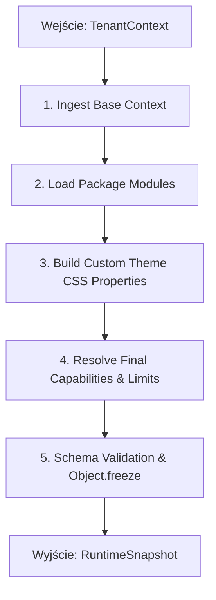

# SPRINT 1: FOUNDATION IMPLEMENTATION
## Zadanie 7 — Runtime Composition Engine Specification
*Specyfikacja kompozycji środowiska uruchomieniowego sklepu na podstawie kontekstu tenanta, pakietów, możliwości i konfiguracji.*

---

### 1. Architektura Kompozycji (Composition Architecture)

Silnik kompozycji (**Runtime Composition Engine**) odpowiada za połączenie rozproszonych danych wejściowych w jeden, spójny i niemutowalny obiekt uruchomieniowy: `RuntimeSnapshot`. Zapobiega to kosztownemu wyliczaniu parametrów konfiguracji przy każdym wyświetleniu strony.

```text
  TenantContext (Metadane i plan)
        │
        ├──► [Runtime Composition Engine] ──► Immutable Runtime Snapshot
        │                                          (Gotowy stan sklepu)
  Active Packages (Motywy i moduły)
        │
  Branding Config (HSL, Fonty)
```

---

### 2. Cykl Składania Migawki (Composition Pipeline Steps)

Proces składania migawki środowiska uruchomieniowego składa się z pięciu etapów:



1. **Ingest Base Context:** Pobranie podstawowych identyfikatorów tenanta (store_id, slug, status) i zaimplementowanie podstawowej konfiguracji językowej i walutowej.
2. **Load Package Modules:** Weryfikacja listy aktywnych pakietów z `store_modules` oraz wstrzyknięcie ich manifestów do drzewa pamięci.
3. **Build Custom Theme CSS Properties:** Tłumaczenie zmiennych kolorystycznych HSL, zaokrągleń i fontów na ciąg zmiennych CSS Custom Properties (np. `--primary-color: 220 90% 56%`).
4. **Resolve Final Capabilities & Limits:** Aplikacja priorytetów capabilities, weryfikacja grafu zależności możliwości oraz nałożenie limitów planu (np. `maxProducts: 500`).
5. **Schema Validation & Object.freeze:** Walidacja zmontowanej struktury przy użyciu schematu Zod i głębokie zamrożenie obiektu w pamięci.

---

### 3. Kontrakt Runtime Snapshot (RuntimeSnapshot Contract)

Obiekt `RuntimeSnapshot` jest całkowicie niemutowalny (**Immutable Runtime**). Każda próba modyfikacji właściwości po wywołaniu `Object.freeze(snapshot)` (np. `snapshot.theme.colors.primary = "#fff"`) jest blokowana na poziomie runtime JavaScript i zgłasza wyjątek.

```typescript
export interface RuntimeSnapshot {
  readonly snapshotId: string;            // UUID konkretnej kompilacji stanu
  readonly storeId: string;
  readonly slug: string;
  readonly buildVersion: string;
  readonly timestamp: string;             // Czas utworzenia snapshotu
  /** 
   * Unikalny skrót stanu (SHA256) wyliczany z: 
   * runtimeVersion + themeVersion + packageVersions + capabilitySnapshot + configurationVersion
   */
  readonly runtimeHash: string;           

  // Dane motywu przetłumaczone na zmienne CSS
  readonly theme: {
    readonly id: string;
    readonly version: string;
    readonly cssVariables: Record<string, string>;
  };

  // Pełna, zweryfikowana lista możliwości (Capabilities)
  readonly capabilities: {
    readonly list: string[];
    readonly limits: {
      readonly maxProductsCount: number;
      readonly maxImageUploadMb: number;
      readonly allowedPaymentGateways: string[];
    };
  };

  // Załadowane moduły rozszerzeń
  readonly modules: Array<{
    readonly id: string;
    readonly version: string;
    readonly permissions: string[];
  }>;
}
```

---

### 4. Raport Złożenia Runtime (Composition Report)

Po każdym pomyślnym złożeniu snapshotu generowany jest raport diagnostyczny przekazywany do bazy telemetrii i dostępny w Mission Control:

```typescript
export interface RuntimeCompositionReport {
  readonly tenantSlug: string;
  readonly snapshotId: string;
  readonly runtimeHash: string;
  readonly packageStatus: Array<{
    readonly packageId: string;
    readonly status: 'LOADED' | 'MISSING' | 'CONFLICT';
  }>;
  readonly capabilities: {
    readonly enabledCount: number;
    readonly disabledCount: number;
  };
  readonly compositionTimeMs: number;     // Czas składania snapshotu (SLA: < 20ms)
  readonly warningsCount: number;
  readonly errorsCount: number;
}
```

---

### 5. Strategia Cache'owania (Composition Caching Rules)

Budowa `RuntimeSnapshot` jest operacją obciążającą procesor. Z tego powodu snapshoty są rygorystycznie cache'owane:
* **Klucz Cache:** Generowany na podstawie identyfikatora sklepu, wersji kodu oraz sumy kontrolnej konfiguracji:
  `cache_key = "snapshot:" + store_id + ":" + etag_konfiguracji + ":" + build_version`
* **Strategia Inwalidacji:** Każda zmiana w konfiguracji sklepu, aktywacja pakietu w panelu lub globalna aktualizacja platformy powoduje zmianę etaga konfiguracji lub wersji buildu, co automatycznie unieważnia stary cache.
* **Zarządzanie Pamięcią:** Cache jest przechowywany w szybkiej pamięci podręcznej LRU na poziomie brzegowym (Vercel Edge KV).
