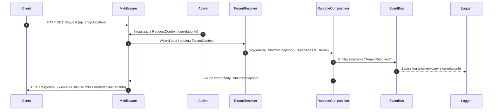

# SPRINT 1: FOUNDATION IMPLEMENTATION
## Zadanie 12 — Implementation Plan (Sprint 2.1 Transition)
*Przełożenie architektury platformy WEB FACTOR na konkretne zadania kodowe i strukturę katalogów przed rozpoczęciem implementacji.*

---

### 1. Docelowa Struktura Repozytorium (Monorepo Workspace)

W celu zapewnienia ścisłej izolacji modułów i reużywalności kodu (zgodnie z **Development Constitution**), platforma zostanie wdrożona jako Monorepo (np. z wykorzystaniem npm/pnpm Workspaces oraz Turborepo).

```text
web-factor/
├── apps/                         # Aplikacje klienckie i panele (Next.js)
│   ├── storefront/               # Silnik sklepu (obsługa subdomen/domen B2C)
│   ├── dashboard/                # Panel dla Partnerów B2B (zarządzanie sklepem)
│   └── mission-control/          # Panel administracji flotą (Operations UI)
├── packages/                     # Współdzielone biblioteki i silniki (npm packages)
│   ├── platform-core/            # Jądro systemu: konfiguracja, logger, błędy, eventy
│   ├── event-bus/                # Lokalna i rozproszona szyna zdarzeń (MEF)
│   ├── tenant/                   # Detekcja hostów, walidacja i cache TenantContext
│   ├── runtime/                  # Edge Middleware, host resolver i orkiestracja żądań
│   ├── package-runtime/          # Silnik instalacji pakietów i walidacji manifestów
│   ├── provisioning/             # Silnik wdrożeń (Saga Orchestrator, rollback)
│   ├── commerce/                 # Rdzeń logiki handlowej (koszyk, pricing, bramki ACL)
│   └── rendering/                # Potok renderowania RSC, optymalizacja SEO, Error Boundaries
├── database/                     # Schematy bazodanowe Supabase Postgres i polityki RLS
├── docs/                         # Pełna dokumentacja projektowa i techniczna
└── tests/                        # Globalne testy integracyjne oraz E2E
    └── platform-core/            # Testy rozruchu i poprawności jądra systemu
```

---

### 2. Specyfikacja Pierwszego Modułu: `packages/platform-core`

`platform-core` stanowi fundament, na którym opierają się wszystkie pozostałe moduły. Moduł ten nie może importować żadnego innego modułu z katalogu `packages/` (jest całkowicie samowystarczalny).

#### 2.1 System Konfiguracji (PlatformConfig)
Zarządza zmiennymi środowiskowymi i statycznymi limitami platformy z walidacją typów przy użyciu Zod.

```typescript
export interface PlatformConfig {
  readonly environment: 'development' | 'staging' | 'production';
  readonly version: string;
  readonly buildId: string;
  readonly features: {
    readonly enableImpersonationAudit: boolean;
    readonly enableMultiRegionTelemetry: boolean;
  };
  readonly limits: {
    readonly maxRequestExecutionMs: number;
    readonly defaultCacheTtlSeconds: number;
  };
}
```

#### 2.2 Ustandaryzowany Rejestrator (PlatformLogger)
Logger integruje się z systemem telemetrii oraz automatycznie przenosi konteksty śledzenia (Correlation/Causation ID).

```typescript
export interface LoggerPayload {
  readonly message: string;
  readonly correlationId?: string;
  readonly causationId?: string;
  readonly tenantId?: string;
  readonly metadata?: Record<string, unknown>;
}

export interface PlatformLogger {
  info(payload: LoggerPayload): void;
  warn(payload: LoggerPayload): void;
  error(payload: LoggerPayload & { readonly error?: Error }): void;
  fatal(payload: LoggerPayload & { readonly error?: Error }): void;
}
```

#### 2.3 Centralny Model Błędów (PlatformError)
Klasa bazowa dla wszystkich błędów rzucanych w obrębie platformy, ułatwiająca ich automatyczną klasyfikację i telemetrię.

```typescript
export type ErrorSeverity = 'LOW' | 'MEDIUM' | 'HIGH' | 'FATAL';

export class PlatformError extends Error {
  readonly code: string;
  readonly severity: ErrorSeverity;
  readonly module: string;
  readonly correlationId: string;
  readonly metadata?: Record<string, unknown>;

  constructor(params: {
    message: string;
    code: string;
    severity: ErrorSeverity;
    module: string;
    correlationId: string;
    metadata?: Record<string, unknown>;
  }) {
    super(params.message);
    this.name = 'PlatformError';
    this.code = params.code;
    this.severity = params.severity;
    this.module = params.module;
    this.correlationId = params.correlationId;
    this.metadata = params.metadata;
    Object.setPrototypeOf(this, PlatformError.prototype);
  }
}
```

#### 2.4 Szyna Zdarzeń (Event Bus Contract)
Definiuje interfejs lokalnej szyny wymiany komunikatów oparty na wzorcu Publish-Subscribe.

```typescript
export interface PlatformEvent<T = unknown> {
  readonly eventId: string;
  readonly correlationId: string;
  readonly causationId?: string;
  readonly timestamp: string;
  readonly type: string;
  readonly tenantId?: string;
  readonly payload: T;
}

export interface PlatformEventBus {
  emit(event: PlatformEvent): Promise<void>;
  subscribe(eventType: string, handler: (event: PlatformEvent) => Promise<void> | void): void;
}
```

---

### 3. Pierwszy Działający Przepływ (First Request Flow Skeleton)

Po zakończeniu Sprintu 2.1 platforma must pomyślnie przetworzyć poniższą sekwencję uruchomieniową w pamięci serwera:



---

### 4. Pierwszy Test Architektoniczny (Architecture Bootstrap Test)

Przed pisaniem jakiejkolwiek logiki biznesowej, tworzony jest test rozruchu platformy:
`tests/platform-core/bootstrap.test.ts`.

#### Specyfikacja Testu (Vitest / Jest):
1. **Rozruch platformy (Platform Starts):** Weryfikacja, czy jądro systemu `platform-core` poprawnie importuje i inicjalizuje swoje podmoduły.
2. **Załadowanie konfiguracji (Configuration Loaded):** Sprawdzenie, czy parametry z procesu środowiskowego są poprawnie parsowane i czy niepoprawne typy konfiguracji blokują start.
3. **Dostępność Loggera (Logger Available):** Weryfikacja, czy wywołanie `.info()` i `.error()` nie generuje wyjątków i poprawnie formatuje payload.
4. **Inicjalizacja Event Busa (Event Bus Ready):** Zarejestrowanie testowego subskrybenta, wyemitowanie testowego zdarzenia i asynchroniczne odebranie komunikatu o zgodnym `correlationId`.
5. **Health Check:** Wywołanie metody diagnostycznej jądra i weryfikacja, czy zwraca status `READY`.

---

### 5. Kryteria Ukończenia Sprintu 2.1 (Definition of Done)

* [x] Struktura katalogowa monorepo została wdrożona na poziomie dysku.
* [x] Konfiguracja TypeScript we wszystkich pakietach kompiluje się bez błędów.
* [x] Moduł `packages/platform-core` przechodzi testy jednostkowe na 100%.
* [x] `PlatformLogger` poprawnie przesyła konteksty Correlation i Causation ID.
* [x] `PlatformEventBus` poprawnie propaguje zdarzenia w trybie asynchronicznym.
* [x] `PlatformError` jest wykorzystywany jako bazowa klasa dla wyjątków.
* [x] Test `bootstrap.test.ts` kończy się sukcesem w pipeline CI/CD.
* [x] Uruchomienie lokalnego serwera deweloperskiego zwraca kod `READY` dla endpointu `/api/health`.
