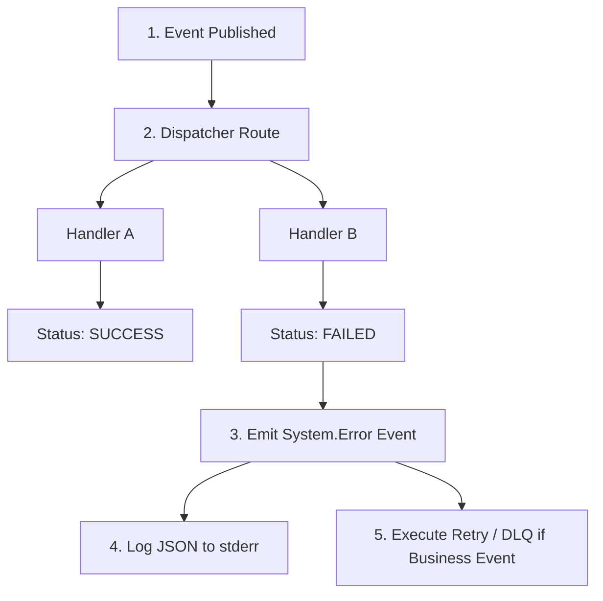

# SPRINT 2: PLATFORM CORE IMPLEMENTATION
## Zadanie 2 — Event Bus Implementation Specification
*Formalny kontrakt implementacyjny, API oraz gwarancje dostarczania dla szyny zdarzeń platformy (Platform Event Bus).*

---

### 1. Kontrakt Zdarzenia (Event Contract)

Wszystkie zdarzenia wymieniane w obrębie platformy muszą spełniać bazowy kontrakt typów w celach telemetrii i zachowania ciągłości przepływu (Correlation / Causation):

```typescript
export interface PlatformEvent<T = unknown> {
  readonly eventId: string;         // UUID v4 zdarzenia (zabezpieczenie przed duplikatami)
  readonly eventType: string;       // Unikalna nazwa zdarzenia (np. "Runtime.RequestStarted")
  readonly timestamp: string;       // Data i godzina w formacie ISO 8601
  readonly correlationId: string;   // ID żądania początkowego, propagowane przez cały przepływ
  readonly causationId?: string;    // ID zdarzenia, które bezpośrednio wywołało to zdarzenie
  readonly tenantId?: string;       // Opcjonalne ID tenanta (sklepu)
  readonly payload: T;              // Czyste dane powiązane ze zdarzeniem (immutable)
}
```

---

### 2. Kontrakt API Szyny Zdarzeń (Event Bus API)

Szyna zdarzeń udostępnia minimalistyczny, asynchroniczny interfejs oparty na wzorcu Mediator/Pub-Sub.

```typescript
export type EventHandler<T = any> = (event: PlatformEvent<T>) => Promise<void> | void;

export interface SubscriptionToken {
  readonly id: string;
  readonly eventType: string;
}

export interface PlatformEventBus {
  /**
   * Publikuje zdarzenie asynchronicznie na szynie.
   * Zwraca obietnicę rozwiązującą się po przekazaniu do kolejki dispatchera.
   */
  publish(event: PlatformEvent): Promise<void>;

  /**
   * Subskrybuje obsługę określonego typu zdarzenia.
   * Zwraca unikalny token subskrypcji potrzebny do wyrejestrowania.
   */
  subscribe<T>(eventType: string, handler: EventHandler<T>): SubscriptionToken;

  /**
   * Wyrejestrowuje subskrypcję za pomocą otrzymanego tokenu.
   */
  unsubscribe(token: SubscriptionToken): void;
}
```

---

### 3. Rejestr Znanych Zdarzeń (Event Registry)

Szyna zdarzeń klasyfikuje i waliduje zdarzenia w podziale na domeny systemowe. Każde zdarzenie musi zostać zarejestrowane w `EventRegistry`:

| Domena (Module) | Typ Zdarzenia (eventType) | Rola i Payload (Context) |
| :--- | :--- | :--- |
| **Runtime** | `Runtime.RequestStarted` | Rejestracja nadejścia żądania HTTP (metryka startu). |
| | `Runtime.RequestCompleted` | Sukces żądania (zawiera czas wykonania TTFB/TTFV). |
| **Tenant** | `Tenant.Resolved` | Poprawna detekcja hosta (zawiera `tenantId` oraz subskrypcję). |
| | `Tenant.ResolutionFailed` | Błąd odnalezienia tenanta (generuje kod 404 w edge). |
| **Provisioning** | `Provisioning.Started` | Uruchomienie procesu tworzenia nowego sklepu (Saga start). |
| | `Provisioning.Completed` | Sukces wdrożenia (sklep jest gotowy do serwowania). |
| | `Provisioning.Failed` | Awaria i wyzwolenie kroków kompensujących Sagi. |
| **Package** | `Package.Loaded` | Poprawne wczytanie kodu pakietu do snapshotu runtime. |
| | `Package.Failed` | Awaria modułu wtyczki (aktywacja Error Boundary). |

---

### 4. Gwarancje Dostarczania (Delivery Guarantees)

W celach optymalizacji wydajności oraz stabilności bazy, platforma różnicuje gwarancje dostarczania komunikatów w zależności od charakteru przepływu:

```text
                  [Platform Event Dispatcher]
                               │
       ┌───────────────────────┴───────────────────────┐
       ▼                                               ▼
[Internal Events]                               [External Events]
Gwarancja: at-most-once                         Gwarancja: at-least-once + Idempotency
Szybka szyna w pamięci (SLA: < 1ms)            Kolejkowanie asynchroniczne (DLQ)
```

#### 4.1 Zdarzenia Wewnętrzne (Internal Event Bus)
* **Gwarancja:** `at-most-once` (maksymalnie raz).
* **Uzasadnienie:** Szybka wymiana informacji w pamięci (np. telemetria żądania, resolvery). Narzut transakcyjny i zapis w bazie byłyby zbyt kosztowne (SLA dla Middleware wynosi `< 5 ms`).
* **Zachowanie:** Jeśli proces Node.js zostanie ubity podczas dispatchowania, zdarzenie może zostać utracone.

#### 4.2 Zdarzenia Zewnętrzne i Biznesowe (External Event Bus)
* **Gwarancja:** `at-least-once` (co najmniej raz) + **Idempotency Key**.
* **Uzasadnienie:** Kluczowe transakcje biznesowe (np. webhooki płatności, Provisioning).
* **Zachowanie:** Każde zdarzenie biznesowe jest utrwalane w bazie przed wykonaniem. Próba ponownego przetworzenia jest blokowana przez sprawdzanie unikalności `eventId` w tabeli `processed_events`.

---

### 5. Obsługa Błędów w Odbiornikach (Error Handling Policy)

Awaria wewnątrz jednego subskrybenta nie może zakłócić działania pozostałych subskrybentów ani rzucić wyjątkiem w wątku publikującym.



1. **Izolacja wykonania:** Każdy handler jest wywoływany w osobnym bloku `try-catch` (oraz `Promise.allSettled` przy orkiestracji asynchronicznej).
2. **Kompensacja błędu:** W przypadku zgłoszenia wyjątku przez handler B:
   * Wyjątek jest przechwytywany i konwertowany na zdarzenie telemetryczne `System.Error`.
   * Logowany jest pełen ślad stosu (Stack Trace) z zachowanym `correlationId`.
   * Jeśli zdarzenie wymaga gwarancji `at-least-once`, następuje ponowienie (Retry Policy) na podstawie konfiguracji (np. wykładniczy backup).

---

### 6. Kontrakt Testowy (event-bus.test.ts)

Test integracyjny `tests/platform-core/event-bus.test.ts` weryfikuje następujące scenariusze:

1. **Scenariusz 1: Publikacja i Odbiór (Pub-Sub Flow)**
   * Utworzenie zdarzenia `Test.Created` ze specyficznym payloadem.
   * Publikacja na szynie.
   * Weryfikacja, czy subskrybent odebrał dokładnie to zdarzenie.
2. **Scenariusz 2: Zachowanie Correlation ID**
   * Wyemitowanie zdarzenia A z `correlationId = "test_req_123"`.
   * Subskrybent w odpowiedzi emituje zdarzenie B.
   * Weryfikacja, czy zdarzenie B przejęło `correlationId` ze zdarzenia A.
3. **Scenariusz 3: Izolacja Awarii (Fault Isolation)**
   * Zarejestrowanie dwóch subskrybentów na to samo zdarzenie.
   * Pierwszy subskrybent rzuca błąd (`throw new Error("Handler failed")`).
   * Drugi subskrybent działa poprawnie.
   * Weryfikacja: Błąd pierwszego subskrybenta nie przerywa wywołania drugiego ani nie crashuje metody `publish()`.
4. **Scenariusz 4: Izolacja Tenanta (Tenant Isolation Test)**
   * Zarejestrowanie subskrybenta z przypisanym kontekstem `tenantId = "tenant_B"`.
   * Wyemitowanie zdarzenia o charakterze biznesowym posiadającego `tenantId = "tenant_A"`.
   * Weryfikacja: Subskrybent automatycznie ignoruje zdarzenie przeznaczone dla innego tenanta (lub system rzuca błąd bezpieczeństwa/odrzuca żądanie na poziomie dystrybutora szyny), zapobiegając wyciekowi danych między tenantami.
