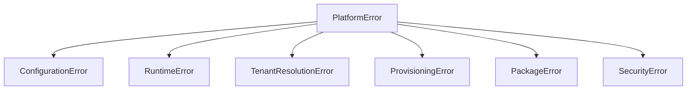
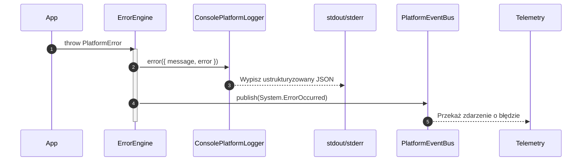

# SPRINT 2: PLATFORM CORE IMPLEMENTATION
## Zadanie 3 — Platform Error Engine Specification
*Specyfikacja techniczna, hierarchia wyjątków, kontrakty oraz zasady integracji systemu obsługi błędów z modułem telemetrycznym w ramach `packages/platform-core`.*

---

### 1. Klasa Bazowa `PlatformError`

Wszystkie wyjątki rzucane przez rdzeń platformy, moduły zewnętrzne oraz aplikacje klienckie muszą dziedziczyć po klasie bazowej `PlatformError`. Klasa ta rozszerza standardowy obiekt `Error` języka JavaScript/TypeScript o metadane telemetryczne.

```typescript
import { PlatformErrorOptions, ErrorSeverity } from '../types';

export class PlatformError extends Error {
  public readonly code: string;
  public readonly severity: ErrorSeverity;
  public readonly module: string;
  public readonly correlationId?: string;
  public readonly causationId?: string;
  public readonly tenantId?: string;
  public readonly metadata?: Record<string, any>;

  constructor(options: PlatformErrorOptions) {
    super(options.message);
    
    // Ustawienie nazwy klasy zamiast ogólnego Error
    this.name = this.constructor.name;
    
    this.code = options.code;
    this.severity = options.severity;
    this.module = options.module;
    this.correlationId = options.correlationId;
    this.causationId = options.causationId;
    this.tenantId = options.tenantId;
    
    // Zabezpieczenie przed mutacją metadanych błędu (frozen metadata)
    this.metadata = options.metadata ? Object.freeze({ ...options.metadata }) : undefined;

    // Przechwycenie śladu stosu (stack trace)
    if (Error.captureStackTrace) {
      Error.captureStackTrace(this, this.constructor);
    }
  }

  /**
   * Serializuje błąd do bezpiecznej, telemetrycznej postaci JSON (np. bez danych wrażliwych).
   */
  public toJSON(): Record<string, any> {
    return {
      name: this.name,
      message: this.message,
      code: this.code,
      severity: this.severity,
      module: this.module,
      correlationId: this.correlationId,
      causationId: this.causationId,
      tenantId: this.tenantId,
      metadata: this.metadata,
      stack: this.stack,
    };
  }
}
```

---

### 2. Hierarchia Wyjątków (Error Hierarchy)

Architektura systemu dzieli błędy na precyzyjnie sklasyfikowane podklasy w zależności od warstwy i odpowiedzialności biznesowej:



#### Szczegółowy podział klas błędów:
1. **`ConfigurationError` (Kod: `CONFIG_VALIDATION_FAILED`, Severity: `FATAL`)**
   * Błędy parsowania i braku zmiennych środowiskowych.
2. **`RuntimeError` (Kod: `RUNTIME_EXECUTION_FAILED`, Severity: `HIGH`)**
   * Wyjątki silnika kompozycji, błędy dynamicznego importowania plików.
3. **`TenantResolutionError` (Kod: `TENANT_NOT_FOUND` / `TENANT_SUSPENDED`, Severity: `MEDIUM` lub `HIGH`)**
   * Nieprawidłowa subdomena, zawieszona subskrypcja sklepu SaaS.
4. **`ProvisioningError` (Kod: `PROVISIONING_STEP_FAILED`, Severity: `HIGH`)**
   * Błędy podczas tworzenia nowego tenanta (np. awaria transakcji db, saga rollback).
5. **`PackageError` (Kod: `DEPENDENCY_RESOLVE_FAILED`, Severity: `HIGH`)**
   * Niezgodności wersji w manifestach wtyczek, cykle w grafie zależności.
6. **`SecurityError` (Kod: `ACCESS_DENIED`, Severity: `FATAL`)**
   * Próby Cross-Tenant, naruszenie reguł izolacji bazodanowej RLS.

---

### 3. Klasyfikacja i Obsługa Błędów

Każdy błąd posiada politykę ponawiania (Retry Policy) oraz określone zachowanie telemetryczne:

| Klasa Błędu | Poziom (Severity) | Retry Policy | Zachowanie Telemetryczne |
| :--- | :--- | :--- | :--- |
| `ConfigurationError` | **FATAL** | `Never` (Natychmiastowy stop) | Log stderr + `Bootstrap.Failed` event $\rightarrow$ Alert P0. |
| `SecurityError` | **FATAL** | `Never` (Reject request) | Log stderr + Alarm IP blocking i audyt impersonacji. |
| `RuntimeError` | **HIGH** | `Max 3 retries` | Log stderr + telemetry event + fallback rendering. |
| `TenantResolutionError`| **MEDIUM** | `Never` | Log stdout + redirect 404 + Event `Tenant.ResolutionFailed`. |

---

### 4. Integracja z Loggerem i Event Busem

Proces przechwytywania i raportowania błędu realizuje poniższy potok zdarzeń:



Przykładowy payload zdarzenia `System.ErrorOccurred`:
```json
{
  "eventId": "evt_err_f8a91b",
  "eventType": "System.ErrorOccurred",
  "timestamp": "2026-07-10T13:52:00.123Z",
  "correlationId": "req_xyz",
  "payload": {
    "name": "SecurityError",
    "code": "ACCESS_DENIED",
    "severity": "FATAL",
    "module": "SECURITY",
    "message": "Cross-Tenant Access Attempt Blocked"
  }
}
```

---

### 5. Kontrakt Testowy (`tests/errors.test.ts`)

Zgodność implementacji z kontraktem jest sprawdzana za pomocą zestawu testów Vitest:

```typescript
describe('Platform Error Engine', () => {
  it('Should correctly instantiate and preserve all metadata fields', () => {
    // Sprawdzenie dziedziczenia po Error
    // Sprawdzenie pól code, severity, module, correlationId
  });

  it('Should recursively freeze metadata object to prevent runtime modification', () => {
    // Sprawdzenie, czy próba zapisu w metadata rzuca błąd w trybie strict
  });

  it('Should serialize stack trace and exclude circular references in toJSON', () => {
    // Sprawdzenie, czy metoda toJSON() zwraca poprawny schemat
  });

  it('Should not leak sensitive details inside SecurityError messages', () => {
    // Sprawdzenie, czy SecurityError ukrywa parametry takie jak klucze API czy hasła
  });
});
```
