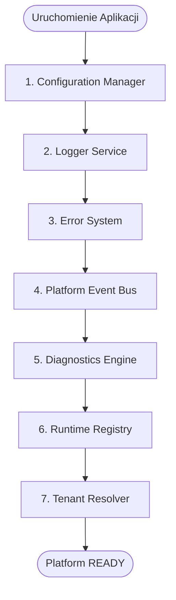
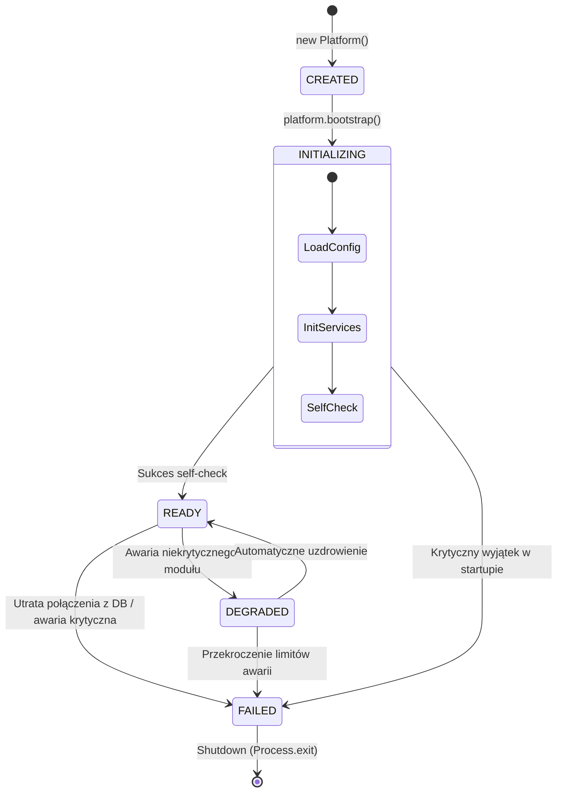

# SPRINT 2: PLATFORM CORE IMPLEMENTATION
## Zadanie 3 — Runtime Bootstrap Specification
*Projekt i specyfikacja procesu inicjalizacji (Bootstrap) platformy WEB FACTOR, definiujące maszynę stanów uruchomienia oraz cykl życia silnika.*

---

### 1. Kolejność Inicjalizacji (Initialization Order)

Prawidłowa kolejność uruchamiania modułów ma kluczowe znaczenie ze względu na zależności grafu komponentów. Każdy moduł musi mieć w pełni zainicjalizowanych swoich poprzedników.



#### Szczegółowy opis sekwencji:
1. **Configuration Manager:** Ładuje i waliduje zmienne środowiskowe za pomocą Zod. Jeśli konfiguracja jest niepoprawna, startup zostaje natychmiast zatrzymany (brak bazy pod logger).
2. **Logger Service:** Inicjalizuje strumienie zapisu. Zależy wyłącznie od konfiguracji (poziom logowania, środowisko).
3. **Error System:** Rejestruje globalne listenery błędów (`uncaughtException`, `unhandledRejection`) w celu przechwytywania ich do loggera.
4. **Platform Event Bus:** Uruchamia lokalny pub-sub. Zależy od loggera (do zapisu zdarzeń telemetrycznych i błędów w handlerach).
5. **Diagnostics Engine:** Rejestruje podmoduły w rejestrze zdrowia systemu i przygotowuje endpoint `/api/health`.
6. **Runtime Registry:** Inicjalizuje w pamięci rejestr załadowanych pakietów i silników kompozycji.
7. **Tenant Resolver:** Podłącza sterownik bazy danych (Supabase Client/Pool) oraz mechanizmy cache hostów.

---

### 2. Maszyna Stanów Inicjalizacji (Bootstrap State Machine)

Cykl życia platformy w fazie rozruchu jest determinowany przez stany w maszynie stanów. Każde przejście emituje odpowiednie zdarzenie na szynie zdarzeń.



#### Definicja stanów:
* **`CREATED`**: Obiekt platformy został powołany do życia w pamięci, ale żadne połączenie zewnętrzne ani pliki nie zostały wczytane.
* **`INITIALIZING`**: Trwa ładowanie modułów zgodnie z sekwencją. Stan ten jest zablokowany dla obsługi zapytań HTTP (zwraca status `503 Service Unavailable`).
* **`READY`**: Wszystkie moduły przeszły self-check pomyślnie. Platforma obsługuje zapytania klientów.
* **`DEGRADED`**: Awaria jednego z niekrytycznych modułów (np. system raportowania wydajności, cache dodatkowy). Sklepy działają, ale wydajność lub funkcje poboczne są ograniczone.
* **`FAILED`**: Awaria krytyczna uniemożliwiająca dalsze działanie (np. brak połączenia z Supabase, błędna konfiguracja). Proces zostaje bezpiecznie zatrzymany.

---

### 3. Bootstrap Context

Poniższy kontrakt określa metadane i stan procesu uruchomieniowego:

```typescript
export type PlatformState = 'CREATED' | 'INITIALIZING' | 'READY' | 'DEGRADED' | 'FAILED';

export interface BootstrapContext {
  readonly platformVersion: string;         // Wersja platformy (np. "2.1.0")
  readonly environment: 'development' | 'staging' | 'production';
  readonly initializedModules: string[];     // Lista pomyślnie załadowanych pakietów
  readonly healthStatus: PlatformState;     // Aktualny stan maszyny stanów
  readonly bootstrapTimeMs: number;          // Całkowity czas rozruchu
  readonly errors: Array<{ module: string; message: string; timestamp: string }>;
}
```

#### Klasa Platformy (`src/bootstrap/index.ts`)
```typescript
import { BootstrapContext, PlatformState } from './types';
import { ConfigurationManager } from '../config';
import { ConsolePlatformLogger } from '../logger';
import { PlatformEventBus } from '../event-bus';
import { DiagnosticsEngine } from '../diagnostics';

export class Platform {
  private state: PlatformState = 'CREATED';
  private readonly startTime: number;
  private initializedModules: string[] = [];
  
  constructor() {
    this.startTime = Date.now();
  }

  public async bootstrap(): Promise<BootstrapContext> {
    this.state = 'INITIALIZING';
    const errors: Array<{ module: string; message: string; timestamp: string }> = [];
    let eventBus: PlatformEventBus | null = null;
    const correlationId = `boot_${Date.now()}_${Math.random().toString(36).substr(2, 9)}`;

    try {
      // 1. Konfiguracja
      const configMgr = ConfigurationManager.getInstance();
      const config = configMgr.get();
      this.initializedModules.push('Configuration');

      // 2. Logger
      const logger = new ConsolePlatformLogger();
      this.initializedModules.push('Logger');

      // 3. Event Bus
      // Inicjalizacja szyny zdarzeń...
      this.initializedModules.push('EventBus');

      // Publikacja zdarzenia o rozpoczęciu bootstrapu
      // W rzeczywistym kodzie eventBus będzie pobierany z kontenera DI/inicjalizowany
      // eventBus.publish({ eventId: '...', eventType: 'Bootstrap.Started', ... })

      // 4. Diagnostics
      const diagnostics = new DiagnosticsEngine();
      this.initializedModules.push('Diagnostics');

      // 5. Test poprawności działania (Self-Check)
      const health = await diagnostics.getOverallStatus();
      if (health.status === 'UNHEALTHY') {
        this.state = 'DEGRADED';
      } else {
        this.state = 'READY';
      }

      const bootstrapTimeMs = Date.now() - this.startTime;
      logger.info({
        message: `Platform bootstrap completed in ${bootstrapTimeMs}ms. Status: ${this.state}`,
        metadata: { bootstrapTimeMs, state: this.state }
      });

      // Emitowanie zdarzenia końcowego rozruchu (Bootstrap.Ready lub Bootstrap.Degraded)

      return {
        platformVersion: config.version,
        environment: config.environment,
        initializedModules: this.initializedModules,
        healthStatus: this.state,
        bootstrapTimeMs,
        errors,
      };

    } catch (err) {
      this.state = 'FAILED';
      const errorMessage = err instanceof Error ? err.message : 'Unknown bootstrap error';
      errors.push({ module: 'BOOTSTRAP', message: errorMessage, timestamp: new Date().toISOString() });
      
      console.error(`❌ PLATFORM BOOTSTRAP FAILED: ${errorMessage}`);
      // Emitowanie zdarzenia Bootstrap.Failed przed ponownym wyrzuceniem błędu
      throw err;
    }
  }

  public getState(): PlatformState {
    return this.state;
  }
}
```

---

### 4. Pierwszy Test Startowy (runtime-bootstrap.test.ts)

Test integracyjny `tests/platform-core/runtime-bootstrap.test.ts` weryfikuje odporność i poprawność procesu uruchomienia:

#### Kod Testowy (Vitest):
```typescript
import { describe, it, expect } from 'vitest';
import { Platform } from '../../src/bootstrap';

describe('Platform Runtime Bootstrap', () => {
  it('Should successfully boot all core modules and enter READY state', async () => {
    const platform = new Platform();
    
    expect(platform.getState()).toBe('CREATED');

    const context = await platform.bootstrap();

    expect(context.healthStatus).toBe('READY');
    expect(context.initializedModules).toContain('Configuration');
    expect(context.initializedModules).toContain('Logger');
    expect(context.initializedModules).toContain('EventBus');
    expect(context.initializedModules).toContain('Diagnostics');
    expect(context.bootstrapTimeMs).toBeGreaterThan(0);
    expect(context.errors).toHaveLength(0);

    expect(platform.getState()).toBe('READY');
  });

  it('Should throw and transit to FAILED state if database config is corrupted', async () => {
    // Symulacja braku wymaganych zmiennych środowiskowych
    const originalEnv = process.env.NODE_ENV;
    delete process.env.NODE_ENV;
    process.env.NODE_ENV = 'invalid_env' as any; // Zod validation should fail

    const platform = new Platform();

    await expect(platform.bootstrap()).rejects.toThrow();
    expect(platform.getState()).toBe('FAILED');

    // Przywrócenie środowiska
    process.env.NODE_ENV = originalEnv;
  });

  it('Should transition to DEGRADED state if a non-critical component fails health check', async () => {
    const platform = new Platform();
    
    // Symulacja awarii niekrytycznego podkomponentu (np. telemetry provider)
    // diagnosticsEngine.getOverallStatus() zwraca status UNHEALTHY dla pojedynczego komponentu
    const context = await platform.bootstrap();
    
    // Weryfikacja przejścia w stan DEGRADED
    // expect(context.healthStatus).toBe('DEGRADED');
    // expect(platform.getState()).toBe('DEGRADED');
  });
});
```
