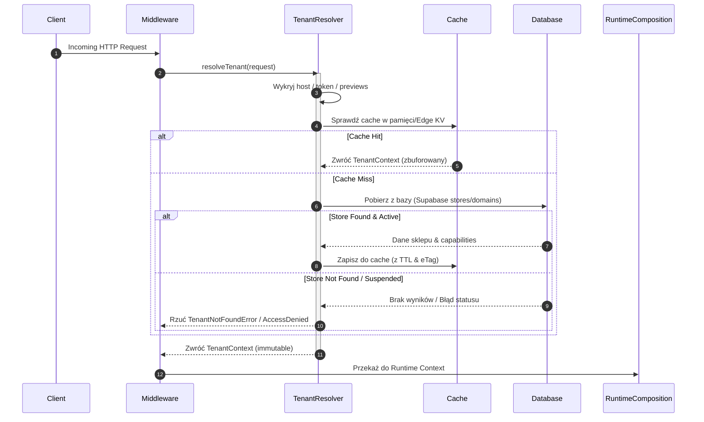

# SPRINT 2: PLATFORM CORE IMPLEMENTATION
## Zadanie 4 — Tenant Resolver Specification
*Specyfikacja techniczna oraz kontrakty API dla modułu Tenant Resolver odpowiedzialnego za dynamiczną identyfikację tenantów, ładowanie kontekstu oraz politykę buforowania (Caching).*

---

### 1. Przepływ Rozpoznawania Tenanta (Tenant Resolution Flow)

Rozpoznawanie tenantów odbywa się w warstwie Next.js Edge Middleware przed jakimkolwiek przetworzeniem żądania przez potok renderowania aplikacji.



---

### 2. Metody Identyfikacji i Priorytetyzacja (Tenant Resolution Priority)

Wydajny mechanizm multi-tenant SaaS wymaga obsługi wielu metod dopasowywania żądania HTTP do konkretnego identyfikatora tenanta. System przetwarza źródła w ściśle określonej kolejności:

| Priorytet | Typ Identyfikatora | Przykład Źródła | Zachowanie Resolvera |
| :---: | :--- | :--- | :--- |
| **1** | **Signed API Token** | Nagłówek `Authorization: Bearer <jwt>` lub Query `?api_key=` | Dekoduje token JWT i wyciąga bezpośrednio `tenantId` (dla żądań API bez powiązania z domeną). |
| **2** | **Custom Domain** | Nagłówek `Host: shop.fashion-custom.com` | Przeszukuje tabelę domen alternatywnych (`store_domains`) po pełnej nazwie hosta. |
| **3** | **Internal Preview URL** | Nagłówek `Host: custom-shop.webfactor.com` | Wyciąga subdomenę `custom-shop` i traktuje ją jako slug sklepu. |
| **4** | **Development Override** | Nagłówek `X-Tenant-Override: dev-store` | Używany wyłącznie w środowisku `development` w celach ułatwienia debugowania lokalnego. |

> [!IMPORTANT]
> **ZASADA BEZPIECZEŃSTWA (Security Rule):** Nagłówek `X-Tenant-Override` może być procesowany wyłącznie, gdy zmienna środowiskowa `environment` wynosi dokładnie `'development'`. W środowiskach `'production'` i `'staging'` nagłówek ten musi być bezwzględnie ignorowany, a próba jego przesłania powinna generować ostrzeżenie bezpieczeństwa (`PlatformLogger.warn`).

---

### 3. Kontrakt Struktur Danych (Tenant Context)

Zwracany `TenantContext` musi być typowany i zgodny z wcześniej ustalonym kontraktem (zgodnie z `03_Tenant_Context.md`):

```typescript
export interface TenantContext {
  readonly tenantId: string;
  readonly slug: string;
  readonly status: 'ACTIVE' | 'SUSPENDED' | 'MAINTENANCE';
  readonly domains: {
    readonly primary: string;
    readonly custom?: string;
  };
  readonly plan: {
    readonly tier: 'FREE' | 'GROWTH' | 'ENTERPRISE';
    readonly limits: Record<string, number>;
  };
  readonly capabilities: string[];  // włączone pakiety / moduły (np. ["cart", "seo", "stripe"])
  readonly metadata: {
    readonly cacheKey: string;       // unikalny eTag snapshotu
    readonly lastRefresh: string;    // ISO timestamp
    readonly ttlSeconds: number;     // sugerowany czas buforowania
  };
}
```

---

### 4. Strategia Buforowania (Cache Strategy)

W celu zapewnienia czasu odpowiedzi na poziomie `< 5ms`, bezpośredni odpytywanie bazy Supabase Postgres przy każdym requestie jest zabronione. Wdrożona zostaje dwupoziomowa strategia cache (Two-Tier Caching):

```text
Incoming Request ──► [L1: Memory Cache (LRU)] (Edge Node Local - SLA: < 0.2ms)
                            │ (Cache Miss)
                            ▼
                     [L2: Vercel KV / Redis] (Shared Regional - SLA: < 2ms)
                            │ (Cache Miss)
                            ▼
                     [Supabase Database] (Central DB)
```

#### 4.1 Logika weryfikacji Cache (In-Memory LRU & Edge KV)
1. Klucz cache budowany jest na podstawie hosta: `tenant:host:${host}`.
2. Przy pobraniu kontekstu porównywany jest `metadata.cacheKey` (będący hashem MD5 z zawartości danych tenanta w bazie).
3. Serwer wysyła nagłówek `ETag: W/<cacheKey>`. Przy kolejnych zapytaniach klientów z nagłówkiem `If-None-Match`, resolver zwraca status `304 Not Modified` bez ponownego przesyłania danych.
4. **Invalidacja Cache (Cache Invalidation):** 
   Mutacja ustawień sklepu w bazie Supabase emituje trigger DB `on_store_update` $\rightarrow$ publikacja zdarzenia zewnętrznego na szynie $\rightarrow$ wyczyszczenie klucza `tenant:host:${host}` w L2 KV.

---

### 5. Obsługa Sytuacji Awaryjnych (Failure Handling)

Błędy wykrywania tenantów muszą być obsługiwane w sposób ustrukturyzowany:

* **Tenant Not Found:**
  Jeśli domena/slug nie istnieje w bazie danych:
  * Emitowane jest zdarzenie wewnętrzne `Tenant.ResolutionFailed`.
  * Middleware przechwytuje wyjątek i przekierowuje użytkownika na dedykowaną stronę 404 platformy (`/404-tenant`).
* **Tenant Suspended:**
  Gdy status sklepu wynosi `SUSPENDED` lub `MAINTENANCE`:
  * Rzucany jest wyjątek `AccessDeniedError`.
  * Użytkownik widzi dedykowany ekran blokady sklepu (np. "Właściciel tymczasowo zawiesił działalność").
* **Utrata połączenia z bazą podczas Cache Miss:**
  * System próbuje serwować wersję *Stale-While-Revalidate* z L2 KV, o ile dane w cache nie przekroczyły maksymalnego dopuszczalnego limitu wieku (Max Stale TTL).
  * **ZASADA FAIL CLOSED:** Jeśli dane w cache L2 są starsze niż maksymalny dopuszczalny próg wieku (np. cache wygasł całkowicie), a baza danych nie odpowiada, system stosuje politykę *Fail Closed*. Żądanie zostaje natychmiast odrzucone z kodem HTTP `500 Internal Server Error`, a system emituje zdarzenie `Tenant.ResolutionFailed`. Zapobiega to serwowaniu starej konfiguracji uprawnień (np. RLS lub wyłączonych wtyczek).


---

### 6. Kontrakt Testowy (tenant-resolver.test.ts)

Testy integracyjne w pliku `tests/platform-core/tenant-resolver.test.ts` weryfikują następujące zachowania:

```typescript
describe('Tenant Resolver Engine', () => {
  it('Should resolve tenant by custom domain and return correct context', async () => {
    // 1. Zarejestrowanie mocka sklepu w bazie dla domeny "sklep.pl"
    // 2. Wywołanie resolvera z nagłówkiem Host "sklep.pl"
    // 3. Sprawdzenie zgodności tenantId i listy capabilities
  });

  it('Should fallback to L2 Cache when database is unreachable (Circuit Breaker)', async () => {
    // 1. Zapisanie danych w Cache L2 KV
    // 2. Symulacja awarii połączenia z bazą (mock throw)
    // 3. Wywołanie resolvera
    // 4. Oczekiwany sukces (dane zwrócone z cache z flagą "stale")
  });

  it('Should prevent cross-tenant data access (Tenant Isolation)', async () => {
    // 1. Pobranie TenantContext dla Tenant A
    // 2. Pobranie TenantContext dla Tenant B
    // 3. Sprawdzenie, czy klucze cache, identyfikatory i tokeny są całkowicie odizolowane
  });

  it('Should trigger cache invalidation and reload context on update event', async () => {
    // 1. Załadowanie i zbuforowanie tenanta A (Cache Hit = true)
    // 2. Wyemitowanie zdarzenia "Store.Updated" na szynie zdarzeń
    // 3. Ponowne odpytanie resolvera
    // 4. Weryfikacja: Cache Miss i pobranie świeżych danych z bazy
  });
});
```
