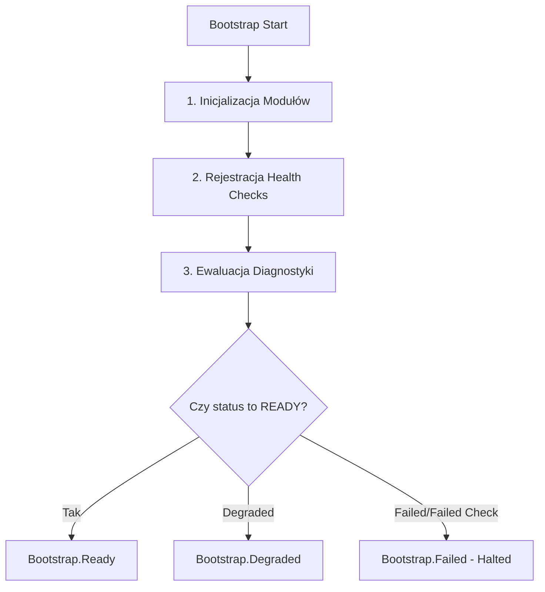

# SPRINT 2: PLATFORM CORE IMPLEMENTATION
## Zadanie 5 — Platform Diagnostics Registry Implementation
*Dokumentacja techniczna oraz specyfikacja implementacyjna rejestru diagnostycznego i systemu agregacji statusów zdrowia platformy (Health & Readiness Engine) w paczce `packages/platform-core`.*

---

### 1. Kontrakt Health Check (Diagnostic Interfaces)

Każdy krytyczny komponent platformy (np. Logger, Event Bus, baza danych, silnik tenantów) rejestruje swój status w centralnym module `DiagnosticsRegistry`. Kontrakty są zdefiniowane następująco:

```typescript
export type HealthStatus = 'READY' | 'DEGRADED' | 'FAILED';

export interface HealthResult {
  readonly status: HealthStatus;
  readonly message?: string;
  readonly timestamp: string;
  readonly details?: Record<string, any>;
}

export interface HealthCheck {
  readonly name: string;
  check(): Promise<HealthResult>;
}
```

---

### 2. Moduł Rejestru Diagnostycznego (DiagnosticsRegistry)

Klasa `DiagnosticsRegistry` odpowiada za zarządzanie kolekcją komponentów diagnostycznych oraz agregację ich statusów w jeden czytelny profil zdrowia platformy.

#### 2.1 Logika Agregacji Statusów
Reguła ewaluacji statusu ogólnego (Overall Status) działa w następujący sposób:
* Jeśli **wszystkie** komponenty zwrócą `READY`, status ogólny to **`READY`**.
* Jeśli **co najmniej jeden** komponent zwróci `FAILED`, status ogólny to **`FAILED`** (Fail-Closed, zablokowanie startu).
* Jeśli **co najmniej jeden** komponent zwróci `DEGRADED` (a żaden `FAILED`), status ogólny to **`DEGRADED`** (uruchomienie w stanie ograniczonej funkcjonalności).

```typescript
export interface AggregatedHealthResult {
  readonly status: HealthStatus;
  readonly timestamp: string;
  readonly components: Record<string, HealthResult>;
}
```

---

### 3. Integracja z Cyklem Uruchomieniowym (Bootstrap Flow)

Diagnostyka stanowi integralną część potoku uruchomieniowego:



Podczas cyklu bootstrapu, system wywołuje `DiagnosticsRegistry.evaluate()`. Jeśli status końcowy to `FAILED`, bootstrap zostaje przerwany, a platforma zgłasza krytyczny wyjątek `ConfigurationError` lub `RuntimeError`.

---

### 4. Specyfikacja Testów (`diagnostics.test.ts`)

Zgodność z architekturą jest weryfikowana za pomocą testów Vitest testujących:
1. **Rejestrację komponentów:** Weryfikacja dodawania nowych modułów diagnostycznych.
2. **Agregację statusów:**
   * Test statusu `READY` przy zdrowych komponentach.
   * Test statusu `DEGRADED`, gdy jeden z komponentów ma awarię niekrytyczną (np. opóźnienia bazy danych).
   * Test statusu `FAILED`, gdy jeden z krytycznych komponentów (np. baza danych lub resolver) zgłosi awarię całkowitą.
3. **Izolację wyjątków:** Weryfikacja, czy rzucenie surowego błędu wewnątrz metody `check()` komponentu jest bezpiecznie przechwytywane jako status `FAILED` bez wysypania całego mechanizmu diagnostycznego.
