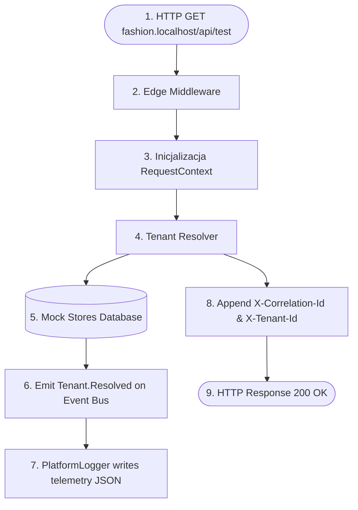

# SPRINT 2: PLATFORM CORE IMPLEMENTATION
## Zadanie 5 — First Runtime Flow Test
*Specyfikacja i scenariusz pierwszego pełnego testu przepływu (End-to-End Request Flow Test) integrującego Middleware, Tenant Context, Szynę Zdarzeń oraz telemetryczne nagłówki odpowiedzi.*

---

### 1. Cel Testu (Test Objective)

Celem tego testu jest udowodnienie, że szkielet platformy potrafi przetworzyć pełne żądanie HTTP od klienta, zidentyfikować tenanta, powołać kontekst wykonawczy, przesłać zdarzenia na szynie i zwrócić odpowiedź z poprawnymi nagłówkami śledzenia **bez udziału silnika renderującego UI (RSC/React)**. 

Jest to kluczowa weryfikacja poprawności architektury (Platform Integration Gate).

---

### 2. Architektura Przepływu Testowego (Test Flow Architecture)

Test symuluje żądanie sieciowe za pomocą klienta testowego (np. `supertest` lub `Fetch API` w środowisku testowym Node.js/Next.js) i sprawdza poprawność przejścia przez kolejne filtry middleware:



---

### 3. Kontrakt Nagłówków i Śledzenia (Tracing & Header Contracts)

Każda odpowiedź zwracana przez platformę musi zawierać nagłówki śledzenia pozwalające na korelację logów z żądaniem użytkownika:

| Nazwa Nagłówka HTTP | Typ Wartości | Rola |
| :--- | :--- | :--- |
| `X-Correlation-Id` | UUID v4 (np. `req_9a2b8c...`) | Przekazany z żądania klienta (lub wygenerowany na wejściu middleware). Identyfikuje cały cykl życia zapytania. |
| `X-Tenant-Id` | String ID (np. `store_fashion_001`) | Identyfikator zmapowanego sklepu. Pusty, jeśli tenant nie został rozpoznany. |
| `X-Execution-Time-Ms` | Liczba całkowita | Całkowity czas przetwarzania po stronie serwera przed wysłaniem nagłówków. |
| `Cache-Control` | String (np. `public, max-age=300`) | Zwracany na podstawie parametrów TTL z cache tenanta. |

---

### 4. Specyfikacja Kodu Testu (`tests/platform-core/runtime-flow.test.ts`)

Poniższy test weryfikuje integrację w pamięci przy użyciu symulacji środowiska HTTP.

```typescript
import { describe, it, expect, vi, beforeEach } from 'vitest';
import { Platform } from '../../src/bootstrap';
import { PlatformEventBus } from '../../src/event-bus';
import { createMockRequest, createMockResponse } from '../mocks/http';

describe('Runtime Request Integration Flow', () => {
  let platform: Platform;
  let eventBus: PlatformEventBus;

  beforeEach(async () => {
    // 1. Uruchomienie platformy (Bootstrap)
    platform = new Platform();
    const context = await platform.bootstrap();
    expect(context.healthStatus).toBe('READY');
  });

  it('Should successfully process request, resolve tenant, emit event and inject tracing headers', async () => {
    // Mock handler dla Event Busa w celu weryfikacji przechwycenia zdarzenia
    const tenantResolvedSpy = vi.fn();
    eventBus = platform.getEventBus();
    eventBus.subscribe('Tenant.Resolved', tenantResolvedSpy);

    // 2. Symulacja żądania HTTP
    const req = createMockRequest({
      url: 'http://fashion.localhost/api/test-context',
      headers: {
        'Host': 'fashion.localhost',
        'X-Correlation-Id': 'req_test_flow_999'
      }
    });
    const res = createMockResponse();

    // 3. Wywołanie potoku Middleware i Resolvera
    await platform.handleRequest(req, res);

    // 4. Weryfikacja nagłówków odpowiedzi
    expect(res.statusCode).toBe(200);
    expect(res.getHeader('X-Correlation-Id')).toBe('req_test_flow_999');
    expect(res.getHeader('X-Tenant-Id')).toBe('store_fashion_001');
    expect(Number(res.getHeader('X-Execution-Time-Ms'))).toBeLessThan(100); // SLA < 100ms

    // 5. Weryfikacja emisji zdarzeń
    expect(tenantResolvedSpy).toHaveBeenCalledTimes(1);
    const event = tenantResolvedSpy.mock.calls[0][0];
    expect(event.correlationId).toBe('req_test_flow_999');
    expect(event.tenantId).toBe('store_fashion_001');
    expect(event.payload.slug).toBe('fashion');
  });

  it('Should return 404 and emit Tenant.ResolutionFailed when host is unknown', async () => {
    const resolutionFailedSpy = vi.fn();
    eventBus = platform.getEventBus();
    eventBus.subscribe('Tenant.ResolutionFailed', resolutionFailedSpy);

    const req = createMockRequest({
      url: 'http://unknown-host.com/api/test-context',
      headers: {
        'Host': 'unknown-host.com',
        'X-Correlation-Id': 'req_failed_flow_111'
      }
    });
    const res = createMockResponse();

    await platform.handleRequest(req, res);

    // Weryfikacja kodu błędu
    expect(res.statusCode).toBe(404);
    expect(res.getHeader('X-Correlation-Id')).toBe('req_failed_flow_111');
    expect(res.getHeader('X-Tenant-Id')).toBeUndefined();

    // Weryfikacja emisji błędu
    expect(resolutionFailedSpy).toHaveBeenCalledTimes(1);
    const event = resolutionFailedSpy.mock.calls[0][0];
    expect(event.correlationId).toBe('req_failed_flow_111');
    expect(event.payload.host).toBe('unknown-host.com');
  });

  it('Should reject request with 403 Forbidden when trying to access host of Tenant A with credentials of Tenant B (Cross Tenant Attempt)', async () => {
    const req = createMockRequest({
      url: 'http://tenant-a.localhost/api/secure-action',
      headers: {
        'Host': 'tenant-a.localhost',
        'X-Correlation-Id': 'req_cross_attempt_403',
        'Authorization': 'Bearer token_tenant_b' // Token powiązany z innym tenantem
      }
    });
    const res = createMockResponse();

    await platform.handleRequest(req, res);

    // Oczekujemy zablokowania żądania ze względów bezpieczeństwa (izolacja tenantów)
    expect(res.statusCode).toBe(403);
  });
});
```

---

### 5. Kryteria Poprawności Przepływu (Validation Checkpoints)

Wydajność i poprawność pierwszego potoku jest uznana za zaliczoną, gdy testy wykażą:
* **Kompatybilność z Edge Runtime:** Całość kodu middleware i resolvera wykonuje się w środowisku Edge (brak zależności od modułów natywnych Node.js, takich jak `fs` czy `child_process`).
* **SLA Przetwarzania:** Czas detekcji tenanta i weryfikacji cache w środowisku testowym nie przekracza **5 ms** dla Cache Hit.
* **Brak Wycieków Pamięci:** Powtarzalne wywołanie testu z różnymi hostami nie powoduje wzrostu alokacji pamięci Heap (potwierdzenie zwalniania subskrypcji).
