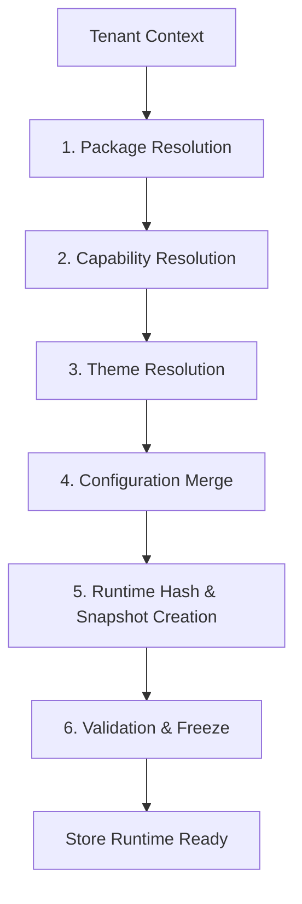

# SPRINT 3: RUNTIME COMPOSITION
## Specyfikacja Kontraktu — 01_RUNTIME_COMPOSITION_ENGINE.md
*Definicja silnika kompozycji środowiska uruchomieniowego sklepu (Runtime Composition Engine) dla platformy WEB FACTOR.*

---

### 1. Rurociąg Kompozycji (Composition Pipeline)

Silnik kompozycji (`RuntimeCompositionEngine`) odpowiada za dynamiczne budowanie unikalnego środowiska wykonawczego dla każdego sklepu na podstawie jego kontekstu (`TenantContext`). Uruchomienie sklepu nie polega na ładowaniu oddzielnych kontenerów czy procesów, lecz na wygenerowaniu bezpiecznego, izolowanego i zamrożonego w pamięci snapshotu kompozycji (`RuntimeSnapshot`).

Rurociąg składa się z następujących faz realizowanych sekwencyjnie:



#### Fazy przetwarzania:
1. **Package Resolution**: Odczyt listy zarejestrowanych i wykupionych pakietów/rozszerzeń dla danego tenanta.
2. **Capability Resolution**: Agregacja funkcjonalności (capabilities) dostarczanych przez aktywne pakiety, z uwzględnieniem priorytetów i potencjalnych konfliktów.
3. **Theme Resolution**: Identyfikacja i weryfikacja szablonu graficznego przypisanego do tenanta.
4. **Configuration Merge**: Scalanie globalnej konfiguracji platformy z konfiguracjami specyficznymi dla wdrożonych pakietów oraz indywidualnymi ustawieniami sklepu.
5. **Runtime Hash Computation**: Obliczenie deterministycznego skrótu stanu kompozycji (`runtimeHash`).
6. **Validation & Freeze**: Końcowa walidacja struktury i twarde zamrożenie (`deepFreeze`) obiektu snapshotu przed udostępnieniem go do silnika renderującego.

---

### 2. Kontrakt Runtime Snapshot

`RuntimeSnapshot` jest kompletnym, niezmiennym i podpisanym stanem konfiguracyjnym sklepu. Stanowi jedyne źródło prawdy dla potoku renderowania (`Rendering Pipeline`) i logiki biznesowej pakietów.

```typescript
export interface PackageInfo {
  id: string;
  version: string;
  priority: number;
}

export interface ThemeInfo {
  id: string;
  version: string;
  settings: Record<string, any>;
}

export interface RuntimeSnapshot {
  /** Unikalny identyfikator tenanta */
  tenantId: string;
  
  /** Wersja jądra silnika platformy */
  engineVersion: string;
  
  /** Zestaw aktywnych pakietów przypisanych do sklepu */
  packages: PackageInfo[];
  
  /** Płaska lista aktywnych uprawnień funkcjonalnych */
  capabilities: string[];
  
  /** Aktywny motyw graficzny sklepu */
  theme: ThemeInfo;
  
  /** Scalona konfiguracja aplikacji (globalna + pakiety + tenant) */
  configuration: Record<string, any>;
  
  /** Deterministyczny skrót SHA-256 reprezentujący spójność kompozycji */
  runtimeHash: string;
  
  /** Sygnatura czasowa wygenerowania snapshotu */
  composedAt: string;
}
```

#### Reguły Architektoniczne Snapshotu:
* **VALIDATED**: Przed zwróceniem snapshotu, silnik weryfikuje poprawność schematu przy użyciu biblioteki `Zod`.
* **IMMUTABLE / FROZEN**: Obiekt snapshotu przechodzi przez rekurencyjne zamrożenie (`deepFreeze`), aby zapobiec modyfikacjom w pamięci podręcznej (np. dodaniu nieautoryzowanego capability przez kod rozszerzenia w trakcie cyklu żądania).

---

### 3. Rozwiązywanie Pakietów (Package Resolution)

Package Resolution decyduje, które moduły są aktywne dla wybranego tenanta. System unika monolitycznych instrukcji warunkowych na rzecz dynamicznego wczytywania manifestów rozszerzeń.

* **Tenant A (Sklep Odzieżowy Premium):**
  * Aktywne pakiety: `["commerce@2.1.0", "blog@1.0.2", "payments-stripe@3.0.0", "analytics-ga4@1.1.0"]`
* **Tenant B (Księgarnia z Rezerwacjami):**
  * Aktywne pakiety: `["commerce@2.1.0", "bookings@1.4.0", "crm-hubspot@2.0.1"]`

Silnik kompozycji buduje listę pakietów w oparciu o DAG (Directed Acyclic Graph), sprawdzając deklarowane zależności (`dependencies`) oraz poprawność semantyczną wersji (SemVer).

---

### 4. System Uprawnień (Capability System)

Platforma eliminuje sprawdzanie planów taryfowych bezpośrednio w kodzie biznesowym (anti-pattern: `if (tenant.plan === 'VIP')`). Zamiast tego wprowadza granularne uprawnienia (`capabilities`), które są mapowane i włączane przez pakiety lub konfigurację planu tenanta.

#### Przykład listy capabilities w snapshocie:
```json
[
  "commerce.checkout",
  "commerce.cart.discount-codes",
  "blog.post.editor",
  "payments.stripe.express",
  "bookings.calendar.sync"
]
```

#### Reguły rozwiązywania konfliktów (Conflict & Priority Rules):
1. Jeśli dwa pakiety dostarczają tę samą funkcjonalność (np. `shipping.calculator`), o pierwszeństwie decyduje atrybut `priority` zdefiniowany w manifeście pakietu (wyższa wartość nadpisuje niższą).
2. W przypadku identycznego priorytetu, silnik zgłasza kontrolowany błąd kompozycji (`CompositionConflictError`), zapobiegając nieprzewidywalnemu zachowaniu aplikacji.

---

### 5. Integracja ze Zdarzeniami (Composition Events)

Proces kompozycji jest w pełni obserwowalny i integruje się z platformową szyną `PlatformEventBus`. W trakcie budowania snapshotu emitowane są następujące zdarzenia strukturalne:

1. **`RuntimeComposition.Started`**: Rozpoczęcie procesu budowania kompozycji dla danego `tenantId`.
2. **`Package.Resolved`**: Pomyślne rozstrzygnięcie i załadowanie pojedynczego pakietu wraz z wersją.
3. **`Capability.Enabled`**: Aktywacja konkretnej funkcjonalności lub grupy uprawnień.
4. **`Theme.Loaded`**: Załadowanie i walidacja ustawień motywu graficznego.
5. **`RuntimeSnapshot.Created`**: Wygenerowanie obiektu snapshotu i obliczenie jego sumy kontrolnej `runtimeHash`.
6. **`RuntimeComposition.Completed`**: Zakończenie całego procesu kompozycji, rejestracja czasu trwania operacji.

---

### 6. Kontrakt Testowy (Test Contract)

Wdrożenie silnika kompozycji w pliku `RuntimeCompositionEngine.ts` musi zostać zweryfikowane zestawem testów integracyjnych w pliku `runtime-composition.test.ts`.

#### Wymagane scenariusze testowe:

1. **Poprawna kompozycja (Standard Success Flow)**:
   * Dane wejściowe: `TenantContext` z przypisanymi pakietami "Commerce" i "Blog".
   * Asercja: Wygenerowany `RuntimeSnapshot` zawiera oczekiwane pakiety, odpowiednie capabilities (np. `commerce.checkout`, `blog.read`), poprawny motyw i sumę kontrolną `runtimeHash`.
2. **Brak wymaganych pakietów (Missing Package)**:
   * Dane wejściowe: Kontekst wskazujący na pakiet, który nie istnieje w repozytorium/rejestrze.
   * Asercja: Zgłoszenie błędu `CompositionError` z kodem `PACKAGE_NOT_FOUND`.
3. **Rozstrzyganie konfliktów capabilities (Conflict Resolution)**:
   * Dane wejściowe: Dwa pakiety dostarczające ten sam klucz capability, ale z różnymi priorytetami.
   * Asercja: W snapshocie ląduje konfiguracja pakietu o wyższym priorytecie.
4. **Wykrywanie zablokowanych konfliktów (Unresolved Conflict)**:
   * Dane wejściowe: Dwa pakiety z tym samym priorytetem próbujące zarejestrować to samo capability.
   * Asercja: Zgłoszenie błędu `CompositionConflictError`.
5. **Niezmienność snapshotu (Immutability Enforcement)**:
   * Asercja: Próba modyfikacji właściwości snapshotu (np. `snapshot.capabilities.push('unauthorized')` lub `snapshot.theme.id = 'hack'`) rzuca wyjątek `TypeError` (skutek działania `Object.isFrozen`).
6. **Deterministyczny skrót (Runtime Hash Invariance)**:
   * Asercja: Wywołanie kompozycji dwukrotnie dla tych samych danych wejściowych zwraca identyczny `runtimeHash`. Dowolna zmiana w konfiguracji lub wersjach pakietów generuje inny skrót.

---

### 7. Kompatybilność Wersji Snapshotu (Runtime Snapshot Compatibility)

Aby zagwarantować bezproblemowe migracje platformy w modelu SaaS i zapobiec uruchamianiu niekompatybilnych snapshotów na starszych lub nowszych wersjach jądra silnika, silnik kompozycji wdraża reguły kompatybilności wersji (Compatibility Rules):

1. **Wersjonowanie Schematu (`schemaVersion`)**:
   * Każdy wygenerowany `RuntimeSnapshot` posiada wewnętrzny, niejawny parametr wersji schematu struktury danych.
2. **Weryfikacja kompatybilności wstecznej (Backwards Compatibility)**:
   * Podczas rozruchu runtime porównuje wersję silnika (`engineVersion`) zapisaną w snapshocie z aktualnie uruchomioną wersją platformy.
   * Dozwolone jest uruchomienie snapshotu, jeśli różnica w wersjach głównych (Major) wynosi 0 (np. Engine `v1.2.0` może bez problemu obsłużyć Snapshot wygenerowany dla Engine `v1.0.0`).
3. **Blokada przy niekompatybilności (Fail-Closed Compatibility)**:
   * Próba uruchomienia snapshotu z nowszego silnika na starszym jądrze (np. Snapshot z silnika `v2.0.0` uruchamiany na silniku `v1.5.0`) lub przy niezgodności wersji głównej skutkuje natychmiastowym zgłoszeniem wyjątku `IncompatibleEngineException` i przerwaniem kompozycji żądania.
