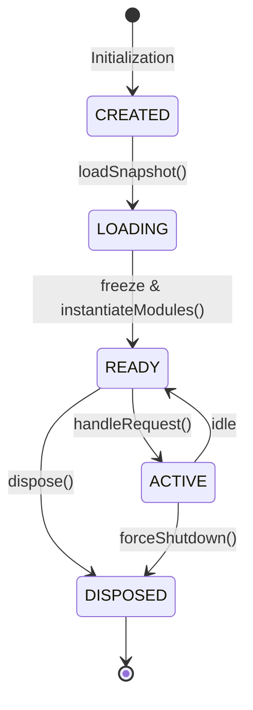
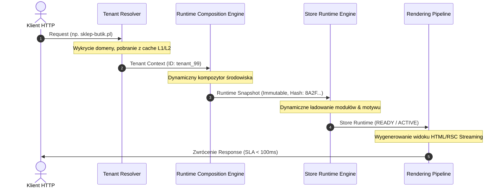

# SPRINT 3: RUNTIME COMPOSITION
## Specyfikacja Kontraktu — 02_STORE_RUNTIME_ENGINE.md
*Definicja silnika uruchomieniowego sklepu (Store Runtime Engine) łączącego Snapshot, moduły biznesowe i Renderowanie w WEB FACTOR.*

---

### 1. Cykl Życia Środowiska Sklepu (Store Runtime Lifecycle)

Aby zagwarantować stabilność operacyjną, izolację zasobów oraz efektywne zarządzanie pamięcią w środowisku Edge, każdy sklep reprezentowany jest przez instancję posiadającą ściśle określony cykl życia (Lifecycle).

Przejścia między stanami są sterowane zdarzeniowo przez orkiestratora środowiska:



#### Definicje Stanów Cyklu Życia:
1. **CREATED**:
   * Instancja silnika została powołana w pamięci operacyjnej dla konkretnego `tenantId`.
   * Zasoby są puste, konfiguracja nie została scalona.
2. **LOADING**:
   * Wywołanie `RuntimeCompositionEngine.compose()`.
   * Budowanie snapshotu pakietów, weryfikacja kompatybilności wstecznej z silnikiem platformy.
3. **READY**:
   * Snapshot został pomyślnie wygenerowany, zweryfikowany i zamrożony (`deepFreeze`).
   * Zarejestrowane w snapshocie moduły (pakiety) zostały załadowane i zainicjalizowane w pamięci z dedykowanymi uprawnieniami.
4. **ACTIVE**:
   * Środowisko aktywnie przetwarza przychodzące żądania HTTP i przesyła je do modułu renderującego (`Rendering Pipeline`).
   * Czas trwania tego stanu zależy od obciążenia i polityk retencji pamięci.
5. **DISPOSED**:
   * Zwolnienie pamięci, wyrejestrowanie referencji modułów, zamknięcie otwartych połączeń/cache.
   * Stan terminalny. Ponowne wywołanie sklepu wymaga odtworzenia cyklu od stanu `CREATED`.

---

### 2. Kontrakt Store Runtime (Store Runtime Contract)

`StoreRuntime` reprezentuje aktywną instancję sklepu w pamięci serwera. Łączy dane snapshotu z wykonywalną logiką biznesową.

```typescript
import { RuntimeSnapshot } from './RuntimeSnapshot';

export type StoreLifecycleState = 'CREATED' | 'LOADING' | 'READY' | 'ACTIVE' | 'DISPOSED';

export interface RuntimeModule {
  readonly id: string;
  readonly manifest: any;
  initialize(context: RuntimeSnapshot): Promise<void>;
  executeAction(actionName: string, payload: any): Promise<any>;
  dispose(): Promise<void>;
}

export interface StoreRenderer {
  renderView(viewName: string, props: Record<string, any>): Promise<string>;
}

export interface StoreRuntime {
  /** Identyfikator sklepu */
  readonly tenantId: string;
  
  /** Zamrożony snapshot kompozycji środowiska */
  readonly runtimeSnapshot: RuntimeSnapshot;
  
  /** Zainicjalizowane, aktywne instancje modułów/rozszerzeń w pamięci */
  readonly modules: Map<string, RuntimeModule>;
  
  /** Dedykowany silnik renderujący powiązany z wybranym motywem */
  readonly renderer: StoreRenderer;
  
  /** Aktualny stan cyklu życia instancji */
  readonly lifecycle: StoreLifecycleState;
}
```

---

### 3. Zintegrowany Przepływ Przetwarzania (End-to-End Integration Flow)

Potok przetwarzania żądań w architekturze WEB FACTOR spaja wszystkie dotychczasowe klocki w jedną deterministyczną rurę. 



#### Szczegóły kroków integracji:
1. **Identyfikacja**: `TenantResolver` dopasowuje nagłówki żądania (Host, Custom Domain, JWT) i zwraca zamrożony `TenantContext`.
2. **Kompozycja**: `RuntimeCompositionEngine` pobiera listę pakietów, weryfikuje ich zależności, buduje uprawnienia i generuje `RuntimeSnapshot` podpisany sumą kontrolną.
3. **Instancjowanie**: `StoreRuntimeEngine` bierze snapshot, inicjalizuje w pamięci moduły biznesowe (np. `CommerceEngineModule`, `StripePaymentsModule`) oraz ładuje konfigurację motywu.
4. **Renderowanie**: Żądanie przechodzi przez `StoreRuntime.renderer.renderView()`, generując gotowy strumień RSC/HTML przesyłany bezpośrednio do przeglądarki klienta.

---

### 4. Kontrakt Testowy (Test Contract)

Poprawność implementacji `StoreRuntimeEngine.ts` musi zostać zweryfikowana zestawem testów w pliku `store-runtime.test.ts`.

#### Wymagane scenariusze testowe:

1. **Poprawne przejścia stanów cyklu życia (Lifecycle Transition Success)**:
   * Asercja: Inicjalizacja silnika ustala stan na `CREATED`. Wczytanie snapshotu przechodzi przez `LOADING` do `READY`. Przetwarzanie żądania ustawia `ACTIVE`. Wywołanie dispose ustawia `DISPOSED`.
2. **Obsługa błędów inicjalizacji modułów (Module Initialization Failure Handling)**:
   * Dane wejściowe: Moduł rzuca wyjątek podczas metody `initialize()`.
   * Asercja: Silnik kompozycji przechwytuje błąd, przechodzi w stan `DISPOSED` (czyszczenie zasobów) i propaguje kontrolowany wyjątek uniemożliwiający uruchomienie niestabilnego sklepu.
3. **Izolacja wykonania żądań w stanie ACTIVE (Request Processing Boundary)**:
   * Asercja: Próba wywołania żądania na instancji w stanie `CREATED` lub `DISPOSED` zgłasza natychmiastowy wyjątek `IllegalLifecycleStateException`.
4. **Wyrejestrowanie zasobów przy zamykaniu (Clean Disposal)**:
   * Asercja: Wywołanie `dispose()` na instancji silnika poprawnie wywołuje metody `dispose()` na wszystkich załadowanych modułach i zwalnia referencje do obiektów, zapobiegając wyciekom pamięci w środowisku wielodostępnym.
