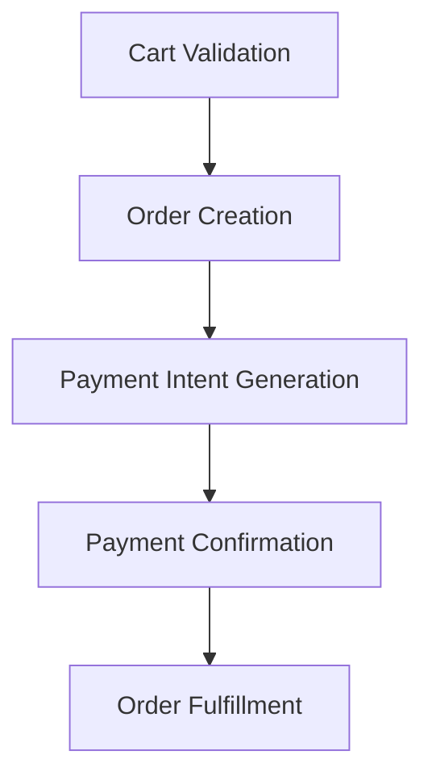

# SPRINT 4: COMMERCE RUNTIME
## Specyfikacja Kontraktu — 01_COMMERCE_ENGINE.md
*Definicja silnika handlowego (Commerce Engine), koszyka, transakcji oraz modelu izolacji tenantów w WEB FACTOR.*

---

### 1. Domena Produktowa (Product Domain)

Domena produktowa definiuje struktury danych niezbędne do reprezentowania katalogu produktów w środowisku wielodostępnym. Każdy obiekt domenowy musi być ściśle przypisany do tenanta (`tenantId`) celem zagwarantowania bezpieczeństwa na poziomie bazy danych (RLS).

```typescript
export interface Pricing {
  priceGross: number;      // Cena brutto w najmniejszej jednostce (np. grosze)
  priceNet: number;        // Cena netto
  taxRate: number;         // Stawka podatkowa w procentach (np. 23 dla 23%)
  currency: string;        // Kod waluty ISO 4217 (np. PLN)
}

export interface Inventory {
  sku: string;             // Stock Keeping Unit
  quantityAvailable: number; // Stan magazynowy dostępny do zakupu
  allowBackorder: boolean;   // Zgoda na zamówienia przy zerowym stanie
}

export interface Category {
  id: string;
  tenantId: string;
  slug: string;
  name: string;
  parentId?: string;       // Rekurencyjna struktura kategorii
}

export interface Product {
  id: string;
  tenantId: string;
  slug: string;
  name: string;
  description: string;
  categories: string[];     // Lista identyfikatorów kategorii
  pricing: Pricing;
  inventory: Inventory;
  isActive: boolean;
  metadata?: Record<string, any>;
}
```

---

### 2. Środowisko Uruchomieniowe Koszyka (Cart Runtime)

Koszyk zakupowy (`Cart`) działa jako tymczasowy stan sesji zakupowej klienta końcowego. Obliczenia kwot podsumowania (`Totals`) oraz walidacja stanów magazynowych muszą odbywać się w sposób deterministyczny na serwerze Edge.

```typescript
export interface CartItem {
  productId: string;
  quantity: number;
  unitPriceGross: number;
  totalGross: number;
}

export interface CartTotals {
  subtotalGross: number;
  subtotalNet: number;
  taxTotal: number;
  discountGross: number;
  grandTotalGross: number;
}

export interface Cart {
  id: string;
  tenantId: string;
  items: CartItem[];
  totals: CartTotals;
  couponCode?: string;
  createdAt: string;
  updatedAt: string;
}
```

#### Przepływ i Walidacja Koszyka:
1. **Pobranie i Dodanie**: Klient dodaje produkt. Silnik pobiera stan magazynowy (`Inventory`) z cache oraz cennik (`Pricing`).
2. **Weryfikacja**: Walidacja reguł biznesowych:
   * Czy produkt jest aktywny (`isActive === true`)?
   * Czy dodawana ilość mieści się w stanach magazynowych (`quantity <= quantityAvailable` lub `allowBackorder === true`)?
3. **Obliczenie Sum (Totals)**:
   * Wyznaczenie sumy netto, brutto i podatków na poziomie pozycji.
   * Aplikowanie rabatów na bazie kodu rabatowego (jeśli obecny).
   * Obliczenie kwoty końcowej (`grandTotalGross`).

---

### 3. Przepływ Zamówienia i Transakcji (Checkout Flow)

Proces finalizacji zamówienia realizowany jest według ściśle określonej maszyny stanów zamówienia:



1. **Order Creation**: Koszyk zostaje przekształcony w obiekt zamówienia (`Order`) ze statsem `PENDING_PAYMENT`. Stany magazynowe w bazie danych zostają tymczasowo zablokowane/zarezerwowane.
2. **Payment Intent**: Silnik generuje intencję płatności (`PaymentIntent`) za pośrednictwem zintegrowanej bramki (np. Stripe, 1Koszyk) skonfigurowanej dla tego konkretnego tenanta.
3. **Payment Confirmation**: Webhook bramki płatniczej potwierdza transakcję. Status zamówienia zmienia się na `PAID`. Rezerwacja magazynowa zostaje zatwierdzona jako trwała redukcja stanu.
4. **Fulfillment**: Zamówienie trafia do realizacji (`FULFILLED` lub `COMPLETED`).

---

### 4. Zdarzenia Handlowe (Commerce Events)

Wszystkie operacje biznesowe silnika komercyjnego emitują zdarzenia do platformowego `PlatformEventBus`:

* **`Product.Created`**: Dodanie nowego produktu do katalogu tenanta.
* **`Cart.Created`**: Utworzenie nowej sesji koszyka zakupowego.
* **`Cart.Updated`**: Zmiana ilości, dodanie lub usunięcie pozycji, naliczenie rabatu.
* **`Order.Created`**: Złożenie nowego zamówienia (oczekiwanie na płatność).
* **`Payment.Completed`**: Pomyślne potwierdzenie transakcji płatniczej przez webhook.
* **`Order.Fulfilled`**: Przejście zamówienia w stan kompletny (np. wysłanie paczki).

Każde zdarzenie niesie ze sobą metadane kontekstu żądania (`correlationId`, `causationId`) oraz identyfikator sklepu (`tenantId`), co pozwala na pełną analitykę w panelu Mission Control.

---

### 5. Izolacja Wielodostępności i Bezpieczeństwo RLS

Izolacja danych jest wymuszona na trzech płaszczyznach architektury:

1. **Baza Danych (RLS)**:
   * Każda tabela domenowa (`products`, `categories`, `carts`, `orders`) posiada kolumnę `tenant_id` powiązaną relacją z tabelą `tenants`.
   * Aktywne polityki RLS (Row Level Security) uniemożliwiają odczyt i zapis danych tenanta B przez połączenie nawiązane w kontekście tenanta A.
2. **Pamięć Uruchomieniowa (Engine Isolation)**:
   * Klasy menedżerów (np. `ProductManager`, `CartManager`) przyjmują `TenantContext` przy inicjalizacji lub przy każdym wywołaniu metod.
   * Zabronione jest cache'owanie danych produktowych w pamięci globalnej bez klucza `tenantId`.
3. **Izolacja Zdarzeń (Event Ownership)**:
   * Szyna zdarzeń (`PlatformEventBus`) filtruje subskrypcje na podstawie atrybutu `tenantId`.
   * Moduły sklepu B nie mogą nasłuchiwać na zdarzenia `Order.Created` generowane przez sklep A.
