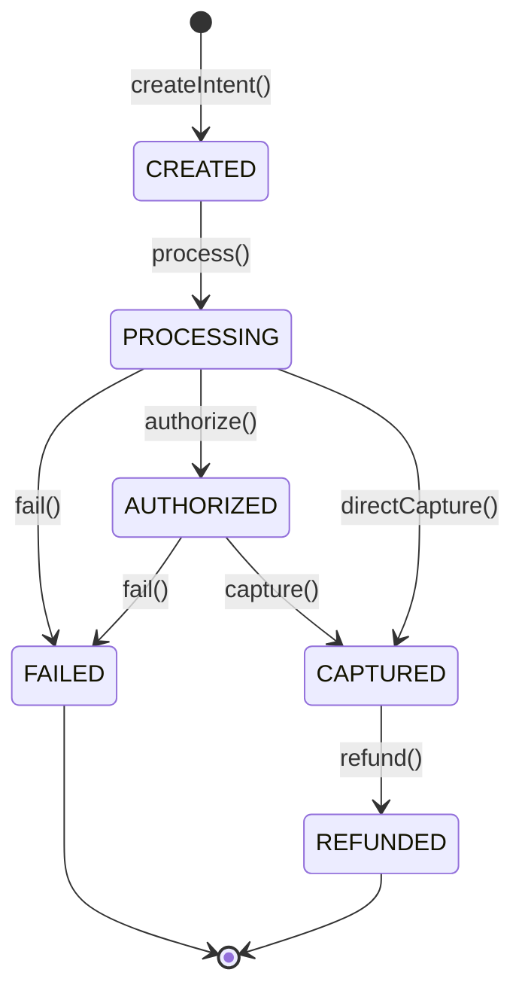

# SPRINT 4: COMMERCE RUNTIME
## Specyfikacja Kontraktu — 02_PAYMENT_ENGINE.md
*Definicja silnika płatności (Payment Engine), interfejsu adaptera dostawców oraz maszyny stanów płatności w WEB FACTOR.*

---

### 1. Maszyna Stanów Płatności (Payment State Machine)

Cykl życia płatności jest ściśle zdefiniowany przez poniższą maszynę stanów. Dowolne przejście poza zdefiniowanymi ścieżkami rzuca błąd `InvalidPaymentStateException`.



#### Opis Stanów:
1. **CREATED**: Utworzono intencję płatności (PaymentIntent) w systemie WEB FACTOR.
2. **PROCESSING**: Transakcja jest przetwarzana przez zewnętrznego dostawcę.
3. **AUTHORIZED**: Środki na koncie kupującego zostały zablokowane (preautoryzacja).
4. **CAPTURED**: Środki zostały pobrane (płatność zakończona sukcesem).
5. **FAILED**: Płatność została odrzucona przez bank/dostawcę lub przekroczyła czas na zakończenie.
6. **REFUNDED**: Środki zostały zwrócone klientowi (zwrot częściowy lub całkowity).

---

### 2. Domena Płatności (Payment Domain Model)

Każda transakcja musi zawierać identyfikator tenanta (`tenantId`) w celu zachowania separacji danych w modelu SaaS.

```typescript
export type PaymentState = 'CREATED' | 'PROCESSING' | 'AUTHORIZED' | 'CAPTURED' | 'FAILED' | 'REFUNDED';

export interface PaymentIntent {
  id: string;
  tenantId: string;
  orderId: string;
  amountGross: number;      // W najmniejszej jednostce walutowej (np. grosze)
  currency: string;         // ISO 4217 (np. PLN)
  status: PaymentState;
  providerId: string;       // Identyfikator dostawcy (np. stripe, przelewy24)
  externalId?: string;      // ID transakcji w zewnętrznym systemie dostawcy
  createdAt: string;
  updatedAt: string;
}

export interface Transaction {
  id: string;
  tenantId: string;
  paymentIntentId: string;
  type: 'CHARGE' | 'REFUND';
  amount: number;
  status: 'SUCCESS' | 'FAILED';
  rawResponse?: Record<string, any>; // Oryginalna telemetria bramki
  createdAt: string;
}

export interface Refund {
  id: string;
  tenantId: string;
  paymentIntentId: string;
  amount: number;
  reason: string;
  status: 'PENDING' | 'COMPLETED' | 'FAILED';
  createdAt: string;
}
```

---

### 3. Architektura Adaptera Dostawców (Provider Adapter Pattern)

Silnik płatności (`PaymentEngine`) nie może bezpośrednio zależeć od konkretnego SDK bramki płatniczej (np. Stripe SDK). Wszystkie integracje implementują wspólny kontrakt `PaymentProviderAdapter`.

```typescript
export interface CreateProviderIntentDto {
  orderId: string;
  amountGross: number;
  currency: string;
  metadata?: Record<string, any>;
}

export interface PaymentProviderAdapter {
  readonly id: string; // np. 'stripe', 'przelewy24'
  
  /**
   * Tworzy płatność w zewnętrznym systemie bramki
   */
  createIntent(dto: CreateProviderIntentDto): Promise<{
    externalId: string;
    clientSecret?: string; // Informacje dla frontendu do dokończenia transakcji
    rawPayload: any;
  }>;

  /**
   * Pobiera aktualny stan płatności z zewnętrznego systemu
   */
  getPaymentStatus(externalId: string): Promise<PaymentState>;

  /**
   * Zwraca środki z transakcji
   */
  refundPayment(externalId: string, amount: number): Promise<{
    refundExternalId: string;
    success: boolean;
    rawPayload: any;
  }>;
}
```

---

### 4. Zdarzenia Płatności (Payment Events)

Każde przejście stanu generuje asynchroniczne zdarzenie wysyłane do `PlatformEventBus`:

* **`Payment.Created`**: Utworzenie `PaymentIntent`.
* **`Payment.ProcessingStarted`**: Rozpoczęcie przetwarzania (przekierowanie na stronę banku).
* **`Payment.Completed`**: Pomyślne pobranie środków (status: `CAPTURED`). Wyzwala zmianę statusu zamówienia w `CommerceEngine`.
* **`Payment.Failed`**: Odrzucenie transakcji.
* **`Payment.Refunded`**: Pomyślne przetworzenie zwrotu środków.

---

### 5. Kontrakt Testowy (Test Contract)

Implementacja silnika płatności w pliku `payment-engine.test.ts` musi zweryfikować:

1. **Prawidłowe przejścia maszyny stanów**:
   * Zezwolenie na: `CREATED` ➔ `PROCESSING` ➔ `CAPTURED`.
   * Rzucenie `InvalidPaymentStateException` przy próbie: `CAPTURED` ➔ `PROCESSING`.
2. **Działanie Adaptera (MockProviderAdapter)**:
   * Weryfikacja poprawnego wstrzykiwania i delegowania operacji do adaptera Stripe/P24.
3. **Izolację Tenantów (RLS)**:
   * Próba wywołania transakcji lub pobrania stanu płatności należącej do tenanta A przez kontekst tenanta B rzuca `TenantSecurityException`.
4. **Obsługę Zwrotów (Refunds)**:
   * Integracja i rejestracja zwrotów w tabeli transakcji oraz aktualizacja stanu intencji na `REFUNDED`.
